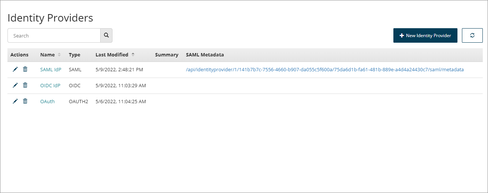

# Identity Providers page

<head>
  <meta name="guidename" content="Flow"/>
  <meta name="context" content="GUID-090915bf-801d-44a2-9d9b-87906f606908"/>
</head>

The **Identity Providers** page allows you to manage and administer your tenant identity providers.

## Opening the page

-   Select **Identity Providers** from the left-hand menu.

## Page overview

The **Identity Providers** page displays all the identity providers currently set up within the tenant.

-   Click **New Identity Provider** to add a new identity provider, from one of the supported types:

    -   [Adding an OAuth 2.0 identity provider](flo-IDP-OAUTH_2e829687-868b-4246-8b59-6c61f58b5049.md)

    -   [Adding an OIDC identity provider](flo-IDP-OIDC_22f7e42f-cf6c-419a-a16d-88d6e9c2e3f6.md)

    -   [Adding a SAML identity provider](flo-IDP-SAML_ca8daa54-7003-4b4e-8134-a8b1c6f9ab7d.md)

-   Identity providers are displayed in a table, sorted using the **Last Modified** column by default, showing the most recently modified identity providers first.

-   Click on an identity provider **Name** to open it for editing in a new tab.

-   Click on the **Name** or **Last Modified** headings to change the table sorting order.

-   Click the **Edit** icon  in the **Actions** column to edit an identity provider.

-   Click the **Delete** icon  in the **Actions** column to delete an identity provider.

-   Click the link in the **SAML Metadata** column to open the XML metadata generated by for any SAML identity provider that you have added. This file can be imported into a SAML identity provider.

-   Only 10 identity providers are shown at a time. If there are more than this, you can use the **Page Navigation** icons to navigate between the table pages.

    