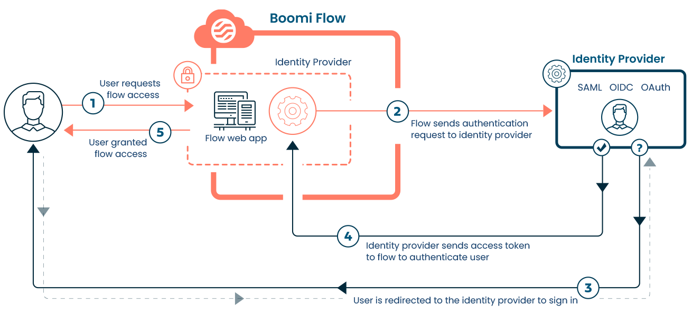

# Identity Providers

<head>
  <meta name="guidename" content="Flow"/>
  <meta name="context" content="GUID-cc718062-51e1-4c35-b9e7-3e971ac28249"/>
</head>

Add an identity provider \(IdP\) to a tenant to provide external user authentication for your flows.

Adding an identity provider to allows you to delegate flow user authentication to an external IdP service. For example, you can set up a flow to authenticate users with single sign-on \(SSO\) through an identity provider, so that users can only access the flow once they have successfully signed in to the IdP with their existing social or enterprise account.

-   Add and configure an identity provider on the [Identity Providers page](flo-IDP-page_090915bf-801d-44a2-9d9b-87906f606908.md).
-   You can then use this identity provider to control access to an entire flow, or to specific sections of a flow by using swimlanes. This is done by adding the required groups/users to the **Authentication** section on the **Flow Properties** form or a swimlane map element.

## Identity providers

The following identity provider frameworks and protocols are supported:

-   Open Authorization \(OAuth\) 2.0. See [Adding an OAuth 2.0 identity provider](flo-IDP-OAUTH_2e829687-868b-4246-8b59-6c61f58b5049.md).

-   OpenID Connect \(OIDC\). See [Adding an OIDC identity provider](flo-IDP-OIDC_22f7e42f-cf6c-419a-a16d-88d6e9c2e3f6.md).

-   Security Assertion Markup Language \(SAML\). See [Adding a SAML identity provider](flo-IDP-SAML_ca8daa54-7003-4b4e-8134-a8b1c6f9ab7d.md).

## Worked examples

To help you get started with using an identity provider to provide flow authentication, the following worked examples are provided:

-   [Using Okta SAML for flow authentication](flo-IDP-SAML_Okta_793cb37f-536b-4974-acd8-2971bd4a076f.md)

-   [Using OIDC for flow authentication](flo-IDP-Authentication_92b789da-b206-4bc1-8951-5c632e460b88.md)