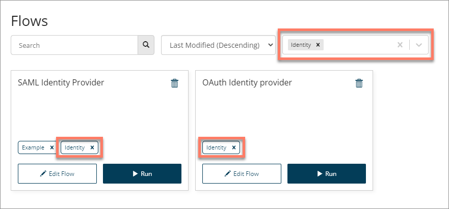

# Flow labels

<head>
  <meta name="guidename" content="Flow"/>
  <meta name="context" content="GUID-feb71668-ade0-41ba-ba73-325641414373"/>
</head>

Add labels to flow tiles to group and filter your flows on the **Flows** page.

## Overview

You can group related flows together on the **Flows** page by adding a label to each flow tile that you wish to include in a group. You can then filter the page using the label, so that the page shows only flows that have that label assigned.

-   Adding labels to flow tiles is completely optional.

-   You can assign multiple labels to each flow tile on the page, depending on how you wish to group and organize your flows. Using multiple labels allows you to apply specific, granular filtering of flows on the page.

-   If a label already exists with the same name as one that you are trying to create, you cannot create the new label until you change the name.

-   Label names are case-sensitive, and can contain any combination of alpha, numeric, and special characters, up to a maximum of 50 characters.

## Example

In this example, a tenant contains a large number of flows, making it hard to quickly find certain flows, such as only flows that use an identity provider. An "Identity" label is created and added to these flows, allowing quick filtering of the page to show only the flows with this label assigned.

1.  An "Identity" label is created and added to the relevant flows.

2.  The "Identity" label is added to the **Label Filter** field.

3.  The page updates to show only the flows with this label assigned.

## Adding a label

To add a label to a flow tile:

1.  Click anywhere on the **Click to add a label** text on a tile.
2.  Either create and add a new label by entering a label name, and selecting **Create \[Label name\]**, or select a label from the list of existing labels. This list is automatically populated with labels already created in the tenant.
3.  The label is added, and shown on the tile.
4.  You can now assign this label to other flow tiles on the page, and filter the page as required.

## Removing a label

To remove a label from a flow tile:

1.  Click on the cross \(**x**\) icon to the right of the label. Note that the label is not deleted from the tenant, just removed from the tile.

## Filtering by label

To use labels to filter the **Flows** page:

1.  Click on the **Label Filter** field.
2.  Select any label that you wish to filter the page by from the drop-down. Start entering text into the field to show specific labels matching the text you enter.
3.  The page updates to show only the flows that have this label assigned.
4.  Add additional labels to the field as required, to apply further filtering on multiple labels. If you add multiple labels to this field, only flows that match the exact combination of labels are shown on the page.

    For example, if you add "Identity" and "Example" into this field, only flows that have both of these labels assigned are shown, not just flows that have either label assigned to them.
