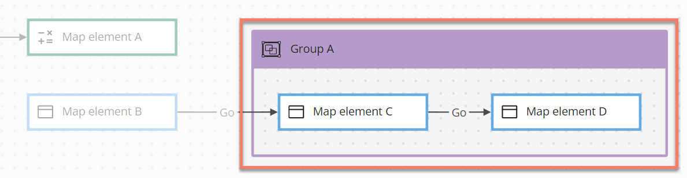
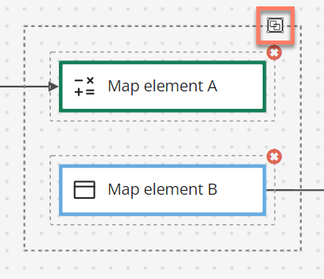
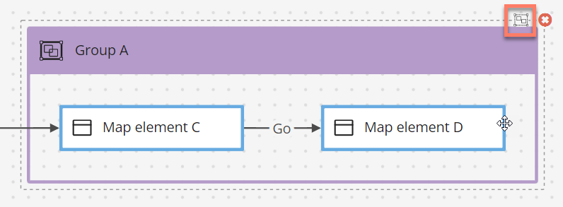

# Group elements 

<head>
  <meta name="guidename" content="Flow"/>
  <meta name="context" content="GUID-790eaab4-9dd6-4081-a199-9f2fe46a9302"/>
</head>

Group elements allow you to organize multiple elements on the flow canvas into a single group, which can then be moved and positioned as a single canvas element.

## Overview 

-   Grouping map elements allows you to move multiple connected map elements around the canvas as a single group, enabling easier positioning and layout of your flow elements.

-   Resize a group element by dragging the edges or corner of the group.

-   Map elements can be dragged into and out of a group as required.

-   To edit the group name, click on the name text and enter a new name for the group.

-   To delete a group, select the group and click the **Delete** icon. You are warned that permanently deleting the group will also delete the elements within the group, and you may wish to simply ungroup the map elements instead of deleting them with the group.

## Grouping map elements 

To group map elements on the canvas, either:

1.  Drag a group element onto the flow canvas where you would like to position the group.
2.  Enter a name for the group and click **Save**.
3.  The group element is added to the canvas. Add map elements into the group as required, by dragging and dropping them onto the group map element.

Or:

1.  Select multiple map elements on the canvas, and click the **Group** icon to group them together.
2.  The elements are added into a new group element, which can then be renamed and resized as required.

## Ungrouping map elements 

To ungroup map elements on the canvas:

1.  Select the group element, and click the **Ungroup** icon.

## Adding comments to a group element 

Comments can be added to a group element.

-   [Adding Comments to a map element](c-flo-Config_Comments_647ce9d6-5c9e-4e27-aa29-1a69732957a5.md)