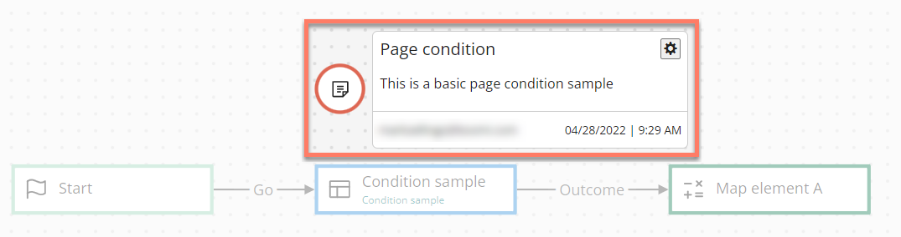

# Note map elements 

<head>
  <meta name="guidename" content="Flow"/>
  <meta name="context" content="GUID-aa993c3a-9c61-45a2-b392-c59aae58199d"/>
</head>

Note map elements allow you to add notes directly to the flow canvas, to provide information about the flow.

## Overview 

-   Only unformatted text content can be entered into a note map element.

-   Double-click on a note map element to hide/show the content of the note. The note content is shown by default.

-   Information about the note is shown as the bottom of the note, including which user added the note, and the date and time when the note was last updated.

-   To edit a note, either:

    -   Click on the note **Settings** icon and select **Edit**.

    -   Click directly on the note name text.

-   To delete a note, click on the note **Settings** icon and select **Delete**.

## Adding a note map element 

To add and configure a note map element:

1.  Drag a note map element onto the flow canvas where you would like to position the note.
2.  Enter a title for the note in the **New Note** text field.
3.  Enter the note content in the **Add Note** text area. Only unformatted text content can be added.
4.  Click **Save** to save the note onto the canvas.