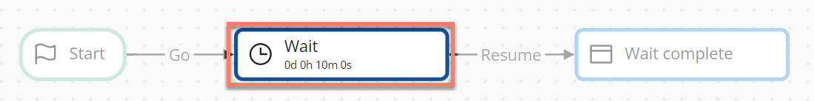
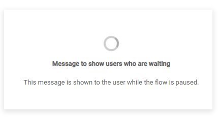

# Wait map elements 

<head>
  <meta name="guidename" content="Flow"/>
  <meta name="context" content="GUID-24d8b1a1-2f6e-4a55-821a-26c6928b2432"/>
</head>

Wait map elements are used to pause a running flow for a set amount of time.

## Overview 

When a user running a flow reaches a wait map element, the flow is paused, and a screen/message displayed to the user for the duration that is set in the wait map element. Once this time period has elapsed, the flow continues running, progressing to the next map element in the flow.

-   You can configure the message that you wish to display to the user while the flow is paused. The default loading spinner is used, unless you have defined a custom loading spinner in a custom player. See [customizing the load spinner](t-flo-Players_spinner_7343ec9c-c2d7-497e-bf8d-b1b4c36b2878.md).

    

-   You can add multiple wait map elements to a flow.

-   The wait time period can only be set between 5 seconds \(minimum\) to 120 days \(maximum\).

-   Users can close the flow browser session, and then resume the flow at a later time without affecting the wait time period.

-   Universal Time Coordinated \(UTC\) time is used as the default time zone for any date and time that you choose. If it is shown, you can select an alternative time zone to apply from the **Timezone** drop-down menu. Your current time zone is shown below this field.

    For example, if you set an Absolute Time wait to "10/10/2022 14:00" and select "UTC+0" from the **Timezone** drop-down menu:

    -   If your current time zone is UTC+0, the wait would complete at "14:00" on this date in your time zone.

    -   If your current time zone is UTC+1, the wait would complete at "15:00" on this date in your time zone \(that is, an hour later than UTC\). In this instance, you might want to select "UTC+1" from the **Timezone** drop-down menu.

    Select the appropriate setting that is most appropriate for the time zone that you require, such as the time zone that you and/or your flow users operate within.

## Adding a wait map element 

To add and configure a wait map element:

1.  Add a wait map element to the canvas.
2.  Configure the wait map element:

    **Name**: Enter a name for the wait map element. "Wait" is entered by default, and can be kept unless the name needs to be more detailed, for example if you have multiple wait map elements in the flow.

    **Wait Type**: Select how you wish to define the wait behaviour:

    -   Relative Time: Specify the wait time period in the **Days**, **Hours**, **Minutes**, and **Seconds** fields that are shown when you select this option. Multiple field units of time can be combined, for example 2 days and 4 hours.

    -   Relative Phrase: Specify the wait time period by entering a natural language phrase in the **Phrase** field that is shown when you select this option.

        Universal Time Coordinated \(UTC\) time is used as the default time zone for the time that you specify. Select an alternative time zone to apply from the **Timezone** drop-down menu if required.

    -   Absolute Time: Select a fixed date and time in the future in the **Point in time** fields. After this point in time, the wait is considered complete, and the flow continues.

        Universal Time Coordinated \(UTC\) time is used as the default time zone for the time that you specify. Select an alternative time zone to apply from the **Timezone** drop-down menu if required.

    -   Value: Select a value to use for defining the wait period.

        Universal Time Coordinated \(UTC\) time is used as the default time zone for the time that you specify. Select an alternative time zone to apply from the **Timezone** drop-down menu if required.

    **Message to show users who are waiting**: Enter and format the message that you wish to display to the user while the flow is paused. Click **Insert Value** to insert a value into the message.

3.  Click **Save**.

## Absolute Time 

Select a fixed date and time in the future. After this point in time, the wait is considered complete, and the flow will continue.

For example, you can set a wait map element to pause a flow until a specific time on a specific date. Once this date/time has been passed, the flow continues to the next map element.

If a flow is run that contains a wait map element with an absolute date/time value that has already passed, the flow will immediately continue past the wait map element without showing the wait message.

## Relative Time 

Specify the amount of time the flow should be paused for, relative to a specific point in time, in days, hours, minutes, and seconds.

This time is relative to the point in time at which the wait map element is executed.

For example, if you set a wait map element to pause a flow for 10 minutes, the 10 minute timer period begins from the moment that the user reaches the wait map element in the flow. After 10 minutes has passed, the flow continues to the next map element.

## Relative Phrase 

Specify the amount of time the flow should be paused for, relative to a specific point in time, using a natural language phrase.

This time is relative to the point in time at which the wait map element is executed. Phrases are not case-sensitive.

For example, if you specify "10 minutes from now", the flow will pause for 10 minutes from the moment that the user reaches the wait map element in the flow \("now"\). The duration must be specified as a numeric value, for example, "10" rather than "ten".

-   Relative phrases use Universal Time Coordinated \(UTC\) format, and not the time zone of the runtime user. For example, "next Monday" would pause a flow until the next Monday begins, at a nanosecond after midnight on Sunday.

-   A "day" unit of time is defined as 24 hours from a specific point in time. For example, if the wait map element is executed in a flow at 11:30:00 on May 16, 2022, a day from that point would be 11:30:00 on May 17, 2022.

-   A "week" unit of time is defined as 7 days from a specific point in time. For example, if the wait map element is executed in a flow at 11:30:00 on Monday, May 16, 2022, a week from that point would be 11:30:00 on Monday, May 23, 2022.

-   A "month" unit of time is defined as 1 month from a specific point in time. For example, if the wait map element is executed in a flow at 11:30:00 on May 16, 2022, a month from that point would be 11:30:00 on June 16, 2022.

    Note that if the following month has less days than the current month, it will adjust the duration to the nearest day in the following month if the current day does not exist in the next month. For example, if the wait map element is executed in a flow at 11:30:00 on May 31, 2022, a month from that point would instead be 11:30:00 on June 30, 2022, as June does not contain a 31st day. A month from June 30, 2022 would be July 30, 2022 however, as July does contain a 30th day.

The following relative phrase syntaxes are supported.

| Phrase syntax | Time unit(s) | Examples |
|:-------------:|:------------:|:--------:|
| [duration] [unit(s)] from now | <ul><li>second, seconds</li><li>minute, minutes</li><li>hour, hours</li><li>day, days</li><li>week, weeks</li><li>month, months</li></ul> | <ul><li>1 second from now</li><li>30 seconds from now</li><li>1 minute from now</li><li>10 minutes from now</li><li>1 hour from now</li><li>2 hours from now</li><li>1 week from now</li><li>3 weeks from now</li><li>1 month from now</li><li>3 months from now</li></ul> |
| [start/end] of the [unit] | <ul><li>day</li><li>week</li><li>month</li></ul> | <ul><li>start of the day</li><li>end of the day</li><li>start of the week</li><li>end of the week</li><li>start of the month</li><li>end of the month</li></ul> |
| in [duration] [unit(s)] | <ul><li>second, seconds</li><li>minute, minutes</li><li>hour, hours</li><li>day, days</li><li>week, weeks</li><li>month, months</li></ul> | <ul><li>in 1 second</li><li>in 30 seconds</li><li>in 1 minute</li><li>in 10 minutes</li><li>in 1 hour</li><li>in 2 hours</li><li>in 1 week</li><li>in 3 weeks</li><li>in 1 month</li><li>in 3 months</li></ul> |
| next (unit) | day of the week | <ul><li>next Monday</li><li>next Wednesday</li><li>next Saturday</li></ul> |

## Value 

Select a value that is used to define the amount of time the flow should be paused for.

The following types of value are supported:

|Value Content Kind|Description|
|:-----------------|:----------|
|Date|Similar to the Absolute Time option, select a fixed date and time in the future. After this point in time, the wait is considered complete, and the flow will continue.|
|Number|Specify the number of seconds that the flow should wait for, before continuing.|
|String|Specify the amount of time the flow should be paused for, relative to a specific point in time, using a natural language phrase. Supported relative phrase syntaxes are detailed in the Relative Phrase section above.|

## Adding an outcome 

Outcomes can be added to a wait map element.

-   [Adding Outcomes to a map element](c-flo-Config_Outcomes_d524e869-12d3-4f1f-b671-84872998773f.md)

## Adding comments to a map element 

Comments can be added to a wait map element.

-   [Adding Comments to a map element](c-flo-Config_Comments_647ce9d6-5c9e-4e27-aa29-1a69732957a5.md)