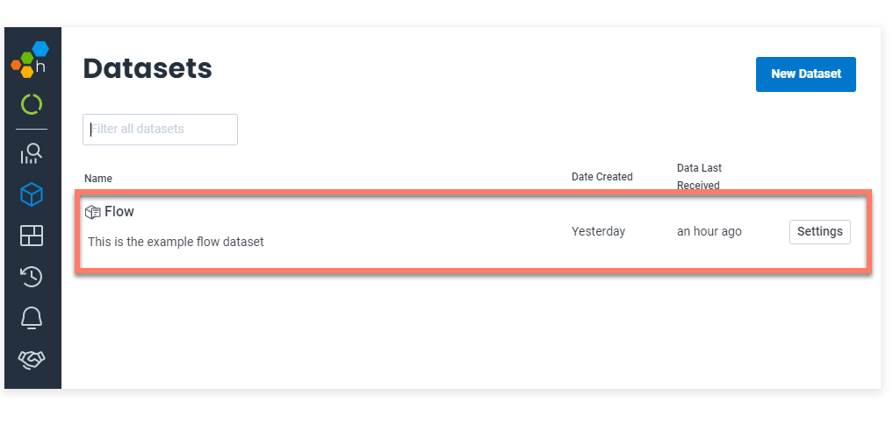
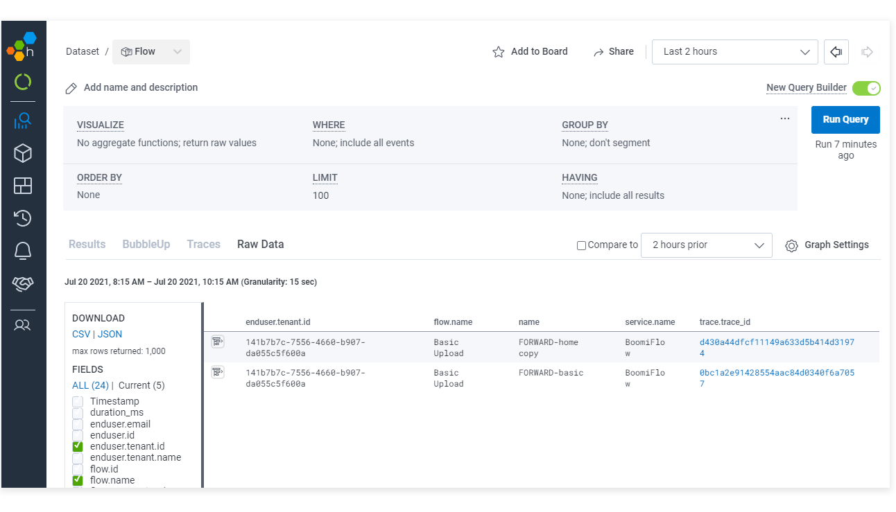

# Sending observability data directly to an APM system

<head>
  <meta name="guidename" content="Flow"/>
  <meta name="context" content="GUID-4e75f3bd-9caa-4a4a-ac12-5d94b1a7dff2"/>
</head>

Flow observability can be configured to send data directly to an APM system that supports direct OTLP ingestion.

## About this worked example

This worked example illustrates the steps involved in sending observability data directly to an APM system that supports direct OTLP ingestion. [Honeycomb](https://www.honeycomb.io/) is used as the APM vendor in this example, although your Organization may use a different APM system.

## Setting up the APM system \(Honeycomb\)

The Honeycomb APM system is set up and configured as follows:

-   A Honeycomb account is created and signed into.

-   The Honeycomb account API key is copied as this will be required when adding an OTLP Header in .

## Setting up observability in Flow

Once the Honeycomb APM system is set up and ready to receive data, observability can be enabled in a tenant.

1.  Sign in to as an Administrator.
2.  Navigate to the **Observability** section on the **Tenant** page.
3.  **OTLP endpoint**: In this example, the Honeycomb endpoint is entered as the OpenTelemetry Protocol \(OTLP\) endpoint to which tenant flow\(s\) data should be sent:
    -   *https://api.honeycomb.io:443*

4.  **OTLP headers**: In this example, optional headers are sent with the data, including the API key authentication credentials copied when setting up Honeycomb, and the name of the dataset to create in Honeycomb.
    -   *x-honeycomb-team=fe78e7f56b941c2f6ec67ae112ff64fg,x-honeycomb-dataset=Flow*

5.  **Save Settings** is clicked to apply the setting, enabling observability data for the tenant to be sent to Honeycomb.

## Viewing flow runtime data in Honeycomb

In this example, a few flows are run and interacted with, in order to check that Honeycomb is receiving flow runtime data.

The '*Flow*' dataset has been created in Honeycomb, which verifies that data is being received:

This dataset can then be queried to view runtime observability data for flows in the tenant:

