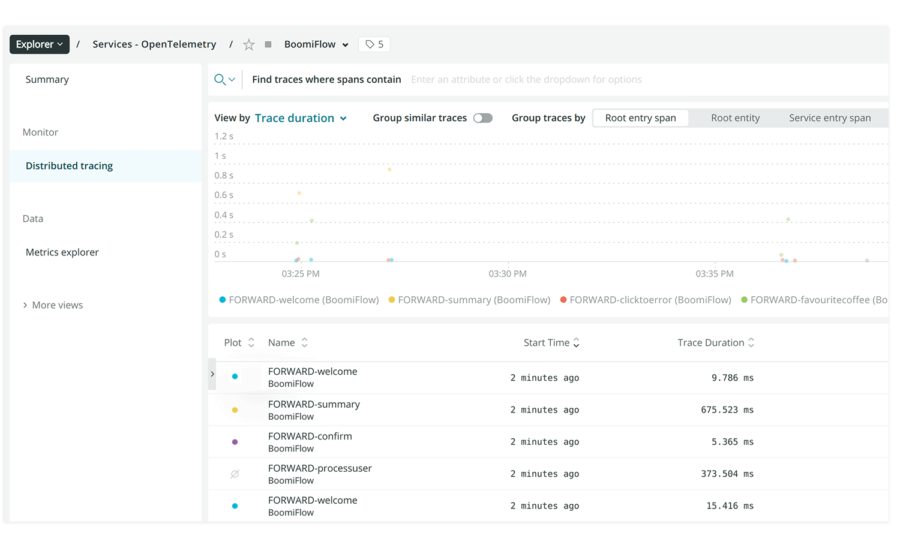

# Sending observability data to an OpenTelemetry collector

<head>
  <meta name="guidename" content="Flow"/>
  <meta name="context" content="GUID-8b3010e3-51b1-43b5-8b09-9575e59610b0"/>
</head>


Flow observability can be configured to send data to an APM system through an OpenTelemetry collector.

## About this worked example

This worked example illustrates the steps involved in sending observability data to an APM system, using an OpenTelemetry Collector managed by your Organization. [New Relic](https://newrelic.com/) is used as the APM vendor in this example, although your Organization may use a different APM system.

## Setting up the APM system \(New Relic\)

The New Relic APM system is set up and configured as follows:

-   A New Relic account is created and signed into.

-   The New Relic account API key is copied as this will be required when setting up the collector.


## Setting up the OpenTelemetry collector

An OpenTelemetry collector is set up to pass flows runtime data through to New Relic.

In this worked example, a basic collector is set up on a secure web server, using a Docker implementation incorporating two YAML files within a folder:

-   A docker-compose.yml file that runs the collector:

    ```
    otel-collector:
        image: otel/opentelemetry-collector-contrib
        command: ["--config=/etc/otel-collector-config.yml"]
        volumes:
          - ./otel-collector-config.yml:/etc/otel-collector-config.yaml
        ports:
          - 4317:4317
    ```

-   An otel-collector-config.yml file that configures the collector/APM vendor settings:

    ```
    receivers:
      otlp:
        protocols:
          grpc:
    exporters:
      newrelic:
        apikey: <New Relic API key>
        timeout: 30s
    processors:
      batch:
        timeout: 20s
    service:
      extensions: [health_check]
      pipelines:
        traces:
          receivers: [otlp]
          processors: [batch]
          exporters: [newrelic]
    ```

    The account API key for the New Relic account replaces the `<New Relic API key>` value.


When the Docker Compose file is run on the web server, the collector begins monitoring data from running flows in the tenant, passing the OpenTelemetry data through to New Relic.

This worked example illustrates a basic Docker collector implementation that may not meet the needs of your Organization. To learn more about setting up an OpenTelemetry collector, see the OpenTelemetry documentation:

-   [OpenTelemetry collector](https://opentelemetry.io/docs/collector/)

-   [Building a custom authenticator](https://opentelemetry.io/docs/collector/custom-auth/)


## Setting up observability in Flow

Now that the collector is set up and ready to receive data from , observability can be enabled in the tenant.

1.  Sign in to as an Administrator.
2.  Navigate to the **Observability** section on the **Tenant** page.
3.  **OTLP endpoint**: In this example, the URL endpoint of the collector is entered, as the endpoint to which tenant flow\(s\) data should be sent. For example:
    -   https://web server collector:port

4.  **OTLP headers**: In this example, no optional headers are sent with the data, as the API key is referenced in the Docker configuration file.
5.  **Save Settings** is clicked to apply the setting, enabling observability for the tenant, sending flow runtime data to New Relic.

## Viewing flow runtime data in New Relic

In this example, a few flows are run and interacted with, in order to check that New Relic is receiving flow runtime data correctly from the collector and .

