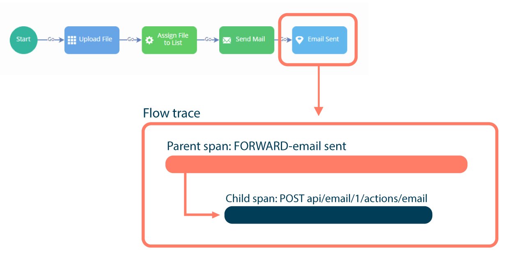

# Understanding Flow observability data

<head>
  <meta name="guidename" content="Flow"/>
  <meta name="context" content="GUID-202a04d0-c3ce-42fb-b18f-909c95c87ed4"/>
</head>

Flow observability data follows the OpenTelemetry standard, which is built around the 'trace' data concept.

-   A trace records the details of a particular action in an application. In Flow, a trace describes each runtime invocation performed by a user, such as clicking a button to move to a new outcome/map element for example.

-   Traces contain 'span' elements, objects representing the work being done by individual or components in a request. In Flow, each trace always contains a top-level span that describes the action itself.

-   Child spans may also be incuded within a span, representing actions that occured within the execution of the parent span, such as calls to external for example.

-   Each span has a set of standard OpenTelemetry fields, such as "timestamp", "duration", "name", and "status code" for example.

-   In addition to these standard OpenTelemetry fields, a collection of specific "tags" are included in the data. These provide more detailed information about the action that are particularly relevant to , such as a map element name, the selected outcome ID, the name of the flow, the flow tenant, details about the user, the URL and call success, the status code, and if any faults occurred. This is typically shown in a tags section by an APM vendor, but may be presented differently in different APM vendors.

:::note

Some APM vendors may not fully align with the standard terminology used by the OpenTelemetry standard in . Data from flow runtime execution is inserted into OpenTelemetry datasets and passed to the APM backend, either directly \(if supported\) or via the OpenTelemetry Collector; how these values are interpreted and presented in each APM's vizualization tool may vary. Typically, an APM will present a list of traces for the supplied date range, and offer users the ability to drill into an individual trace to see child spans \(i.e. calls\) and their duration/status.

:::

## Standard OpenTelemetry data

The following standard OpenTelemetry fields are included in the observability dataset.

|Field name|Description|
|----------|-----------|
|duration\_ms|How much time a span took, in milliseconds.|
|enduser.email|The email of the runtime user that recorded the flow action.|
|enduser.id|The runtime user that recorded the flow action. If no runtime user information is captured by the flow \(as it is a public flow\), this is set as "Public User".|
|enduser.tenant.id|The ID of the tenant that the flow belongs to.|
|enduser.tenant.name|The name of the tenant that the flow belongs to.|
|library.name|The source name for the data, i.e. .|
|name|The type of flow request, followed by the map element name. For example, `FORWARD-welcome` indicates that a user moved forward in a flow to a map element named "welcome".|
|net.peer.ip|The remote IP address of the peer, i.e. the IP address for the user that ran the flow.|
|service.instance.id|The ID of the that was used to perform the flow action.|
|service.name|The name of the that was used to perform the flow action.|
|status\_code|The standard HTTP response status code returned for the flow request.|
|timestamp|When the flow action occurred, given as a full date and time.|
|trace.span\_id|The unique ID of a span.|
|trace.trace\_id|The ID of the trace that a span belongs to.|
|type|The OpenTelemetry request type.|

## Flow tag data

The following metadata is also available as tags within a span.

|Tag name|Description|
|--------|-----------|
|flow.name|The name of the flow that the action was recorded in.|
|flow.request.invokeType|The type of action that was recorded, such as a progression `FORWARD` from a map element.|
|flow.request.selectedOutcomeId|The ID of the outcome selected in the flow.|
|flow.request.state.id|The flow state ID. See [Flow states](c-flo-Flows_Flow_States_32129a7c-a51a-4566-a406-3a66906818c6.md).|
|flow.response.hasRootFaults|Whether any root faults were recorded as a result of the action within the flow. If root faults were recorded, this is set to "True", with details of the root fault populated in the `flow.response.firstRootFault` tag.|
|flow.response.firstRootFault|If root faults were recorded, full details of the fault are populated in this tag, such as the error message, status code and URI.|
|flow.response.mapElement|The name of the map element that the user progressed to in the flow.|
|flow.response.statusCode|The internal response status code returned for the flow request. Note that this is different to the `status_code` field. For example, if a runtime user was unauthenticated, this tag would show a 401 status \(indicating an unsuccessful authentication request\), even though the `status_code` field would show a 200 successful request status.|
|flow.version|The version of the flow that the action was recorded in.|