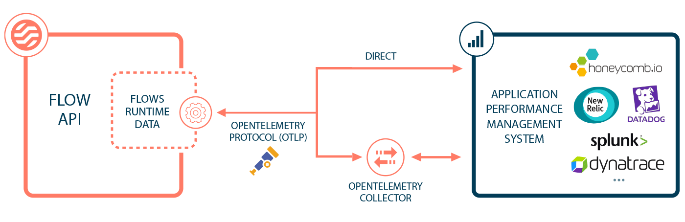

# Observability

<head>
  <meta name="guidename" content="Flow"/>
  <meta name="context" content="GUID-e3ebeb63-f184-4c13-88a5-e20b9115ae10"/>
</head>

Flow allows you to send observability data to an OpenTelemetry Protocol \(OTLP\) endpoint, allowing you to troubleshoot, debug, and manage flow runtime performance.

Flow runtime data is exported using the OpenTelemetry standard. This vendor-agnostic standard allows you to work with your telemetry data in the application and system of your choice.

Observability data can be sent to an application performance monitoring \(APM\) system, by either:

-   Sending data directly to an APM system that supports direct OTLP ingestion, such as [Honeycomb](https://www.honeycomb.io/) for example.

-   Sending data to an OpenTelemetry collector managed by your Organization, that passes the data through to an APM system. Some APM systems require a collector, as they do not support direct OTLP ingestion.

## Setting up observability

A tenant administrator can enable and configure observability for a tenant on the **Tenant** page.

-   [Configuring observability in a tenant](flo-Observability_configuration_0b36d4b4-5f27-49d2-b9e2-487954d6df5b.md)

Observability configuration requires the OpenTelemetry Protocol \(OTLP\) endpoint to which data should be sent, such as the APM system or the collector.

Worked examples are provided to iilustrate how to pass data directly to an APM, or through a collector:

-   [Sending observability data directly to an APM system](flo-Observability_APM_4e75f3bd-9caa-4a4a-ac12-5d94b1a7dff2.md)

-   [Sending observability data to an OpenTelemetry collector](flo-Observability_Collector_8b3010e3-51b1-43b5-8b09-9575e59610b0.md)

Observability data can also be exported for runtime environments:

-   [Observability for Multi-cloud runtime environments](flo-Observability_MC_133943ce-340c-4be1-a401-2f8a3e3741e9.md)

## Understanding observability data

observability data follows the OpenTelemetry standard, which is built around the 'trace' data concept.

-   [Understanding observability data](flo-Observability_Understanding_Data_202a04d0-c3ce-42fb-b18f-909c95c87ed4.md)

## OpenTelemetry documentation

Learn more about the OpenTelemetry standard and collectors in the documentation:

-   [What is OpenTelemetry?](https://opentelemetry.io/docs/concepts/what-is-opentelemetry/)

-   [OpenTelemetry Collectors](https://opentelemetry.io/docs/collector/)

-   [Vendors Supporting OpenTelemetry](https://opentelemetry.io/vendors/)