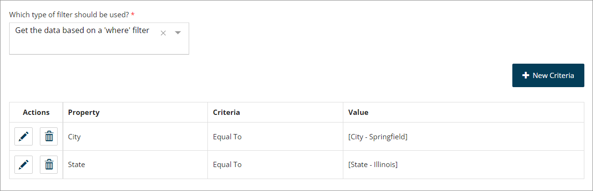

# x-flow-query

<head>
  <meta name="guidename" content="Flow"/>
  <meta name="context" content="GUID-3cb63493-0327-4fe1-ab55-774b5ad9f4fc"/>
</head>


This extension allows you to perform load \(query\) operations using your OpenAPI document.

## Example

```
1  x-flow-query:
2    path: /browse/new-releases
3    operation: get
4    parameters:
5      country: country
6      limit: limit
7      offset: offset
8      format:
9        default: json
```

## Properties

|Property|Description|
|--------|-----------|
|path|The path representing the relative endpoint called to perform the load operation.|
|operation|The HTTP method used to make the request.|
|parameters|The parameters included in the request. In this example, there are multiple properties which will be mapped if they are passed to the connector using the `listFilter` options.|
|default|Provide a value to apply when making a call to the API, instead of setting this parameter during the execution of a flow.|
|where|Allows you to map data from list filters passed from into calls to an API.For example:

 ```
20        x-flow-query:
21            path: /getweather
22            operation: get
23            parameters:
24                where: 
25                    City: city
26                    State: state
```

 The left side is the name of the property on the object returned by the API, the right side is the name of the parameter of the endpoint the request is sent to.

In the following example there is an object `GetWeatherResponse` with a `City` property. Using a database load map element, a `where` filter is added, that defines what the `city` parameter is set to.

 ```
1 /getweather:
2    get:
3      description: Use city and state to retrieve current US weather information.
4      operationId: getweather
5      parameters:
6        - description: City for weather information
7          in: query
8          name: city
9          required: true
10          schema:
11            type: string
12        - description: State for weather information
13          in: query
14          name: state
15          required: true
16          schema:
17            type: string
18....
19....
20        x-flow-query:
21            path: /getweather
22            operation: get
23            parameters:
24                where: 
25                    City: city
26                    State: state
```

 

In this example the `City` parameter is set to be equal to a value in named "City - Springfield", that contains the value `Springfield`.

You can also set this value dynamically, using an input that accepts user input, binding the value to the data typed into the input, and then performing this load operation using the data contained within that value.

|