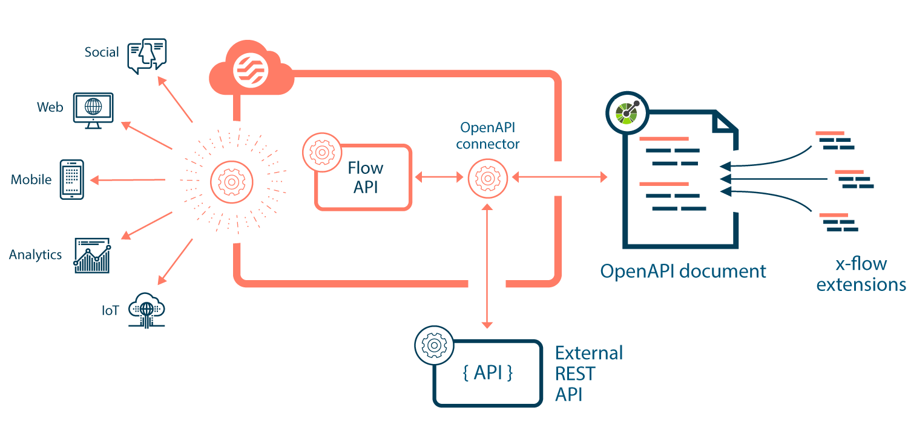

# OpenAPI connector

<head>
  <meta name="guidename" content="Flow"/>
  <meta name="context" content="GUID-2a6165ad-9e9d-4bd5-a185-85ccbe811ba3"/>
</head>

The OpenAPI connector allows you to connect to, and perform actions and operations on RESTful APIs.

## Overview

The OpenAPI connector requires a YAML formatted OpenAPI specification document, that enables to communicate and integrate with your chosen API.

You can add [x-flow](/docs/Atomsphere/Flow/topics/flo-OpenAPI-connector-extensions_a6b9ffd3-cfb6-4423-ad3c-b3209b2f5a80.md) extensions to this document schema, to provide hints for the endpoints that provide create, update, and delete \(CRUD\) operations, mapping the data format for API requests/responses between the API and .

## Prerequisites

The OpenAPI connector requires the following:

-   An OpenAPI document adhering to version 3.0 and greater of the [OpenAPI specification](https://www.openapis.org/).

Using the OpenAPI connector requires the following:

-   Basic knowledge of RESTful APIs.

-   Basic knowledge of the OpenAPI specification API description format for RESTful APIs.

-   Basic knowledge of working with OpenAPI documents using [YAML](https://yaml.org/).

To build flows and connect to your OpenAPI document, you should also have a good understanding of and experience with the following concepts and features:

-   Installing/configuring connectors.

-   Building flows and using database load, database save, and database delete map elements to interact with a data source/connector.

The following known limitations affect the OpenAPI connector.

-   [OpenAPI connector known limitations](/docs/Atomsphere/Flow/topics/flo-OpenAPI-connector-limitations_0a454470-5cf2-4702-9a6b-c0cca53afb19.md)

## Getting started with the OpenAPI connector

The typical steps involved in using the OpenAPI connector are as follows:

1.  Create/download a YAML formatted OpenAPI specification document for the RESTful API that you wish to connect to. Most APIs provide a sample OpenAPI document that can be used as an initial template.

    The OpenAPI document and schema defines how the connector can integrate with your chosen API. The connector uses the document specification to understand how to interact with the API.

    -   [Setting up your OpenAPI document](/docs/Atomsphere/Flow/topics/flo-OpenAPI-connector-document_34619894-c8c6-4ea2-8218-0b8fde37b450.md)

2.  Modify the OpenAPI document as required, for example by adding extensions to integrate operations with the API.

    -   [OpenAPI document specification extensions](/docs/Atomsphere/Flow/topics/flo-OpenAPI-connector-extensions_a6b9ffd3-cfb6-4423-ad3c-b3209b2f5a80.md)

3.  Host the OpenAPI document, for the connector to use when communicating with the API.

4.  Install the OpenAPI connector in your tenant, defining configuration values as required, such as the location \(URL\) of your hosted OpenAPI document.

    -   [Installing the OpenAPI connector](/docs/Atomsphere/Flow/topics/flo-OpenAPI-connector-installing_a97ebe57-1766-4e13-aa61-d4a03bc49714.md)

    -   [OpenAPI connector configuration values](/docs/Atomsphere/Flow/topics/flo-OpenAPI-connector-configuration_ef57ce5b-71ef-410e-848f-a1403d5f630b.md)

5.  Build your flow, using the OpenAPI connector to integrate with the API as required, for example by using database save, load, and delete map elements to perform CRUD operations on the API data source.

## Response examples

Response examples can be added to parameters, properties and objects in your OpenAPI document schema so that responses can be obtained with the connector that are based on examples in the document schema, without actually having to retrieve response data from an external API.

-   [OpenAPI connector response examples](/docs/Atomsphere/Flow/topics/flo-OpenAPI-connector-response-examples_760f2342-bea4-4779-b25b-f663971ce586.md)

## Worked example

See the Boomiverse article [Getting started with the OpenAPI Connector in Boomi Flow](https://community.boomi.com/s/article/Getting-started-with-the-OpenAPI-Connector-in-Boomi-Flow) for a worked example of how to use the OpenAPI Connector to connect to a public API.

## Connector URL

The OpenAPI connector endpoint URL is:

- `1flow://openapi`