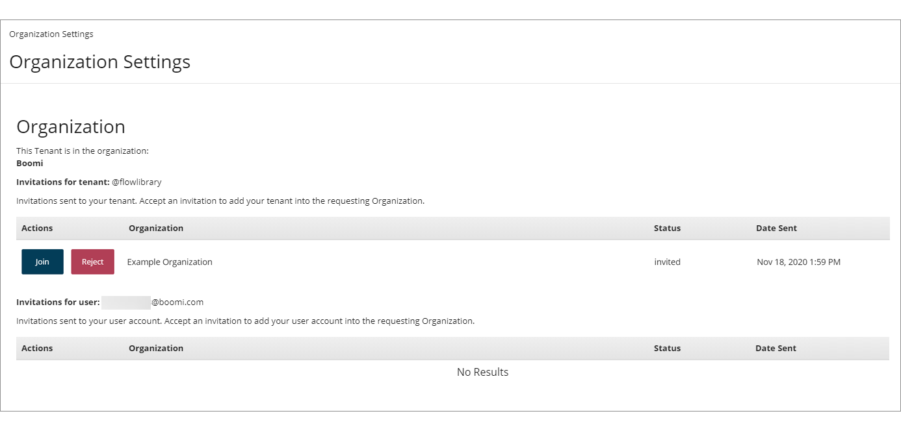

# Organization Settings page

<head>
  <meta name="guidename" content="Flow"/>
  <meta name="context" content="GUID-5d231fef-6306-42be-83b1-606ea13293df"/>
</head>

The **Organization Settings** page allows users to view details of the Organization that they belong to, and manage any outstanding Organization invitations they have been sent.

## Opening the page

-   Select **Organizations** from the top [Settings menu](c-flo-Settings_menu_12a0188d-00cb-4039-97bd-11f89e83f3ca.md).

## Page Overview

If you are signed in as a standard Organization user \(i.e. not as an Organization Administrator\), the **Organization Settings** page displays details of the current Organization that your tenant belongs to, and any outstanding tenant/user invitations and associated actions.

:::note

If you are signed in as an Organization Administrator, this page presents a different set of options. See [Organization Settings page for Organization Administrators](flo-Organizations_Page_Administrators_8c6caca0-abab-41b2-8469-3f07ecd02ec6.md).

:::

## Tenant invitations

Any invitation requests to join an Organization are displayed in the **Invitations for Tenant** and **Invitations for user** tables.

**Invitations for tenant**: Provides details of any invitations that have been sent to your tenant. Accepting an invitation will add your tenant into the requesting Organization.

**Invitations for user**: Provides details of any invitations that have been sent to your user account. Accepting an invitation will add your user account as an Organization Administrator into the requesting Organization.

-   **Actions**: This column allows you to manually perform actions for each invitation:

    -   Click **Join** to accept the invitation and join the Organization.

    -   Click **Reject** to reject the invitation if you do not wish to join the Organization.

-   **Organization**: The name of the Organization that the invitation has come from.

-   **Status**: The current status of the invitation:

    -   **invited**: The invitation email has been sent, but you have not yet accepted the request.

    -   **rejected**: The invitation was rejected.

-   **Date Sent**: The date that the invitation was sent by the Organization.