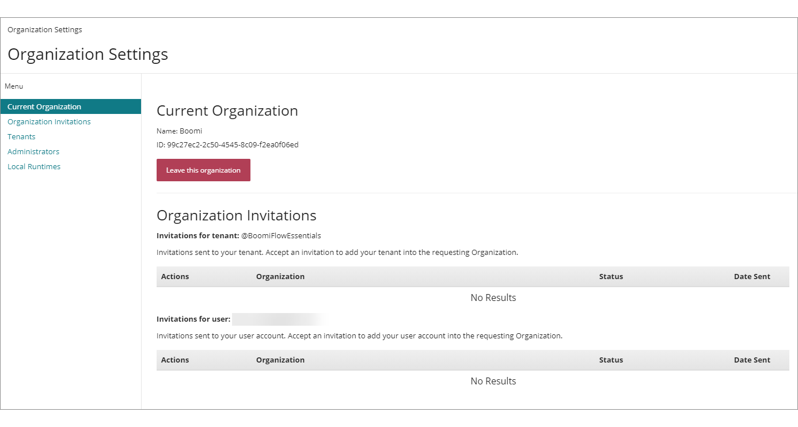

# Organizations

<head>
  <meta name="guidename" content="Flow"/>
  <meta name="context" content="GUID-bd4d88aa-6da0-471a-b0bb-4ac481804747"/>
</head>

Organizations are set up to allow centralized management of your tenants.

An Organization is linked to your licence. Administrators can create and provision new tenants, users, local runtimes, and invite existing tenants and users to join the Organization.

Organizations are managed and administered on the **Organization Settings** page.

The options available on this page depends on the type of user that is signed in:

-   Standard users can view details of the Organization that they belong to, and manage any outstanding Organization invitations they have been sent. See [Organization Settings page](flo-Organizations_Page_5d231fef-6306-42be-83b1-606ea13293df.md).

-   Organization Administrators have additional options available to them for managing an Organization, such as viewing and administering the tenants, users and local runtime connections within the Organization. See [Organization Settings page for Organization Administrators](flo-Organizations_Page_Administrators_8c6caca0-abab-41b2-8469-3f07ecd02ec6.md).

-   To join an Organization you must first accept an invitation request. See [Joining an Organization](flo-Organizations_Joining_Organizations_e0bf8f6d-9d07-49ae-8496-302a2926d4d2.md).

## Managing an Organization

Organization Administrators can manage tenants within the Organization, by:

-   Inviting an existing tenant to join an Organization. See [Adding tenants to an Organization](flo-Organizations_Adding_Tenants_af7f41a8-a5f4-497f-ab5d-a3f14b4e005d.md).

-   Provisioning/creating new tenants within an Organization. See [Creating a new tenant within an Organization](flo-Organizations_Provisioning_Tenants_2b461501-301f-40a7-80e5-d6c54e5eb546.md).

-   Removing tenants from an Organization. See [Removing tenants from an Organization](flo-Organizations_Removing_Tenants_114becc7-aabe-4e06-8528-70b5d6dce067.md).

Organization Administrators can manage Administrator user accounts within the Organization, by:

-   Inviting an existing user to become an Organization Administrator. See [Adding Administrators to an Organization](flo-Organizations_Adding_Administrators_9aaffe3f-1345-45b0-9f46-0354565074ee.md).

-   Removing Administrators from an Organization. See [Removing Administrators from an Organization](flo-Organizations_Removing_Users_30c052ed-ad1f-473c-a444-a8109f443829.md).

-   Removing themselves as an Administrator from an Organization. See [Leaving an Organization](flo-Organizations_Leaving_Organizations_ebcf4141-c761-4aba-a21b-5d2ac2cd0932.md).

Organization Administrators can manage local runtime connections within the Organization, by:

-   Creating local runtime connections to local runtime environments. See creating a local runtime connection in Boomi Flow.