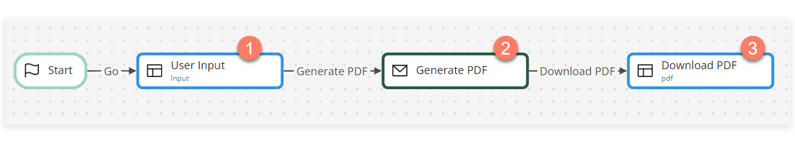
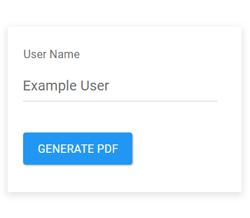
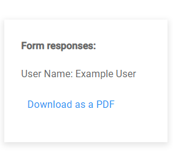
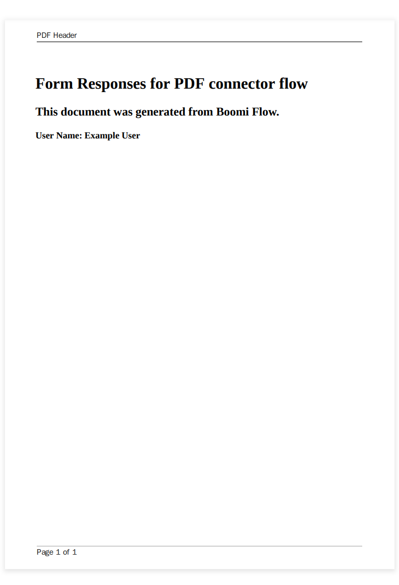

# Creating a PDF from HTML 

<head>
  <meta name="guidename" content="Flow"/>
  <meta name="context" content="GUID-24910d26-017f-4f56-b936-dc18526a01ee"/>
</head>

This worked example shows how the PDF connector can be used to create a PDF from HTML, which can then be downloaded by users in a flow.

## Before you begin

Before using this worked example, ensure that you are familiar with the following concepts and procedures:

-   Installing the PDF connector. See [PDF connector](flo-PDF_Connector_7ac7f936-2b7f-4419-90b5-4997672faf20.md).

-   Creating new flows. See [Creating a new flow](c-flo-Flows_Creating_a_new_flow_6745110f-738e-4a54-bf5e-c565e4c412a9.md).

-   Setting up flows using map elements on the flow canvas, and running/publishing flows. See [Building and publishing flows](/docs/Atomsphere/Flow/topics/c-flo-Building_and_Publishing_Flows_3dba9a15-316f-4134-9093-d4811ea7d14f.md).

-   Setting up message actions. See [PDF connector message actions](flo-PDF_Connector_Inputs_b94ecffb-337f-4778-b56d-cd2fc7ba5638.md) and [Adding Message Actions to a map element](/docs/Atomsphere/Flow/topics/c-flo-Config_Message_Outcomes_81616add-ed70-45c7-a844-3e98f14844e2.md).

In addition, you should ensure that you are familiar with:

-   Creating HTML content, including correct formatting and use of CSS styling.

## About this worked example 

This worked example is provided for illustration purposes only, to demonstrate the example steps and settings involved in using the PDF connector to create a PDF from HTML, and then provide the download link for flow users.

## Installing the PDF connector

The PDF connector is first installed to allow a PDF to be generated from HTML and referenced as an object value. In this example, a PDF is created to show the user responses recorded in a simple flow form.

-   [PDF connector](/docs/Atomsphere/Flow/topics/flo-PDF_Connector_7ac7f936-2b7f-4419-90b5-4997672faf20.md)

## Setting up the flow

Once the PDF connector is installed, a new flow is created and named "PDF Example".

To use the PDF connector in the new flow, it is imported into the flow as a shared element. Shared elements are 'global' tenant elements that can be shared and re-used across multiple flows within a tenant. See [ Shared Elements](c-flo-Shared_Elements_85425302-deb7-4f96-aedd-be797a3224e5.md).

In this example, the simple flow consists of 3 map elements:

-   A User Input page map element presenting a simple input form that requires the user to enter their name. 

-   A Generate PDF message map element that connects to the PDF connector and generates a PDF using the user input. 

-   A Download PDF page map element that shows the user response and provides a link to download the PDF. 

**User Input**: On this page a single input component stores the user name in an **Employee\_Name** string value. This value can then be included in the PDF HTML.

**Generate PDF**: This message map element has the ["Convert html to pdf" message action](flo-PDF_Connector_Inputs_b94ecffb-337f-4778-b56d-cd2fc7ba5638.md) set up to generate a PDF using the following message action inputs/outputs:

| Input/Output | Content                                                      |
| :----------- | :----------------------------------------------------------- |
| Filename     | `Form responses for {![Employee_Name]}`                      |
| Html         | `<html> <head>  </head> <body>  <h1>Form Responses for PDF connector flow</h1> <h2>This document was generated from Boomi Flow.</h2> <h3>User Name: {![Employee_Name]}</h3>  </body> </html>`|
| Header       | `
 PDF Header
` |
| Footer       | `
 Page  of  
` |
| Pdf file     | A "PDF" `$file` object value is created to reference the generated PDF file.|
:::note

You must change the type of the HTML Value to *String* as it defaults to the *Content* type which will convert any code to text.

:::
**Download PDF**: On this page a PDF component is configured to provide a download link to the "PDF" `$file` object value.

## Running the flow and generating the PDF

When the flow is run:

-   The user is presented with a page that allows them to enter their user name, and then click a button to generate the PDF.

    

-   Once the user has clicked the button, the flow progresses to the message map element which then generates the "Form responses for Example User.pdf" file. After this, the flow presents the user with a page that allows them to view their form response and click a link to download the PDF.

    

-   When the user clicks the link, the PDF is downloaded and displayed.

    