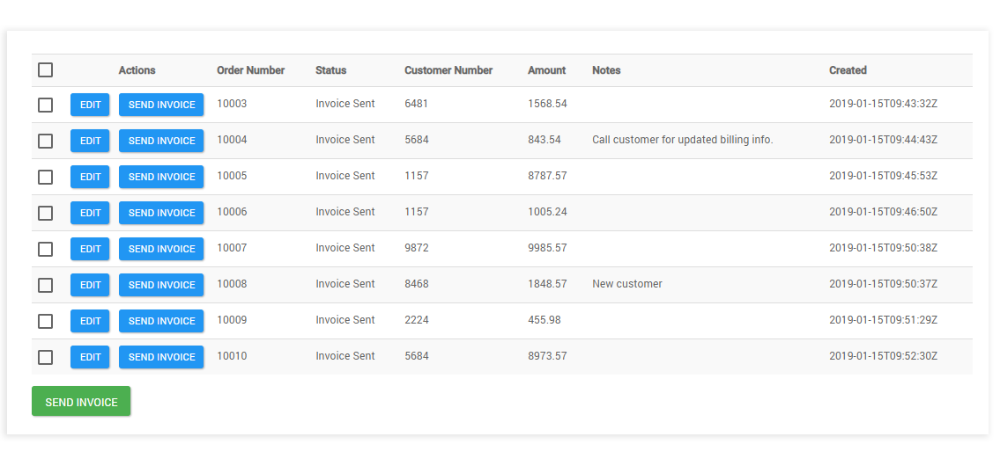

# SQL connector

<head>
  <meta name="guidename" content="Flow"/>
  <meta name="context" content="GUID-02134721-0243-4af6-a8ed-86a49f6ba710"/>
</head>


You can use the SQL connector to connect to and integrate with a SQL database.

## Overview

The SQL connector allows you to load, save, and delete data from a SQL database within a flow.

For example, you can integrate an existing database with a flow to allow users to view and interact with the database table data.

The SQL connector supports the following SQL database types:

-   MySQL

-   PostgreSQL

-   SQL Server


During connector installation your database metadata is read, and each table and database view is mapped to a flow type.

**Views**: You can read data from a database view type in a flow, but you cannot write to or delete data from a database using a database view type.

**Tables**: You can use a database load map element in your flow to read and display rows from the database tables, and the database save and database delete map elements to modify rows in the tables.

For example, you can load rows from a database table into a flow page to present data, allow users to edit the row data, and then save their changes back to the database.



## Installing the SQL connector

1.  Select **Connectors** from the main left-hand menu.
2.  Click **New Connector** to open the **New Connector** page.
3.  Select the 'SQL' connector from the **Connector Type** drop-down menu.
4.  Enter a name for the connector in the **Name** field, such as 'SQL Connector' for example. The SQL connector URL is shown in the **Url** field.
5.  Click **Retrieve Connector Configuration Data** to open the **Configure Connector** page.
6.  Enter the required configuration values. See [SQL connector configuration values](flo-SQL-Connector-Values_052b58f6-aa55-4da2-b815-9d14e028c9d1.md) for details on the values required for this connector.
7.  Click **Install**.
8.  On the **Edit Connector** page, click **Save Connector**.
9.  The SQL connector is now installed, and can be imported as a shared element into your tenant\(s\).

## Connector URL

The SQL connector endpoint URL is:

-   flow://sql

## Known limitations

-   The SQL connector requires a table to have a Primary Key and AutoIncrement defined. Only standard tables with primary keys are supported by the connector. If a database is used where the primary key is not supported, in views the connector will use all the columns in the table as a primary key.

-   You can read data from a database view type in a flow, but you cannot write to or delete data from a database using a database view type.

-   There is a limit of 1000 returned rows for each database query; if a query load is requested with a size bigger than this, the max supported size will be used. The maximum number of elements that can be executed in a row without a break \(such as a step or page\) is 1000.

-   There is a 100 second maximum duration for connector invoker calls. After this duration, the connector invoker call is cancelled.

-   The MONEY type is not supported when using the SQL connector with an SQL Server database type.

-   Although a large variety of data types are supported, if the data type is not supported then the column will be ignored; if the column is not null in the table you will not be able to insert or save in the flow. See [Supported SQL data types](flo-SQL-Connector-Data-Types_59e3c5d4-1358-4569-986f-052a16e9fb35.md).

-   When applying filters to date/time value columns in custom components, the value supplied must use the ISO-8601 extended offset date-time format in order for the connector to correctly parse the value. For example:

    ```
    2011-12-03T10:15:30+01:00
    ```

    To learn more about this date/time format, see the [ISO\_OFFSET\_DATE\_TIME](https://docs.oracle.com/javase/8/docs/api/java/time/format/DateTimeFormatter.html#ISO_OFFSET_DATE_TIME) API specification. See [Formatting date and time values](c-flo-Date_Time_in_Flow_967f3878-c123-4466-9f9f-dffb94c4f3b1.md) to learn more about formatting date/time values in .


## Features

The SQL connector forms part of the following features within :

-   **Database:** This feature allows you to connect to a remote data source and perform save, load and delete operations.