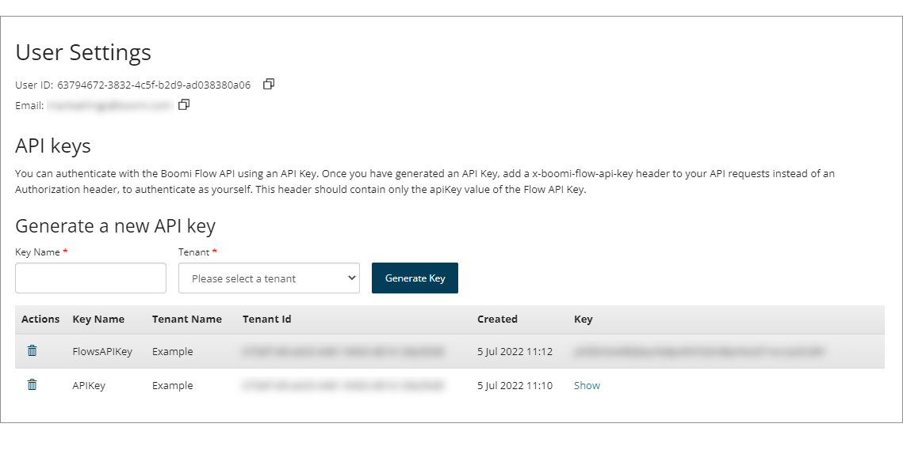

# User settings

<head>
  <meta name="guidename" content="Flow"/>
  <meta name="context" content="GUID-a75df92d-0c13-4468-a57f-4ea66101ccd8"/>
</head>

The **User Settings** page allows you to manage your user account settings, such as API keys.

## Opening the page

-   Click the **User Settings** icon on the top platform menu bar.

## Page overview

The **User Settings** page displays configurable settings for your unique user account.

-   User settings are associated with your unique user account, and apart from API keys, are not specific to a tenant.

-   Your User ID and Email are shown beneath the title, to help you make sure you are generating API Keys for the correct user account. Click the **Copy** icon to copy these values.

-   The **API keys** section allows you to generate and manage API keys for authenticating with the Boomi Flow API. See [API keys](flo-API_Keys_7c393c4c-2193-40ee-b0aa-ef148c5b423c.md).