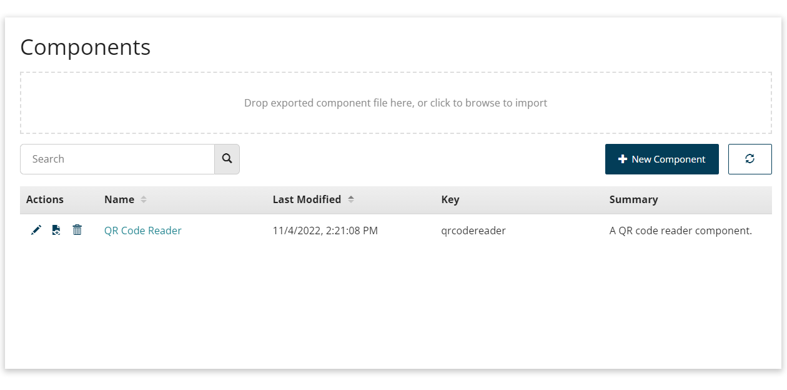
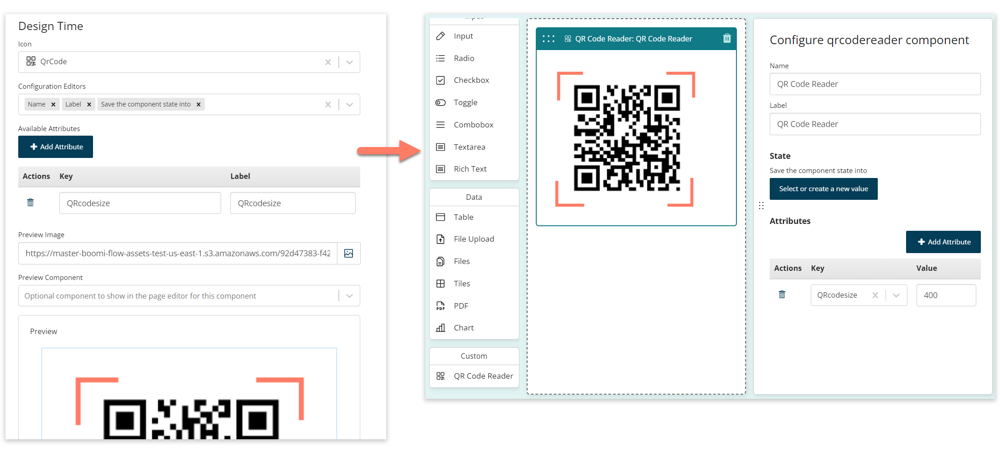

# Add a custom component

<head>
  <meta name="guidename" content="Flow"/>
  <meta name="context" content="GUID-1b012f07-dba4-4f19-aa41-953cc35fcfff"/>
</head>


Add a custom component to your tenant to make it available in the page builder.

## Overview

Custom components are added and managed on the **Components** page.



To open the **Components** page, select **Components** from the main left-hand menu.

On this page, you can:

-   Add a new custom component to your tenant.

-   Import a previously exported custom component. See [Export and import custom components](flo-custom-components-exporting-importing_a8355aba-513e-495e-9d91-2a0496a0acd7.md).

-   Edit, export, and delete existing custom components.


When adding a new custom component, you must define whether it supports the legacy runtime, default runtime, or both. For example, some custom components written for the legacy runtime may not work correctly with the default runtime.

## Add a custom component

To add a custom component:

1.  Open the **Components** page.
2.  Select **New Component**.
3.  **Name**: Enter a name for the new component.
4.  **Key**: Enter the unique component registry key for the component. This value must be in lowercase.

    -   Legacy Runtime components:

        -   The key must match the key used in the component JS for registering with the framework using `manywho.component.register`. The key can match any of name or alias.

            For example, a valid key could be any of `signature-pad`, `SignaturePad`, or `signature_pad`, for a component that uses:

            ```
            const SignaturePad = (props) => {...};
            manywho.component.register("signature-pad", SignaturePad,[ "signaturepad", "signature_pad"])
            ```

            To learn more about registering components with the legacy runtime, see the developer documentation at [Register a React component](https://manywho.github.io/ui-core/modules/_component_.html#register).

    -   Default Runtime components:

        -   The key is used to automatically register the component. The component must include an export function, for example:

            ```
            const SignaturePad = (props) => {...};
            export default SignaturePad;
            ```

5.  **Description**: Enter a description for the component.
6.  **Which runtimes will this component support?**: Select the runtime that the component supports. For example, some custom components written for the legacy runtime may not work correctly with the default runtime.

    -   Both Legacy and Default runtime: Select this option if the component supports both runtimes. Both the **Legacy Runtime** and **Default Runtime** sections are shown.

    -   Legacy Runtime Only: Select this option if the component only supports the legacy runtime. Only the **Legacy Runtime** section is shown.

    -  Default Runtime Only: Select this option if the component only supports the default runtime. Only the **Legacy Runtime** section is shown.

7.  **Legacy Runtime**: Upload the component file\(s\), consisting of a JS file \(.js\), and optionally a CSS file \(.css\).

    -   **Legacy JS**: Select the **Upload JS** icon to upload a file into, or select an existing file from, your asset library. You can also enter a URL to a hosted custom component JS file \(this can be hosted locally to help local development\).

    -   **Legacy CSS**: Select the **Upload CSS** icon to upload a file into, or select an existing file from, your asset library. You can also enter a URL to a hosted custom component CSS file \(this can be hosted locally to help local development\).
8.  **Default Runtime**: Upload the custom component file\(s\), typically consisting of a JS file \(.js\), and optionally a CSS file \(.css\).

    -   **Default JS**: Select the **Upload JS** icon to upload a file into, or select an existing file from, your asset library. You can also enter a URL to a hosted custom component JS file \(this can be hosted locally to help local development\).

    -   **Default CSS**: Select the **Upload CSS** icon to upload a file into, or select an existing file from, your asset library. You can also enter a URL to a hosted custom component CSS file \(this can be hosted locally to help local development\).

9.  **Design Time**: Define how the component appears in the page builder, and which configuration options are available.

    

    -   **Icon**: Select the icon to use for the component in the page builder.

    -   **Configuration Editors**: Select the configuration options to make available in the page builder for the component.

    -   **Available Attributes**: Define any attributes that can be selected and applied to the component. The attributes you add here become available for selection on the component in the page builder.

    -   **Preview Image**: Optionally specify an image to show for the component in the page builder. Select the **Upload Image** icon to upload an image file into, or select an existing image file from, your asset library. You can also enter a URL to a hosted image file \(this can be locally hosted\).
    -   **Preview Component**: Instead of specifying an image to show for the component in the page builder, you can have the component present as an existing component.
    -   **Preview**: Shows how the component will be displayed in the page builder, using the preview image/component selections you have made.
10. Click **Save Component** to save and add the custom component into your tenant.
11. You are returned to the **Components** page.

    -   The new custom component is shown in the table of custom components.

    -   Edit the custom component by selecting either the **Edit** icon in the **Actions** column, or the link in the **Name** column.

    -   Export the custom component by selecting the **Export** icon in the **Actions** column. See [Export and import custom components](flo-custom-components-exporting-importing_a8355aba-513e-495e-9d91-2a0496a0acd7.md).

    -   Delete the custom component from the tenant by selecting the **Delete** icon in the **Actions** column.

    -   The custom component becomes available to use in the page builder. See [Use a custom component in a page](flo-custom-components-adding_9dbee400-f443-4c31-b7bd-94217473956d.md).