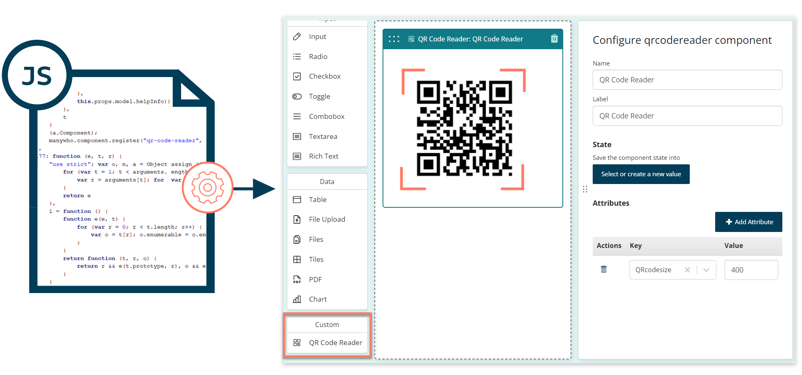

# Components

<head>
  <meta name="guidename" content="Flow"/>
  <meta name="context" content="GUID-39b7f35b-5156-4f7d-98c0-400330f2d34e"/>
</head>

Build and use your own custom user interface components in Flow.

## Overview

Flow comes with a set of pre-built page components that you can use to add standard user interface features and functionality into your flow pages.

If you require a user interface feature that is not provided by these components, you can build a custom component instead, add it to your tenant, and use it in a page just like a standard component.

For example, you can build a custom component to extend the functionality of the standard table component, or to provide a completely new type of feature, such as a QR code reader, or a signature pad input component.

Once you have built a custom component, you can export it and reuse it across other tenants and flows.

## Build a custom component

Build custom components using the React JavaScript library.

-   [Build a custom component](flo-custom-components-creating_1b937a98-761d-4cfc-9ce7-c5e28a93867d.md)

To learn more about creating React components using the React JavaScript library, see the official documentation at [reactjs.org](https://reactjs.org/).

## Add a custom component

Add a custom component into your tenant to make it available to use in the page builder.

-   [Add a custom component](flo-custom-components-installing_1b012f07-dba4-4f19-aa41-953cc35fcfff.md)

## Use a custom component in a page

Once you have added a custom component into your tenant, you can use it in your pages.

-   [Use a custom component in a page](flo-custom-components-adding_9dbee400-f443-4c31-b7bd-94217473956d.md)

## Export and import custom components

Reuse custom components by exporting and importing them across your tenants.

-   [Export and import custom components](flo-custom-components-exporting-importing_a8355aba-513e-495e-9d91-2a0496a0acd7.md)