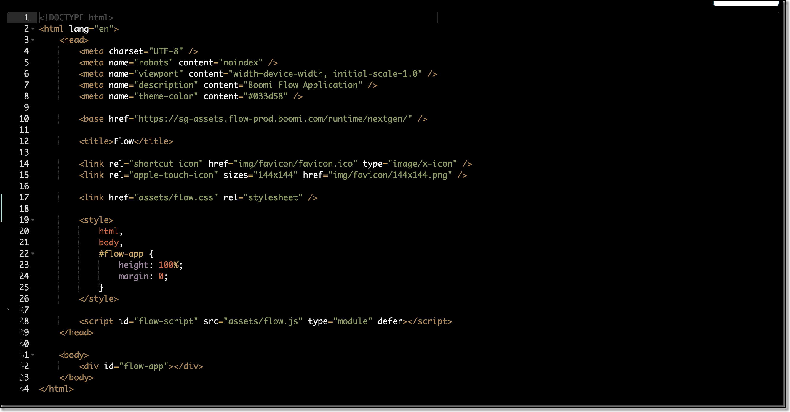

# Default player

<head>
  <meta name="guidename" content="Flow"/>
  <meta name="context" content="GUID-05efb5f4-0c3c-4c1c-98c3-d470af81fcad"/>
</head>

You can use the default player to run your flows.

:::tip

We recommend you to use the default player over the legacy player for an effective and seamless experience. The new player is fast-paced and a lighter version of the legacy player.

:::

## Overview

The default player offers a responsive, mobile-friendly experience when viewing a flow in a browser or on a mobile device, and can be used as a base from which to develop your own custom players.

Changes cannot be made to the default player; if you wish to extend the functionality and styling of the default player, you will need to create a custom player. See [Creating a custom player](t-flo-Players_Create_New_8c9d70c8-3d56-42ac-b988-927e60e5c4db.md).

