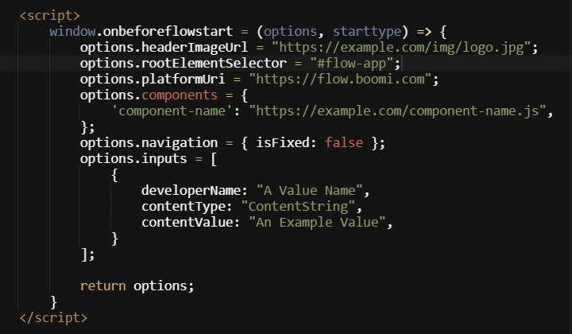

# Customizing the default player

<head>
  <meta name="guidename" content="Flow"/>
  <meta name="context" content="GUID-1d2d45ea-a1a5-4203-8b84-23f908f0aee8"/>
</head>

If the default player does not provide the features or styling that you require, you can create and customize your own player.

## Overview

Once you have created a custom player, you can customize it completely. For example, you can create and link to a stylesheet in the player, allowing you to apply your own custom CSS and change the entire appearance of your flows when viewed in the browser.

## Customizing the default player

You can extend a custom player based on the default player by setting custom options.

To set custom options in a player, add a `window.onbeforeflowstart` function using the signature:

```
onbeforeflowstart: (options: Options, starttype: StartType) => Options | Promise<Options>;
```

:::note

To allow this function to override Flow's initialization options, it must be defined before the flow.js script tag.

:::

You can set the following custom options:

|Option|Type|Description|
|:-----|:---|:----------|
|`tenantid: string;`|String|The ID of the tenant that is used to import the data.|
|`flowID: string;`|String|The flow ID.|
|`flowVersion: string;`|String|The unique version number of the flow.|
|`stateId: string;`|String|Every time a flow is run, it generates a new flow state. The State ID is a unique identifier that identifies these states.|
|`selectOutcomeId: string;`|String|	The ID of the outcome selected in the flow.|
|`rootElementSelector: string;`|String|A CSS selector string used to define the root HTML node that hosts the rendered application.|
|`headerImageUrl: string null;`|String|A URL to display an image in the header.|
|`headerTitle: string null;`|String|A title content to display in the header.|
|`platformUri: string;`|String|The Flow platform base URL.|
|`components: { [key: string]: string  Componentkind};`|String|A map of component names to URLs that return a custom component EcmaScript module.|
|`navigation: {isFixed: boolean};`|Boolean|Configure the navigation element in a flow.|
|`allowLocationControl: boolean;`|Boolean|Allows the flow application to manipulate the browser address bar URL.|
|`inputs: ObjectDataProperty[] null;`|NA|Input values passed into the flow at initialization.|

## Example

An example of providing custom player options:



## CSS and Javascript

Adding CSS and Javascript to custom default players:

- Custom CSS stylesheets can be loaded by simply adding ``<style>`` or ``<link>`` tags after the flow.css link tag.
- Custom JavaScript files can be loaded by simply adding ``<script>`` tags before the flow.js script tag.
