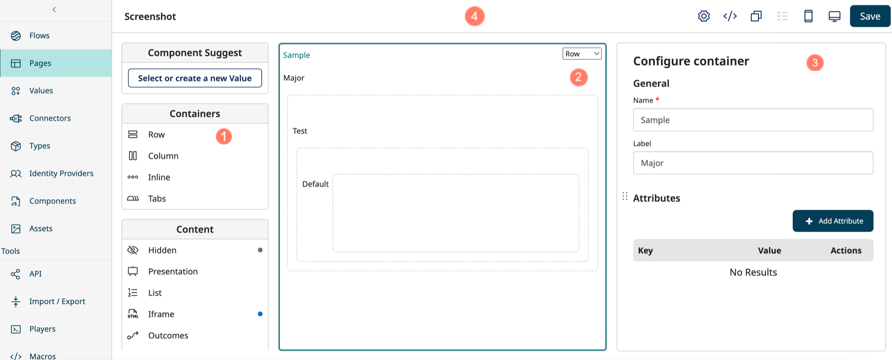

# Using the page builder

<head>
  <meta name="guidename" content="Flow"/>
  <meta name="context" content="GUID-eafc591c-11b8-4924-835f-beff9aecd8c5"/>
</head>

Build and customize your pages using the drag-and-drop page builder.

## Components menu

The **Components** menu shows all the containers and components that you can add to a page. 

-   Drag-and-drop a container or component onto the center page canvas to add it to the page.

## Page canvas

Build the page layout by adding containers and components to the center page canvas. 

-   Add containers to form the page structure, and group components together. You can choose how a container displays it's contents, and the position of the container on the page. See [Containers](/docs/Atomsphere/Flow/topics/flo-pages-containers_02e019ea-6ec7-4468-a045-f5231cd773d6.md).

-   Add standard or custom components into containers on the page, to group and define the content and functionality on the page. For example, add text, images, data tables, user input forms, and so on. See [Components](/docs/Atomsphere/Flow/topics/flo-pages-components_75563266-7597-4963-b9dd-7a5b3f771190.md).

## Configuration panel

The configuration panel updates to show the configuration settings and options for the currently selected container or component. 

## Page header

The top page header provides further page options and settings: 

-   The page name is shown. Click and edit the text to rename the page.

-   A "This page contains unsaved changes" reminder message is shown if you have not saved and committed your changes to the page. Pages are not saved automatically, and must be manually saved using the **Save** button.

-   Click the **Page Settings** icon to edit the general page settings.

-   Click the **Metadata Editor** icon to view and edit the page metadata. See [Page metadata](/docs/Atomsphere/Flow/topics/flo-pages-metadata_b7831eda-f57e-48d1-8214-b2a52524b8f0.md).

-   Click the **Clone Page** icon to create a copy of the page. See [Cloning a page](/docs/Atomsphere/Flow/topics/flo-pages-cloning_8562c35c-439b-4955-854f-00d6620083df.md).

-   Click the **Page Conditions** icon to add simple and complex page conditions to the page. See [Page conditions](/docs/Atomsphere/Flow/topics/flo-pages-conditions_43017e47-4274-40c5-b687-deaa3e445f23.md).

-   Click the **Preview mobile** or **Preview desktop** icon to see a live preview of the page. Click the icon again to return to the build view. See [Previewing a page](/docs/Atomsphere/Flow/topics/flo-pages-previewing_7d23016c-11e5-4a45-a949-c29db9372737.md).

-   Click the **Save** button to save and commit your changes. Pages are not saved automatically, and must be manually saved and committed.