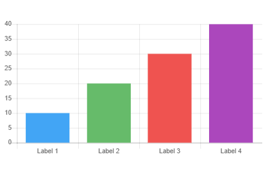
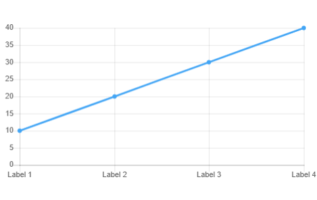
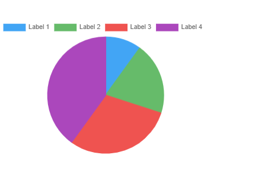
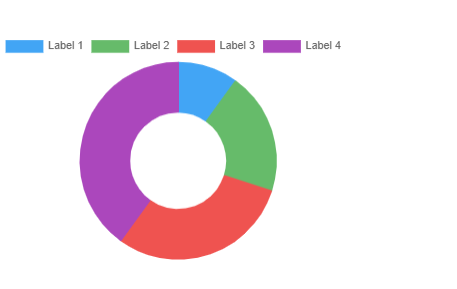
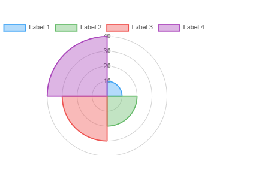

# Chart component

<head>
  <meta name="guidename" content="Flow"/>
  <meta name="context" content="GUID-33e56caf-9880-4c76-ba4c-8415ef50e5f2"/>
</head>

Display data as an interactive visual chart.

## Overview

Add a data chart to a page, such as a bar, line, pie, doughnut, or polar area chart.

-   Add and display multiple datasets on the same chart.

    -   Click **Add Dataset** to set up each dataset.

    -   Select the chart type from the **Chart Type** drop-down menu.

-   When setting up a dataset, you must choose the **Data Source**:

    -   The type of data to be provided. For example, a type with 'Name' and 'Value' properties. All dataset data source types should be the same.

    -   The data source itself, as a chart can be populated using the data from a list value or a connector.

    -   The value that contains the actual chart data \(if using a list value\), or the type binding that should be used to retrieve data \(if using a connector\).

    -   Select the value that you wish to save the user selection data into in the **Save the component state into** field.

    -   Once you have configured the **Data Source** settings, you must add the properties that you wish to display.

        -   Click **Add Column** in the **Data Presentation** section to select the properties that you wish to show in the combobox.

-   Each item in the list that the chart is bound to \(whether loaded from an ObjectDataRequest or from a static value\) will map to a data point on the chart, such as a bar, a line point, a pie segment, and so on.

-   Any outcomes associated with a chart component are executed when an item on the chart is clicked \(bar, point, pie segment, and so on\). The item from the bound data source will be set as selected before the outcome is executed. Only the first outcome bound to the chart will be used.

    For example, an outcome leads from a page to a step map element. The outcome is placed with the 'Line Chart' component on the page, so that when a flow user clicks on a line point in the chart, they are directed to the step map element.

    If an outcome is defined as `Is Bulk Action` it is displayed above the chart.

## Configuring a chart component

The following options and settings can be configured.

| Setting               | Description                                                                                                                                                                     |
|-----------------------|---------------------------------------------------------------------------------------------------------------------------------------------------------------------------------|
| **Dataset**           | Add a dataset to the chart.   • Click **Add Dataset** to set up each dataset.   • Select the chart type from the **Chart Type** drop-down menu.                            |
| **Attributes**        | Add attributes to the chart component. See [Attributes reference](/docs/Atomsphere/Flow/topics/r-flo-Attributes_Reference_4f153424-8c52-4e24-b289-2d961f0b9830.md) and [CSS reference](/docs/Atomsphere/Flow/topics/r-flo-CSS_Reference_d32122b8-0f11-47be-91c6-6986575f933e.md).                                                                                   |
| **Data Source**       | Choose the data source for the component:   **Get the data from a Connector**: Retrieve the table data from a connector.   • Select the type for the data that you wish to display in the **The Type of data to be provided** field.   • Select the type binding in the **Use this binding to get the data** drop-down menu.   **Get the data from a List Value**: Retrieve the table data from a list value.   • Click **Select or create a new Value** to choose an existing list value or create a new list value. |
| **Data Presentation** | Click **Add Column in the Data Presentation** section to choose the chart properties that you wish to display, such as the chart label and value properties.                        |
| **Label**             | Enter a label for the chart component. The label is displayed above the component by default. Do not enter a label if you do not require this text to be shown.                    |
| **Name**              | Enter a name for the chart component.                                                                                                                                           |
| **Save the component state into** | Select the value that you wish to save the user selection data into.   • Click **Select or create a new value** to select an existing value or create a new value.              |

## Chart layouts

Bar

Line

Pie

Doughnut

Polar area

