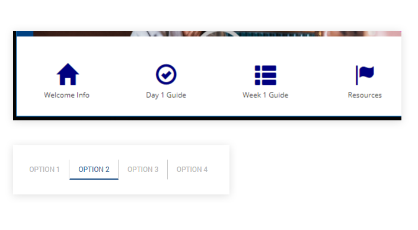

# Outcomes component

<head>
  <meta name="guidename" content="Flow"/>
  <meta name="context" content="GUID-ef650d8a-88db-484b-81b5-1ce4dc3fd0b5"/>
</head>

Display outcomes as a group of buttons on the page.

## Overview

The outcomes component is useful for more complex positioning and styling of outcomes on a page.

Outcomes must be linked to an outcomes component, otherwise they will not be displayed or included in the component.

To link an outcome to an outcomes component:

1.  Add an outcomes component to a page layout.
2.  On the flow canvas, double-click on the outcome that you wish to include in the outcomes component.
3.  In the outcome configuration panel, select the outcomes component on the page layout from the **Place this Outcome with a Component on the Page** drop-down menu.
4.  Save the outcome.
5.  Repeat this process for any other outcomes that you wish to include in the component.
6.  When the flow is run/published, the outcomes you have included in the component are displayed on the page in a group, and can then be further styled using attributes and custom CSS styling as required.

You can use an outcomes component to completely modify the appearance and positioning of outcome buttons on a page, using a combination of attributes and custom CSS styling. See [CSS reference](/docs/Atomsphere/Flow/topics/r-flo-CSS_Reference_d32122b8-0f11-47be-91c6-6986575f933e.md).

For example:

## General settings

The following options and settings can be configured.

|Setting|Description|
|:------|:----------|
|**Name**|Enter a name for the component.|
|**Label**|Enter a label for the component. The label is displayed above the outcomes by default. Do not enter a label if you do not require this text to be shown.|
|**Help information about this component**|Display help text directly below the component, for example to provide further information on how to use the component.|

## Styles

Apply additional CSS styling to the component.

1.  Enter space-delimited CSS classes/selectors into the **CSS Classes** field.

When you run the flow, these classes are appended to the main component class. See [CSS reference](/docs/Atomsphere/Flow/topics/r-flo-CSS_Reference_d32122b8-0f11-47be-91c6-6986575f933e.md).

## Attributes

Add attributes to the component.

1.  Click **Add Attribute**.
2.  Enter a supported attribute **Key** and **Value**. See [Attributes reference](/docs/Atomsphere/Flow/topics/r-flo-Attributes_Reference_4f153424-8c52-4e24-b289-2d961f0b9830.md).