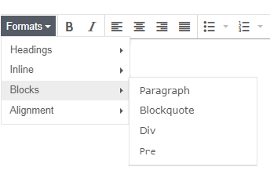
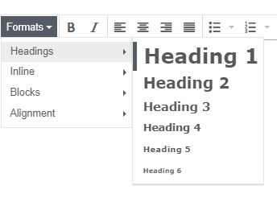
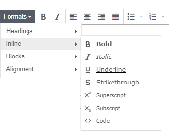

# Presentation component

<head>
  <meta name="guidename" content="Flow"/>
  <meta name="context" content="GUID-ee22d607-db7d-41a2-a7fe-44c343091e56"/>
</head>

Add rich text and media content to a page.

## Overview

The presentation component provides a rich text editor that allows you to add content into a page. When a flow is run/published, the content is rendered as HTML in the web application page.

## Configuring a presentation component

The following options and settings can be configured.

|Setting|Description|
|:------|:----------|
|**Name**|Enter a name for the component.|
|**Label**|Enter a label to show on the page.|
|**Content**|Add and format rich text and media content using the content editor.|
|**Help information about this component**|Display help text directly below the component, for example to provide further information on how to use the component.|

## Styles

Apply additional CSS styling to the component.

1.  Enter space-delimited CSS classes/selectors into the **CSS Classes** field.

    When you run the flow, these classes are appended to the main component class. See [CSS reference](/docs/Atomsphere/Flow/topics/r-flo-CSS_Reference_d32122b8-0f11-47be-91c6-6986575f933e.md).

## Attributes

Add attributes to the component.

1.  Click **Add Attribute**.
2.  Enter a supported attribute **Key** and **Value**. See [Attributes reference](/docs/Atomsphere/Flow/topics/r-flo-Attributes_Reference_4f153424-8c52-4e24-b289-2d961f0b9830.md).

## Inserting content

Insert content into the page from the **Insert** menu, right-clicking in the editor, or clicking on the relevant toolbar button. Content is inserted where the cursor is positioned in the editor.

| Content type       | Description                                                                                                                              |
|:-------------------|:-----------------------------------------------------------------------------------------------------------------------------------------|
| **Anchor**         | Insert an anchor hyperlink into the content, allowing direct linking to the specific content.                                            |
| **Date/Time**      | Insert the current date/time, from a selection of formats.                                                                               |
| **Image**          | Insert an image into the content. Detailed properties:   1. **Source**: URI or browse via **Asset Manager**.  2. **Image description**: Text for the image `<alt>` tag.  3. **Dimensions**: Width and height in pixels. De-select **Constrain proportions** to alter the ratio. Images have `.img-responsive` class by default.|
| **Horizontal Line**| Insert a horizontal line.                                                                                                                |
| **Link**           | Insert a hyperlink into the content. Define standard link attributes like title, target, and display text.                                |
| **Media**          | Insert video and audio content. Features:   1. **General \| Source**: URI source or browse via **Asset Manager**.  2. **General \| Dimensions**: Width and height in pixels. Modify video size ratio if needed.  3. **Embed**: Video embed code, e.g., Iframe or HTML5 video.  4. **Advanced \| Alternative source**: URI for alternative media file.  5. **Poster**: Image display while media is downloading. |
| **Special Character**| Insert a special character, e.g., non-breaking space, copyright symbol.                                                                  |
| **Table**          | Insert a table. Use **Table** menu for properties and modifications.                                                                     |
| **Value**          | Insert a value. For example: `{![My Value]}`, or `{![My Object].[Property Name]}`.                                                       |

## Formatting content - Alignment

|Alignment type|Description|
|:-------------|:----------|
|Left, Center, Right, Justify|Align content left, right, centered or justified.|

## Formatting content - Blocks

Format content using a pre-defined block element.

|Block type|Description|
|:---------|:----------|
|**Blockquote**|Format content that is quoted from another source.|
|**Div**|Place content inside an HTML `
` tag, to divide or create a content section that can then be targeted and styled separately using CSS.|
|**Paragraph**|Place content inside a paragraph `
` tag, to define a paragraph.|
|**Pre**|Format content in a pre-formatted fixed-width font, preserving both spaces and line breaks.|

## Formatting content - Headings

Format content using a standard HTML heading element.

|Heading type|Description|
|:-----------|:----------|
|**Heading 1** - **Heading 6**|There are six heading styles available in the content editor.|

## Formatting content - Inline

Format content inline using standard HTML formatting tags.

|Format type|Description|
|:----------|:----------|
|**Bold**|Embolden and emphasize text.|
|**Code**|Format text as computer code.|
|**Italic**|Format text in italics.|
|**Strikethrough**|Format text as incorrect.|
|**Subscript**|Format text as subscript, i.e. text is displayed smaller and below the line.|
|**Superscript**|Format text as superscript, i.e. text is displayed smaller and above the line.|
|**Underline**|Format text as underlined.|

## Viewing and editing HTML source code

1.  Click **View \| Source code** to view the HTML source code for the component.
2.  Edit/customize the HTML as required.
3.  Click **OK** to save your changes.