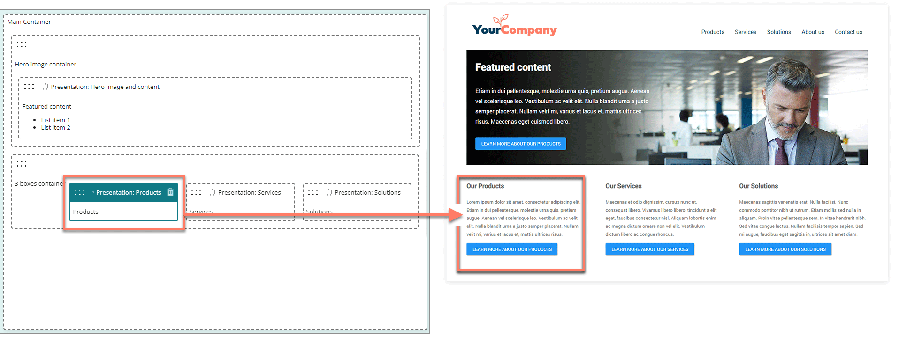

# Components

<head>
  <meta name="guidename" content="Flow"/>
  <meta name="context" content="GUID-75563266-7597-4963-b9dd-7a5b3f771190"/>
</head>

Add components to display content and provide functionality in a page.

## Overview

components are reusable, customizable elements that you can add to a page to provide common web interface features and functionality.

For example:

-   Add presentation components to present rich-text and multimedia content.

-   Add table components to present data as interactive tables, using data from connectors and data sources.

-   Add input components to enable user input functionality, and allow users to interact with a page.

## Standard components

Flow comes with a set of standard pre-built components.

You can add standard components from the page builder **Components** menu.

-   [Content components](/docs/Atomsphere/Flow/topics/flo-pages-components-content_186a3e9e-0c24-4570-a341-32aff7f4d76b.md): Display content on a page, such as rich text, images and multimedia.

-   [Input components](/docs/Atomsphere/Flow/topics/flo-pages-components-input_e6b419b2-403d-409a-bcf3-77ed9f522fdb.md): Add form functionality such as input fields, radio buttons, and checkboxes into a page, to allow user input in a flow.

-   [Data components](/docs/Atomsphere/Flow/topics/flo-pages-components-data_9d62c740-1181-4e91-86f8-1e8dbb46022b.md): Display interactive data on a page, and allow your flow users to interact with files.

## Custom components

If you require a user interface feature not provided by the standard components, you can build a custom component instead, and add it to a page just like a standard component.

You can add custom components from the **Custom** section of the page builder **Components** menu. This section is not shown if there are no custom components installed in the tenant. See [Components](/docs/Atomsphere/Flow/topics/flo-custom-components_39b7f35b-5156-4f7d-98c0-400330f2d34e.md).

## Adding a component

To add a component to a page:

1.  From the **Components** menu, drag-and-drop a component onto the page where you would like to position it.
2.  Configure the component options and settings in the configuration panel.

## Moving a component

To move a component on a page:

- You can drag and drop any component from the list of components to a new position on the page.

## Editing a component

To edit an existing component:

1.  Click anywhere on a component to select it.

    -   The component is highlighted with a blue solid border.

    -   Configure the component options and settings in the configuration panel.

## Deleting a component

To delete a component:

1.  Click anywhere on a component to select it.
2.  Click the **Delete** icon located in the top-right of the component header.
3.  Click **Delete** on the **Delete selected component** dialog. The component is removed from the page.