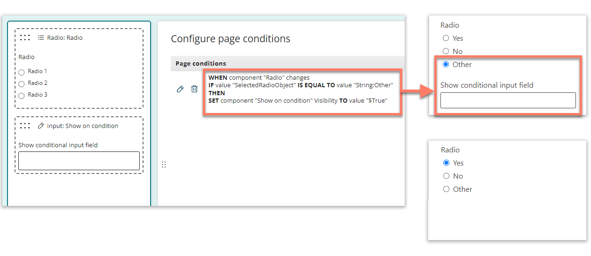

# Page conditions

<head>
  <meta name="guidename" content="Flow"/>
  <meta name="context" content="GUID-43017e47-4274-40c5-b687-deaa3e445f23"/>
</head>

Add page conditions to conditionally change the display and behaviour of components on a page.

## Overview

Apply conditional formatting to components on a page to create a more dynamic user experience.

For example:

-   **Visibility**: Change the visibility of a component on the page, based on the state of another component, or a value selected by a user.

    -   Example: Use a toggle switch to show/hide another component.

-   **Required**: Make a component required, so that it must be completed by a user before they can proceed in a flow.

    -   Example: A user cannot continue to the next page in a flow until they have entered data into an input component.

-   **Enabled/disabled**: Change whether a component is enabled or disabled.

    -   Example: Disable a component until the user has selected an option from another component on the page.

## Create a page condition

Create and add a page condition to a page:

-   [Create a page condition](/docs/Atomsphere/Flow/topics/flo-pages-conditions-creating_c7b982f9-dfec-4006-b611-25bea834aa12.md)

Configure the page condition by adding page rules and operations:

-   [Page rules](/docs/Atomsphere/Flow/topics/flo-pages-conditions-rules_22f87872-e064-4d43-9fc7-ff85b6689332.md): Add rules to define when to trigger a page operation.

-   [Page operations](/docs/Atomsphere/Flow/topics/flo-pages-conditions-operations_b8916343-35a8-4085-8b50-a160e2bf3869.md): Add operations to define what action is triggered when the page rule conditions are met.

## Notes on using page conditions

-   **Order**: Page conditions are applied to a page in the order in which they are added on the **Conditions** panel. To change the order in which page conditions are applied, you must delete the conditions, and then re-add them in the required order.

-   **Plan**: Plan your page conditions from the perspective of the operation first, rather than from the rule. For example, "I want to make this component do this, when this other component/value is this", instead of "if this component/value is this, then make this other component do that".

-   **Conflicts**: Page conditions always apply the opposite operator to the opposite of a rule. This can result in conflicts between conditions on a page unless conditions are planned carefully. For example:

    -   A page condition checks if a value is equal to "5", and sets a component visibility to "true" if the condition is met.

    -   If the value is not equal to "5", the condition will instead apply the opposite of the rule, setting the component visibility to "false".

-   **Building multi-level conditions**: Page conditions only allow single-level AND/OR logic. To apply multi-level conditional logic with page conditions, use multiple page conditions to build up the logical steps.

    For example, to show a component when \(X=2 AND \(Y=4 OR Y=5\)\), you could first create a page condition that sets a Boolean property to "true" IF \(Y=4 OR Y=5\), and then set the visibility of the component to "true" IF \(X=2 AND the Boolean property EQUALS "true"\).