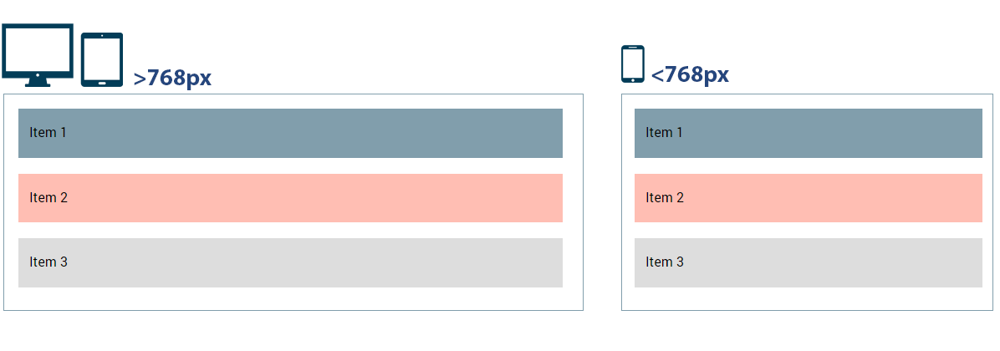
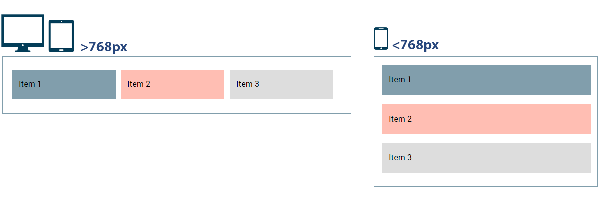
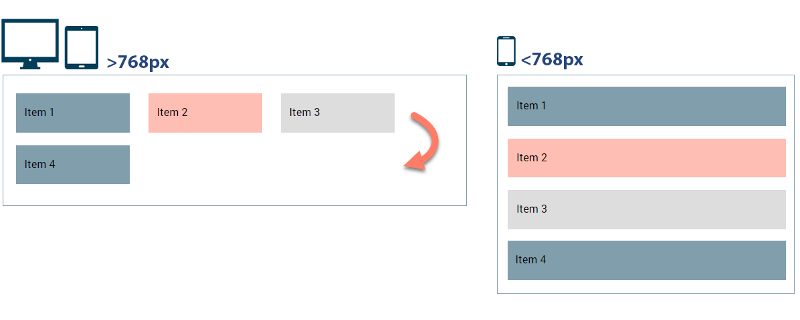
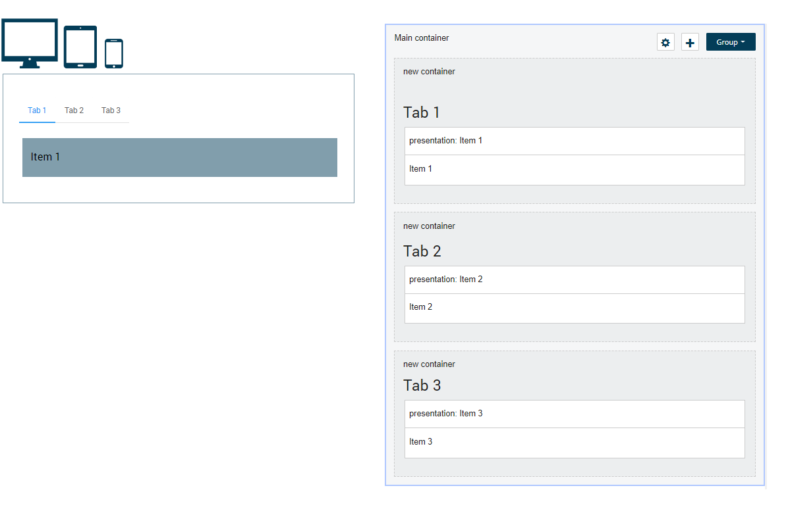
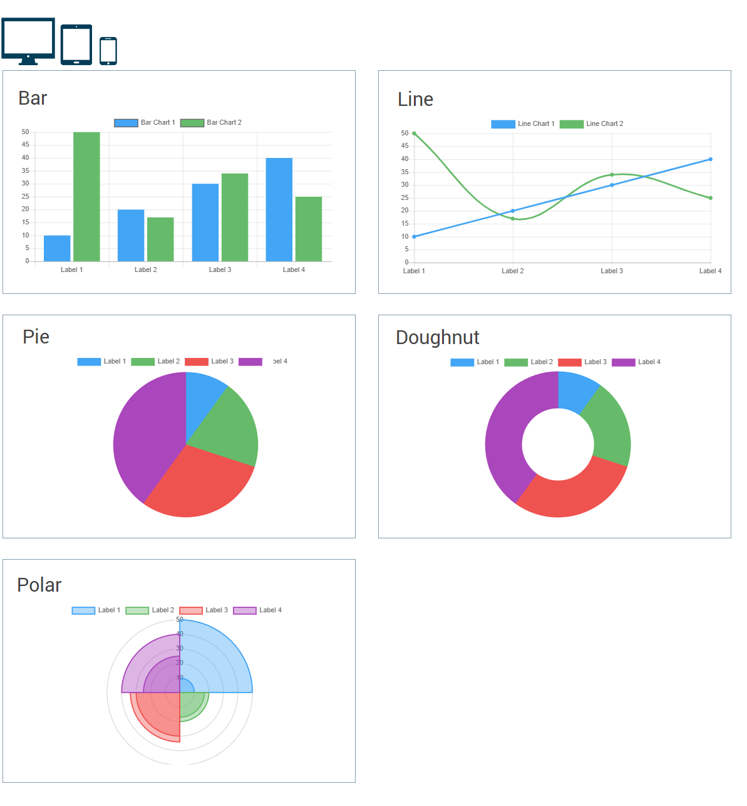

# Container layout types

<head>
  <meta name="guidename" content="Flow"/>
  <meta name="context" content="GUID-dbb2755d-f33a-4b21-b034-3c11f9f5fde0"/>
</head>

Choose how a container and it's contents are displayed on a page, such as in horizontal rows or as columns.

You can add the following types of container layout to a page:

-   Row

-   Column

-   Inline

-   Tab

-   Chart

## Row

On all screen sizes, items within the container are laid out in separate stacked horizontal rows.

## Column

On larger screens, items are displayed within the container in columns; on smaller mobile and tablet screens, these columns and any nested columns will stack.

Column width is responsive, based on a 12 column grid. Child items in this container are divided into the 12 column grid equally, for example, if the container has 3 child items inside, each item will occupy 4 columns.

## Inline

Items in an inline container are laid out horizontally side by side, with each item wrapping to the left if there isn't enough horizontal space available for all the items to be laid out next to each other; this depends on the width of each container \(defined by the container content or a CSS `width` attribute for example\) and the screen size. The larger the screen, the more items are displayed in a row; on smaller mobile and tablet screens, more wrapping will occur.

## Tab

A container that displays child containers as a set of tabs; selecting a tab displays the content within the child container.

The label of each tab is defined in the **Label** field of the child container. For example, if a Tab container contains a child container with a label of "Tab 1" then a single tab is displayed with a label of "Tab 1".

## Chart

A container used to combine and display multiple chart components as a single chart. See [Chart component](/docs/Atomsphere/Flow/topics/flo-pages-components-chart_33e56caf-9880-4c76-ba4c-8415ef50e5f2.md).

For example, to compare 2 lists of the same type as a single chart visualization, you can create a Chart container, and within this add 2 chart components, one bound to list A and the other bound to list B. This is then rendered as a single chart with the two datasets, such as a line chart with 2 lines.

-   The chart type is defined by the first chart in the container. For example, if the container contains a bar \(first\) and a line chart \(second\), the rendered chart will be a bar chart.

-   The **Label** columns in both charts must each be set to the same value.

-   If any of the data for either of the charts is loaded asynchronously using an ObjectDataRequest, the data will all have to finish loading before the chart is rendered and displayed.

-   The chart width is responsive; it will scale to fit the size of the screen, with no fixed width.

-   Other containers cannot be nested inside a Chart container; only components can be dragged and dropped into a Chart container.

