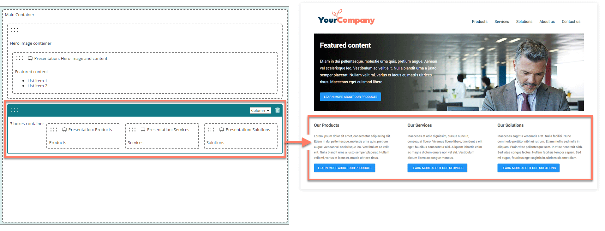

# Containers

<head>
  <meta name="guidename" content="Flow"/>
  <meta name="context" content="GUID-02e019ea-6ec7-4468-a045-f5231cd773d6"/>
</head>

Add containers to a page to form the page structure, and group components together.

## Overview

Containers act as placeholders for content in a page. You can combine multiple containers in a page to build the exact page layout that you require. Add components into containers to define the actual content displayed on the page.

-   All content on a page is contained within a "main" parent container.

-   Choose how a container and it's contents are displayed on a page by changing the container layout type. For example, containers can display content on a page in horizontal rows, or as columns. See [Container layout types](/docs/Atomsphere/Flow/topics/flo-pages-containers-types_dbb2755d-f33a-4b21-b034-3c11f9f5fde0.md).

-   You can nest containers within other containers, which can also contain any mix of containers and components. This allows you to build complex page layouts by combining multiple container types and components.

-   Customize the appearance and behavior of containers using attributes and custom CSS styling. See [Attributes reference](/docs/Atomsphere/Flow/topics/r-flo-Attributes_Reference_4f153424-8c52-4e24-b289-2d961f0b9830.md) and [CSS reference](/docs/Atomsphere/Flow/topics/r-flo-CSS_Reference_d32122b8-0f11-47be-91c6-6986575f933e.md). Containers render as `
` elements when published in a flow web application.

## Adding a container

To add a container to the page:

1.  From the **Containers** section of the **Components** menu, drag-and-drop a container onto the page where you would like to position it.
2.  Configure the container options and settings as required.

    -   The container layout menu is shown in the top-right of the container header.

## Moving a container

To move a container on the page:

- You can drag and drop any component from the list of components to a new position on the page.

## Editing a container

To edit an existing container:

1.  Click anywhere on a container to select it.

    -   The container is highlighted with a blue solid border.

    -   The container layout menu is shown in the top-right of the container header. Change the container layout type as required. See [Container layout types](/docs/Atomsphere/Flow/topics/flo-pages-containers-types_dbb2755d-f33a-4b21-b034-3c11f9f5fde0.md).

    -   Configure the container options and settings in the configuration panel.

## Deleting a container

To delete a container:

1.  Click anywhere on a container to select it.
2.  Click the **Delete** icon located in the top-right of the container header.
3.  Click **Delete** on the **Delete selected component** dialog. The container is removed from the page, along with any nested containers and components within.