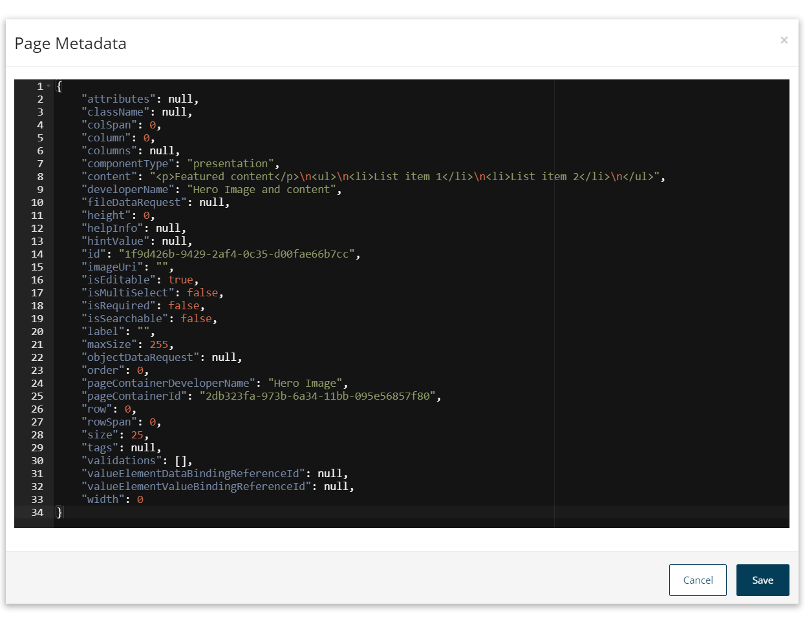

# Page metadata

<head>
  <meta name="guidename" content="Flow"/>
  <meta name="context" content="GUID-b7831eda-f57e-48d1-8214-b2a52524b8f0"/>
</head>

View and edit the page metadata.

You can view and edit the JSON formatted page metadata.

1.  Click the **Metadata Editor** icon in the page header to open the **Page Metadata**.

    

2.  View and edit the metadata as required.
3.  Click **Save** to save any changes you have made to the metadata, or **Cancel** to return to the page builder.

:::caution

Saving changes to the metadata will overwrite any unsaved changes in the page builder.

:::