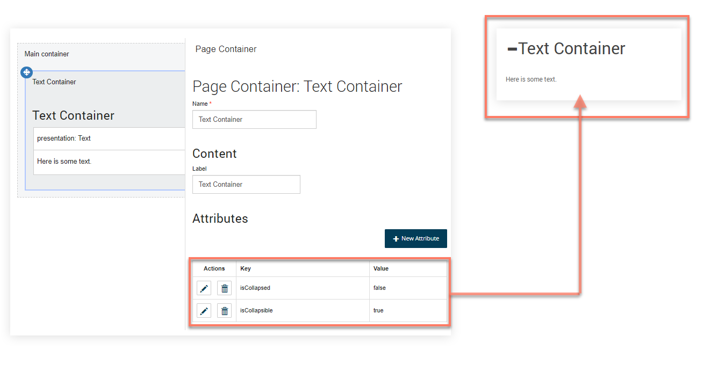

# Container attributes 

<head>
  <meta name="guidename" content="Flow"/>
  <meta name="context" content="GUID-cc22d4de-b8b0-4277-a369-8678965d70b1"/>
</head>

You can customize page containers by applying attributes.

All containers share the same common set of attributes, relating to collapse/expand behaviour.


## Default player runtime 

You can apply the following attributes when running flows with the default player.

| Key      | Value   | Description |
|----------|---------|-------------|
| `isCollapsible` | boolean  | Controls the collapse/expand toggle behaviour for a container.<br/><br/>• `true`: Enables collapse/expand toggle behaviour for the component, overriding the default false setting.<br/><br/>• `false`: Set by default, disables collapse/expand toggle behaviour for the component.<br/><br/>A **Label** must be entered for the container otherwise the toggle icon is not displayed. |
| `isCollapsed` | boolean  | If the container has been set as collapsible, this attribute defines the initial state of the container.<br/><br/>• `true`: The container is initially displayed in a collapsed state.<br/><br/>• `false`: Set by default, the container is initially displayed in an expanded state. |


## Default legacy player runtime 

You can apply the following attributes when running flows with the default legacy player.

| Key      | Value   | Description |
|----------|---------|-------------|
| `isCollapsible`<br/>Page builder: `Can a container be collapsed` | `boolean`  | Controls the collapse/expand toggle behaviour for a container.<br/><br/>• `true`: Enables collapse/expand toggle behaviour for the component, overriding the default false setting.<br/><br/>• `false`: Set by default, disables collapse/expand toggle behaviour for the component.<br/><br/>A Label must be entered for the container otherwise the toggle icon is not displayed. |
| `isCollapsed`<br/>Page builder: `Is a container collapsed` | `boolean`  | If the container has been set as collapsible, this attribute defines the initial state of the container.<br/><br/>• `true`: The container is initially displayed in a collapsed state.<br/><br/>• `false`: Set by default, the container is initially displayed in an expanded state. |
| `collapseGroup`<br/>Page builder: `Name of the container collapse group` | `string`  | Set the value to the name of the group that the container belongs to. All containers in the same group share the same collapsed/expanded state. |


## Metadata example 

This metadata example uses the default legacy player runtime.

```
"attributes": {
  "isCollapsible": false,
  "isCollapsed": false,
  "collapseGroup": "my group",
}
```

## A worked example - using the 'isCollapsible' attribute 

This worked example uses the default legacy player runtime.

-   The `isCollapsible` attribute is added and set to "`true`" on a "Text Container" page container.

-   The `isCollapsed` attribute is also added and set to "`false`".

-   When the flow is published, the container is shown in an expanded state to begin with. A toggle icon next to the label allows the container \(and the content within\) to be collapsed/expanded by the user.



