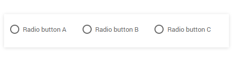

# Radio component CSS 

<head>
  <meta name="guidename" content="Flow"/>
  <meta name="context" content="GUID-4a3aadf0-c44b-4c14-bd96-5bc744eddde0"/>
</head>


This topic provides examples of the main CSS classes/selectors you can use to customize radio components.

## Default player CSS 

You can use the following main classes/selectors to apply additional CSS styling to radio components in a flow running the default player.

|Class/Selector|Description|
|:-------------|:----------|
|`.page-component-radio`|The main class applied to the entire radio component in a flow.<br />For example, to increase the padding around all radio components in a flow:<br />`.page-component-radio {padding:15px}`|
|`.radio-group`|The main class applied to the entire component, i.e., the entire group of radio buttons.<br />For example, to modify the padding around the entire component:<br />`.radio-group {padding:15px}`|
|`.radio`|The main class applied to each individual radio button within the component.<br />For example, to increase the font size for each radio button:<br />`.radio {font-size:20px}`|

## Default legacy player CSS 

You can use the following classes/selectors to apply additional CSS styling to radio components in a flow running the default legacy player.

|Class/Selector|Description|
|:-------------|:----------|
|`.mw-bs .mw-radio-group`|The main class applied to the entire component, i.e., the entire group of radio buttons.<br />For example, to modify the padding around the entire component:<br />`.mw-bs .mw-radio-group {padding:15px}`|
|`.mw-bs .mw-radio`|The main class applied to each individual radio button within the component.<br />For example, to increase the font size for each radio button:<br />`.mw-bs .mw-radio {font-size:20px}`|

**Example: Radio buttons horizontal layout**



```css
.customradio .radio-group {display:grid;align-items: end;}
.customradio .radio {grid-column:auto;grid-row:1;}
```

A '`classes`' attribute is added to the radio component to apply the .customradio style, resulting in the radio buttons being laid out horizontally in columns.