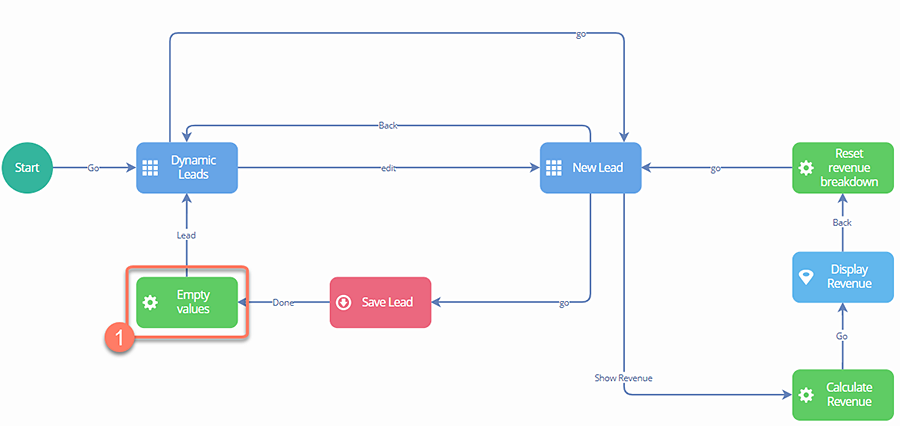
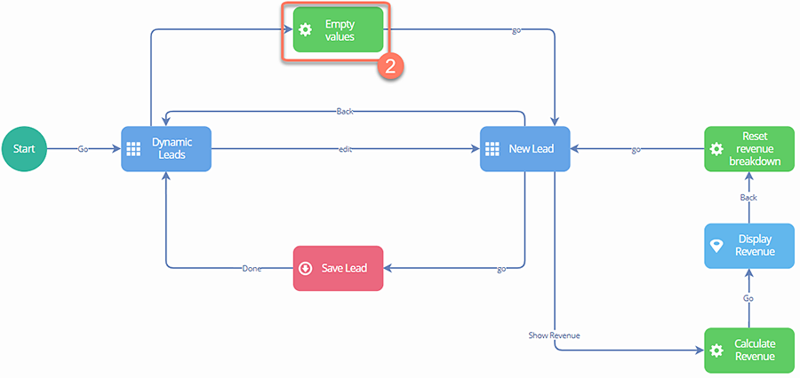

# Offline flows supported functionality

<head>
  <meta name="guidename" content="Flow"/>
  <meta name="context" content="GUID-29c3cd95-fc7e-42f2-ae85-902736568210"/>
</head>

Most functionality in flow is supported whilst running a flow offline, but there are some areas of unsupported or partially supported functionality that should be taken into consideration when designing an offline flow.

- Database load elements: Database load elements can be used to load data in an offline flow.Page element `Objectdata` load requests \(such as from a table component\) are also supported. This area of functionality is supported.
- Database save elements: Database save elements can be used in an offline flow, however care must be taken that values should not be emptied immediately after a save has been performed. See 'Database Save elements best practice' below. This area of functionality is supported.
- Database delete elements: Database delete elements cannot be used in an offline flow.
- File upload components: File upload components can be used in offline flows; files are uploaded once the flow is online and the file upload request is replayed by the user. This area of functionality is not supported.
- `isBound` property: This property is not supported in scenarios where you want to set the `isBound` property on a page components column to equal true. For example, when you have an object property of type string which is set based on the list value selection. This area of functionality is supported.
- Listeners: Listeners cannot be used in an offline flow.
- Macros: Macros are fully supported, however you should not use a macro that creates Date objects or evaluates data randomly, for example using `Math.random()`.This is because when requests get replayed, these values will differ from when the macro execution was simulated by the offline engine. This area of functionality is supported.
- Message Actions: Message Actions cannot be used in an offline flow.
- Page Conditions: Offline flows can support any page condition created with the Basic Page Condition tool. Page conditions with multiple page operations are also supported. The only page condition metadata types that are currently supported are:

   - Visibility
   - Required
   - Enabled

    The only page condition criteria supported are:

   - Equal
   - Not equal
   - Is Is empty

- Referencing System Values: For example, referencing `$State` in the text content in a Step/Presentation component.
- Real-time collaboration: Real-time collaboration cannot be used in an offline flow.
- Subflows: Subflows functionality cannot be used with offline flows.
- Swimlanes: Swimlanes cannot be used in an offline flow.

## Database Save elements best practice

A common scenario when building a flow involves emptying values in a form once it has been saved, in order to avoid the form fields being populated with the previously saved values when the form is used again. As values should not be emptied immediately after a save has been performed in an offline flow, care should be taken to ensure the relevant **Operator** element does not *immediately* follow the **Save** element.

For example, in the flow below, the field values for a 'New Lead' form are cleared immediately once the form has been saved, via the 'Empty Values' **Operator** element \(1\).

In order to ensure this flow works correctly when configured as an 'offline' flow, we would need to change where the values are emptied, for example by emptying the values whenever the user adds a new lead instead \(2\).

