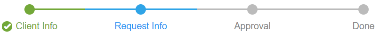

# Default legacy player options

<head>
  <meta name="guidename" content="Flow"/>
  <meta name="context" content="GUID-8bfa7e4b-12e1-4b69-81de-40c9b40f5765"/>
</head>


The default legacy player supports various options that allow you to modify the behaviour of the player. You can customize these options as required in a custom player.

The most commonly used options are covered below.

## collaboration

Defines whether the collaboration functionality is enabled in a flow using the player. Collaboration functionality allows multiple end users to co-browse a flow in real-time.

```
collaboration: {
    isEnabled: false
    },
```

-   **true**: Enables collaboration functionality for flows using the player.

-   **false**: This is the default setting. Collaboration functionality is disabled.


## navigation

Defines the behaviour of the player navigation components used in a flow.

```
navigation: {
    isFixed: true,
    isWizard: false
    },
```

-   **isFixed**: This will 'pin' the navigation bar to the top of the browser window to maintain visibility.

    -   **true**: This is the default setting. The navigation bar is fixed to the top of the browser window.

    -   **false**: The navigation bar will not be fixed to the top of the browser window.

-   **isWizard**: This will render the navigation bar as a 'wizard'.

    -   **true**: Any navigation bar in a flow run using the player will be displayed as a 'wizard'. For example:

        

    -   **false**: This is the default setting. Navigation will be displayed as a normal flow navigation bar.


## replaceUrl

Defines the composition of the flow url. For example, whether a flow url remains as a Run url or has the Join url appended. See [System state values](r-flo-Values_System_State_Values_0e184acc-ec85-4922-b06b-07a5d6966fa0.md).

`replaceUrl: true,`

-   **true**: This is the default setting. This means that when a flow is launched it will replace the Run url with a Join url to ensure that the same flow state is used for the flow.

-   **false**: Disable the Join url behaviour and launch a new flow state each time; the flow will use the Run url each time instead. This can be useful to create a more bookmark-friendly url as using the flow url will always a launch a new copy of the flow, rather than rejoining the flow state.


## theme

Defines the theme that the player is based on. Themes provide a quick way of customising the appearance of a web application player without having to rebuild the application or apply custom CSS. See [Player themes](c-flo-Players_Themes_c08a4544-961f-478d-b949-a833634034b0.md).

`theme: queryParameters['theme']`

-   Remove the queryparameters\[\] string and simply reference the theme you wish to apply to the player. For example, change this to 'theme: 'slate'' to apply the 'slate' theme to any flows using the player.

-   Leaving this set to the default will allow the theme of the player to be modified using the flow url.