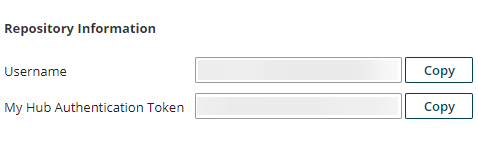

# Boomi Master Data Hub connector configuration values

<head>
  <meta name="guidename" content="Flow"/>
  <meta name="context" content="GUID-3aa1aec5-c543-4fe8-8c95-bec6d7f92b38"/>
</head>

The following configuration values can be defined during installation of the Boomi Master Data Hub connector

## Boomi Master Data Hub connector values

|Name|Type|Required or optional?|Description|
|----|----|---------------------|-----------|
|Hub Hostname|String|✅ Required|The hostname for the Boomi Master Data Hub connector.  For example: `c01-usa-east.hub.boomi.com` If you need to specify a Hub cloud, the location of the Hub cloud associated with a repository can be found in the Repository Properties in Master Data Hub. For details of Hub cloud hostnames, see [Hostnames and IP addresses for the Boomi Atom Clouds and Hub Clouds](/docs/Atomsphere/Platform/r-boo-Hostnames_and_IP_addresses_for_Atom_Clouds__0d150522-9457-4c37-b5a9-a8ad664490bd.md).|
|Hub Username|String|✅ Required|The username of the Master Data Hub Repository that you wish to connect to. This can be found in the **Username** field of the repository information. |
|Hub Token|Password|✅ Required|The password for the username of the Master Data Hub Repository that you wish to connect to. This can be found in the **My Hub Authentication Token** field of the repository information. |