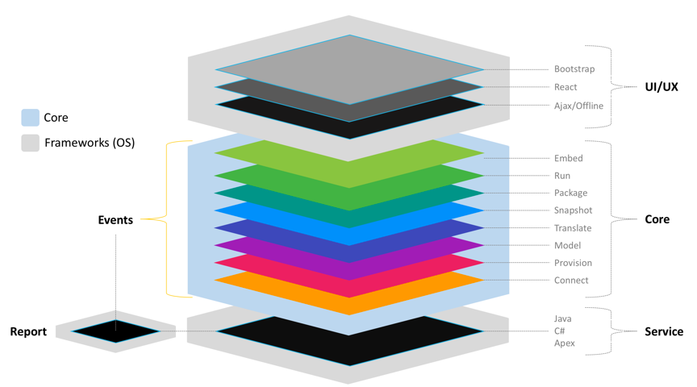

# Scalability 

<head>
  <meta name="guidename" content="Flow"/>
  <meta name="context" content="GUID-36a56e3e-a443-4a78-a013-69e4b8be0140"/>
</head>

Flow is built on an ‘API-first’ architecture, which means its user interface and tools are built as layers on top of the platform and interact with the platform through APIs.

## A Highly Scalable Development Platform

APIs empower customers developing Flow applications to create modern and highly scalable applications. Flow’s built-in API editor, can be scheduled to run at any time during the software development lifecycle.

This decoupling of the application from the architecture makes it easy for customers to optimize, extend and replace application connectors as needed. With little effort, they can add more applications to a business process, workflow or customer journey. Flow’s architecture supports multiple devices and can scale to meet business demands.

The Flow architecture also radically reduces coding. Application page layouts, logic, business rules, permissions, etc. are defined using metadata, not code - and are managed in the cloud.

To learn more about the Flow technical architecture, see [Technical architecture overview](c-flo-Techref_Architecture_b7cbf7a7-bcd0-4d1c-b926-69854df699ec.md).