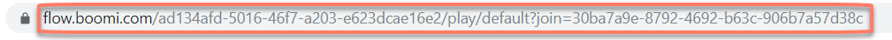
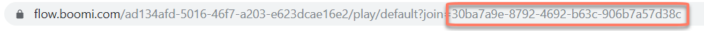
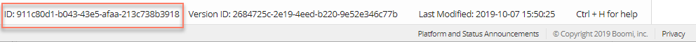
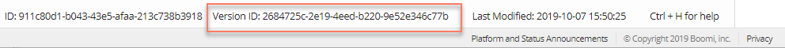

# System state values 

<head>
  <meta name="guidename" content="Flow"/>
  <meta name="context" content="GUID-0e184acc-ec85-4922-b06b-07a5d6966fa0"/>
</head>

The following system values store flow state information.

| Value Name | Description |
|:---------|:----------|
| $JoinURI | Every time a flow is run, it generates a new URI for the Boomi Flow player. This URI is stored in the **$JoinURI** value, and can be found in the browser address field that opens when a flow is run.  - The flow needs to have run at least once for this value to be generated. - The Boomi Flow engine automatically populates and subsequently updates the **$JoinURI** value every time a flow is run. - The **$JoinURI** allows you to resume a flow that is already running. - Example usage: Some apps require more than one end-user accessing a running flow at the same time. Sharing the **$JoinUri** lets a user transfer control of the flow to another user. For example, in an app that automates approval, a Sales Manager can transfer control of the flow to the Director of Sales, for deals worth over $1 million. The Director can then approve the deal, and pass control back to the Sales Manager.|
| $State/ID | Every time a flow is run, it generates a new flow state. The State ID is a unique identifier that identifies these states. The **$State/ID** value stores this ID.  - Once a flow is completed from start to finish, all the state information is removed from the Boomi Flow servers. - Running a flow generates a new URI for the Boomi Flow player, and the string at the end of the URI (right after “join=…”) is the State ID.|
| $State/Current Map Element ID | Every map element in a flow has a unique identifier. The **$State/Current Map Element ID** value stores the ID of the map element the flow is currently on. |
| $State/Date Created | - The user who first runs the flow is designated as the ‘Owner’ of the flow.  - The **$State/Date Created** value stores the date, and the time in UTC, when the flow was first run by the Owner. |
| $State/Date Modified | The **$State/Date Modified** value stores the date, and the time in UTC, when flow control is returned to Boomi Flow. This generally happens when you hit an outcome, for example, by clicking a check box. |
| $State/External ID | You can tag a flow state in Boomi Flow, and then load it with a unique ID. This value can be used if you cannot know beforehand what the state will be. For example, you can use the **$State/External** ID to tag a flow state with an invoice number (instead of the ID generated by the Boomi Flow engine). |
| $State/Flow ID | The **$State/Flow ID** stores the unique identifier generated for each flow. This is displayed at the bottom of the flow canvas, and remains the same throughout the life-cycle of the flow.  |
| $State/Flow Version ID | The **$State/Flow Version ID** stores the unique identifier generated for each version of the flow. Every time the flow is changed, a new version ID is generated. This is displayed at the bottom of the flow canvas.  |
| $State/Flow Developer Name | This value contains the name of the flow. When a flow is renamed, the **$State/Flow Developer Name** is updated with the new data. |
| $State/Is Done? | Stores the state of the flow as either False (the flow is still running) or True (the flow has completed execution).  - When a flow is run, the value of $State/Is Done? is set to False. - At the end of runtime, the value of $State/Is Done? is changed to True. - Check the $State/Is Done? value to determine if a flow has completed execution. A flow is considered complete when it reaches a map element that does not have any outbound outcomes. |
| $State/Join Uri | The **$State/Join Uri** value is the same as the **$JoinURI** value. |
| $State/Owner ID | The user who first runs a flow is designated as the ‘Owner’ of the flow, and is assigned a unique identifier. The **$State/Owner ID** stores this ID value.  Note: If the flow uses a swimlane where the Owner has no access to the flow, the user performing the authentication becomes the new Owner, and the **$State/Owner ID** is updated in the system to reflect the change. |
| $State/Owner User ID | The user who first runs the flow is designated as the ‘Owner’ of the flow. The **$State/Owner User ID** value stores the User ID of this user, as stored in the user directory from which the flow received the user.  For example, if a user is logged in into Salesforce, the **$State/Owner User ID **would be the User ID of the user in Salesforce. |
| $State/Owner First Name | The user who first runs the flow is designated as the ‘Owner’ of the flow. If the flow is using a third-party for authentication, the **$State/Owner First Name** value stores the first name of the flow Owner. |
| $State/Owner Last Name | The user who first runs the flow is designated as the ‘Owner’ of the flow. If the flow is using a third-party for authentication, the **$State/Owner Last Name** value stores the last name of the flow Owner. |
| $State/Owner Username | The user who first runs the flow is designated as the ‘Owner’ of the flow. The **$State/Owner Username** value stores the user name of the flow Owner, based on the login details of that user in the third-party. |
| $State/Owner Email | The user who first runs the flow is designated as the ‘Owner’ of the flow. If the flow is using a third-party for authentication, the **$State/Owner Email** value stores the email address of the flow Owner. |
| $State/Owner Name | The user who first runs the flow is designated as the ‘Owner’ of the flow. If the flow is using a third-party for authentication, the **$State/Owner Name** value stores the name of the flow Owner. |
| $State/Tenant ID | The ID of the flow tenant. For example, you can insert the **$State/Tenant ID** value into a step or page map element to display the ID of the tenant that the flow belongs to. |
| $State/Current Map Element Developer Name | Every map element in a flow has a name. The **$State/Current Map** Element Developer Name value stores this data.  Note: It is possible to have multiple map elements with the same **$State/Current Map Element Developer Name** value. |
| $State/Parent ID | If there is a flow running a subflow via Flow Out functionality, the **$State/Parent ID **value contains the ID of the parent flow state that initiated the child flow. Use this value to return the child flow back to the parent flow state. |