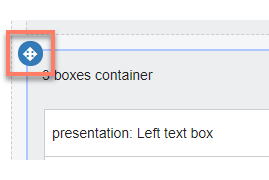

# Moving containers in a page layout

<head>
  <meta name="guidename" content="Flow"/>
  <meta name="context" content="GUID-0878a81a-5883-4f09-9b17-c8dd5d65a61e"/>
</head>

Containers can be moved and re-positioned on a page to modify your page layout.

## Moving a container

1.  Click anywhere on the container that you wish to move. The **Move** icon is displayed at the top-left of the container.

    

2.  Click and hold the **Move** icon, and then drag-and-drop the container into a new location on the page. As you hover over different page elements, they will highlight purple to indicate where the container will be moved to when you release the mouse button.