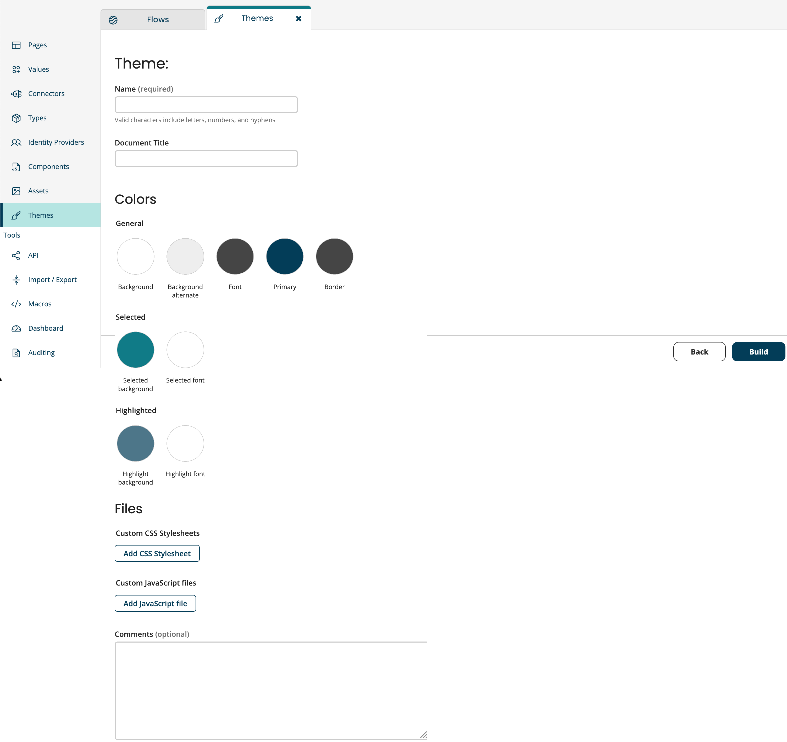

# Create a new theme

<head>
  <meta name="guidename" content="Flow"/>
  <meta name="context" content="GUID-96b25082-d814-47ac-9b78-556d091434ef"/>
</head>

Themes provides a useful base from which you can begin creating your own custom theme. Customizing themes gives you complete control to beautify the user interface for your flows without having to rebuild the application or apply custom CSS.

You need to setup the below fields to create a new theme.

| Field                   | Description                                                  |
| ----------------------- | ------------------------------------------------------------ |
| Name                    | Provide a name to the theme. This field must include only letters, numbers, and hyphens. This is a mandatory field. |
| Document Title          | Specify a title to the document.                             |
| **Colors**              | You can customize the flow using colors.                     |
| *General*               | *Generic settings*                                           |
| Background              | Specify the main background color of the application.        |
| Background alternate    | Specify the alternate background color of the repeatative elements like table rows. |
| Font                    | Choose the font color.                                       |
| Primary                 | Specify the accent color that is used for button border, primary buttons, and table headings. |
| Border                  | Specify the border color of elements such as tables and inputs. |
| *Selected*              | *Selected settings*                                          |
| Selected background     | Specify the background color of selected items such as selected table rows, checked check boxes, or toggles. |
| Selected font           | Specify the font color of selected texts associated to selected table rows, checked check boxes, or toggles. |
| *Highlighted*           | *Highlighted settings*                                       |
| Highlighted background  | Specify the background color of highlighted items such as hovered table rows or hovered selected options. |
| Highlight font          | Specify the font color of highlighted texts associated to the hovered table rows or hovered selected options. |
| **Files**               | You can add customized files.                                |
| Custom CSS Stylesheets  | You can add a customized css stylesheet by clicking on `Add CSS Stylesheet` and add the file by drag-drop method, or by uploading from your local folder (the files are uploaded into, and can be selected from the flow assets), or selecting an existing file from your asset library. You can also enter a URL to a hosted custom component css file. **Remember:** You can only upload files that have a *.css* extension. |
| Custom JavaScript Files | You can add a customized javascript files by clicking on `Add JavaScript file` and add the file by drag-drop method, or by uploading from your local folder (the files are uploaded into, and can be selected from the flow assets), or selecting an existing file from your asset library. You can also enter a URL to a hosted custom component js file. **Remember:** You can only upload files that have a *.js* extension. |
| Comments                | You can type your comments in the blank text space.          |

## Environment Enabled

- You can add a theme to a release or create a release containing just a theme to preview and test it in different environments.
- When editing an existing theme, you will have a `Build` option instead of `Save`.
- On selecting, you will be prompted to either add the theme to an existing release or create a new release.