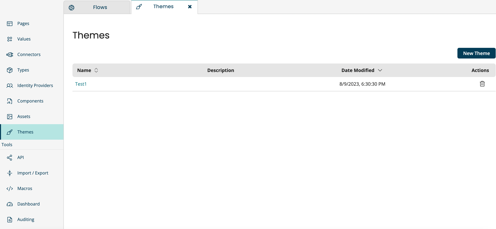

# Themes

<head>
  <meta name="guidename" content="Flow"/>
  <meta name="context" content="GUID-bba1958f-30df-44cb-a105-e30ddde50593"/>
</head>

Themes provide a no-code alternative to Players for customizing Flows. You have the ability to customize the design elements contained within any flow such as fonts, background color, border and so on.

## Overview

Adding customizations to a Flow formerly required modifying a Player and executing the Flow. Themes eliminates the need to manually edit HTML code by providing a user interface for the most common customizations.

**Remember:** Ensure that `Themes` toggle button is turned on in your [Tenant page](c-flo-Tenant_Settings_Page_5cf56ab8-1bcc-48f1-b497-b80491a09a73.md) settings. As you switch on Themes, the Players menu will be disabled and the Themes menu will be enabled.