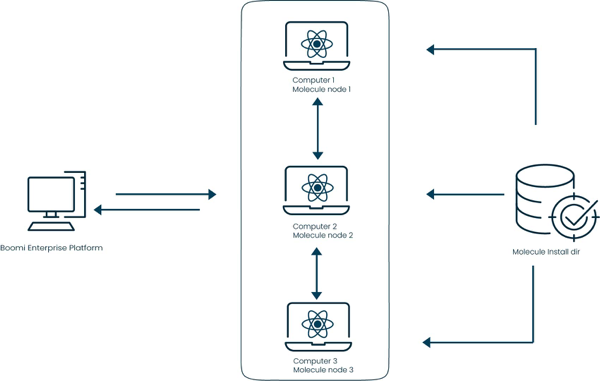
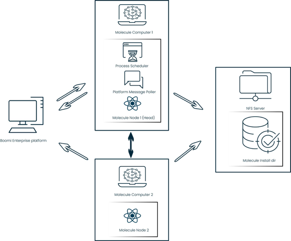

# Molecule

<head>
  <meta name="guidename" content="Integration"/>
  <meta name="context" content="GUID-e9469404-7628-4aa7-a63b-7ae57fb13a3e"/>
</head>

The Boomi Molecule is a single-tenant, clustered Atom that allows for multiple Atom processes to run concurrently. It is the enterprise-grade version of an Atom that you can deploy across multiple servers to enhance load balancing and ensure high availability for mission-critical integration processes.

A Molecule consists of a grouping of nodes installed on multiple on-premise machines. For example, users see only one Atom instance on the Boomi Enterprise Platform's **Process Reporting and Atom Management** pages. However, if you enable the Molecule, it distributes processing across one or more physical machines.

The Molecule is best used in integrations that receive or generate a high volume of documents. Review the Flow Control step to configure multi-threading and processing within your Boomi process design.

## What is clustering? 

Like an Atom, a Molecule runs integration processes managed on the Boomi Enterprise Platform. The distributes these requests among all the machines that form the cluster. The results are balanced computational work among these different machines, which improves the overall performance of the cluster system.

A single node in the cluster is defined as the head node, and does the following:

- Is elected from the remaining nodes in the network and can migrate between nodes ("failover support")

- Retrieves messages from the platform

- Schedules processes

- Maintains the health of each node

- Tends to send processes to other nodes for processing, because the head node takes care of the administrative tasks mentioned previously

## Do you need a Molecule?

Below are some general questions that you should consider before implementing a Molecule.

**Are you satisfied with your on-premises Atom's processing time and volume handling?**

- Depending on the count, size and variation of your document types, you may want to consider Molecule processing across multiple machines. Refer to the High Volume Troubleshooting topic to understand what might cause memory issues or slowness among your Boomi processes.

**How much do you care if a process does not run due to a computer outage?**

- Molecules support failover, so if one head node fails, another node attached to the Molecule can support the management, scheduling, and running of your processes.

**Is this setup worth the extra configuration time, hardware allocation, and maintenance?**

- You enable Atom, Molecule, and cloud technology in a Boomi Atom Cloud for production deployment. If you build integrations that do not require on-premise resources behind your firewall, you can deploy these integrations in the cloud.