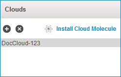

import restriction from './_Restriction.mdx'
import ShortHardReq from './_HardwareRequirementsShort.mdx'

# Docker Atom Cloud system requirements 

If you need to connect to applications and data locations within your local network, you need to install a Cloud on a machine within the network. If you use Boomi’s Docker Cloud installer, you do not have to worry about operating system requirements or need to install Java because the Docker image contains them.

## Docker requirements

To use Docker to install a Cloud, you must:

-   Install Docker on a 64–bit Linux machine. The minimum supported Docker version is 19.03.8.

-   Have access to Docker commands such as `docker ps`, `docker run` and `docker images`.

-   Be familiar with [Docker technology](https://www.docker.com/) and you know how to use [Docker commands](https://docs.docker.com/get-started/overview/).

An Atom Cloud consists of multiple Cloud Molecules that you install on multiple on-premise machines. Boomi recommends that you install no more than ten (10) Cloud Molecules in an Atom Cloud.

:::caution Restriction

Antivirus programs that scan the installation folder of your Atoms, Molecules, or Atom Clouds might conflict with their operation. For example, if the antivirus program attempts to access the files while your Atoms, Molecules, or Atom Clouds are running, it can cause conflicts. Also, the antivirus program could cause permission issues by being seen as a different user. Therefore, disable the antivirus program from running against the Atom, Molecule, or Atom Cloud installation folders during planned maintenance windows. Additionally, after running the antivirus program, check the quarantine folder for any valid files quarantined incorrectly.

:::

<ShortHardReq />

## Enable Clouds

Ensure that you enable Clouds in your account. When you click the **Manage** menu, a **Cloud Management** option appears.

## Other Docker Cloud requirements 

Here are other requirements and information about installing Docker Cloud. You must:

-   Have a persistent high-speed internet connection such as cable, DSL, or higher.

-   Have the appropriate LAN connectivity and security permissions to access the applications and data locations required for your particular integration scenarios.

-   You must remap the additional Cloud's port if you install more than one Docker Cloud on the same machine. Each Cloud can use port 9090 internally in its Docker image, but they cannot both map it to port 9090 on the host.

If your system meets all of these requirements, you are ready to download the Docker Cloud installer.

