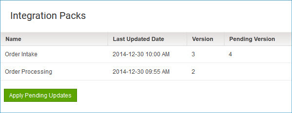

# Integration Packs dialog 

<head>
  <meta name="guidename" content="Integration"/>
  <meta name="context" content="GUID-485b9626-6a74-4eba-af11-da9527ad4e5a"/>
</head>

Use the Integration Packs dialog to monitor the release status of attached integration packs and apply pending updates.

Clicking **View Integration Packs** on the Environment Properties panel opens the Integration Packs dialog.

:::note

You must have the Atom Management privilege to apply pending updates. If you have the Atom Management Read Access privilege, you can view information about integration pack versions, but you cannot apply updates.

:::

For each integration pack to which the selected Atom or environment is attached, the following information appears:

- **Name** - Name of the integration pack.

- **Last Update Date** - Date and time of the current release.

- **Version** - Version number of the current release, expressed as a count of releases to this account. For example, if the current release was the sixth update after the account initially installed the integration pack, the version number shown here would be 7.

- **Pending Version** - If a new release is pending, the version number increases based on the number of releases to this account. For example, if the pending release is the eighth update since the original installation of the integration pack for the account, the new version number is 9.

:::note

If the selected environment does not have an attached Atom, the version number of a pending new release does not appear. Therefore, you cannot apply pending updates for integration packs unless you attach an Atom to the environment.

:::

## Apply Pending Updates 

Initiates a request to apply all integration pack updates listed above as pending. In the confirmation dialog:

- Clicking **OK** runs the request. You cannot undo this action.

- Clicking **Cancel** cancels the request.