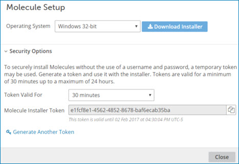

# Downloading the installer

<head>
  <meta name="guidename" content="Integration"/>
  <meta name="context" content="GUID-edb2871c-e830-4756-b8fc-846cb5b81652"/>
</head>

Download the installer from the **Atom Management** page to create a new in your account.

## Before you begin

Review the Molecule system requirements to ensure that your system is compatible with setting up a Molecule. If you plan to use Docker to install a Molecule, see the Docker Molecule system requirements.

:::note

It is a best practice that you download the latest version of the installer each time you wish to create a new Molecule. Previously downloaded installers might not contain the latest optimizations and may result in errors.

:::

Docker image installations are no longer available from the Integration user interface. You can download and run the DockerMolecule image directly from [Docker Hub](https://hub.docker.com/r/boomi/molecule/) and use it manually. Boomi's Docker Hub provides necessary information about the Docker Molecule Docker image, like how the image version, how to manually use the image or use it in unprivileged mode, and how to configure your Molecule using a list of environment variables.

To install a Molecule in an account, you must have the Atom Management privilege in that account. You also must have either the Build Read Access or the Read and Write Access privilege so that you have access to the page. If you do not have the Atom Management privilege and you try to download the Molecule installer, you receive an error message. If you downloaded and ran the installer prior to receiving this privilege, you are able to attach the Molecule only to accounts for which you have the Atom Management privilege.

## Procedure

1. To download the local installer, go to **Manage** > **Atom Management** and click **New** > **Molecule**.

    The **Molecule Setup** dialog opens.

    

2. From the **Operating System** drop-down list, select the type of to install:

    - Windows 32bit - `https://platform.boomi.com/atom/molecule_install.exe`

    - Windows 64bit - `https://platform.boomi.com/atom/molecule_install64.exe`

    - Linux 32bit - `https://platform.boomi.com/atom/molecule_install.sh`

    - Linux 64bit - `https://platform.boomi.com/atom/molecule_install64.sh`

3. (Optional) Open the **Security Options** section to generate an installer token.

    You can use the token to install a or give the token to someone else to perform the installation. Using a token eliminates the need to specify credentials. When generating tokens, they are valid only for the specific account and Atom Clouds.

    1. From the **Token Valid For** drop-down list, select the length of time for which the token should be valid.

        The minimum length of time is 30 minutes; the maximum is 24 hours.

    2. Click **Generate Token**.
    
        A unique installer token appears in the **Molecule Installer Token** field along with the date and time when the token expires.

    3. Click the  to copy the installer token to the clipboard.

    4. Paste the token to another location for use when performing the installation.

    5. Click **Generate Another Token** to generate additional installer tokens.

        

4. Click **Download Installer**.

    A dialog opens that shows the name of the executable file you need for the operating system you selected.

5. Click **Save File**.

    The executable file downloads to your machine.

6. (Optional) Give the installer token and the executable file to the person who performs the installation.

7. Follow the operating system-specific instructions linked below for installing a Molecule on Windows or Linux, or by using Docker.