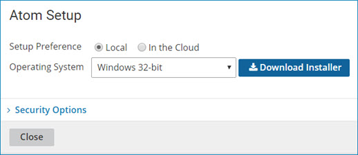
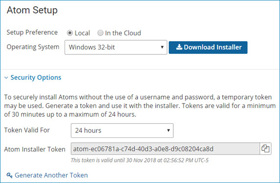

# Downloading the local Atom installer 

<head>
  <meta name="guidename" content="Integration"/>
  <meta name="context" content="GUID-401abba4-2ea0-43d7-9a15-4012f63467c1"/>
</head>

Download the local Atom installer from the **Atom Management** page to create a new Atom in your Platform account.

## Before you begin

Review the Atom system requirements to ensure that your system is compatible with setting up a local Atom. If you plan to use Docker to install an Atom, see the Docker Atom system require

:::note

It is a best practice that you download the latest version of the installer each time you want to create a new Atom. Previously downloaded installers might not contain the latest optimizations and can result in errors.

:::

Docker image installations are no longer available from the Integration user interface. You can download and run the Atom Docker image directly from [Docker Hub](https://hub.docker.com/r/boomi/atom/) and use it manually. Boomi's Docker Hub provides necessary information about the Atom Docker image, such as the image version, how to manually use the image or use it in unprivileged mode, and how to configure your Atom using a list of environment variables.

To install an Atom in an account, you must have the Atom Management privilege in that account. You also must have either the Build Read Access or the Build Read and Write Access privilege so that you have access to the Build page. If you do not have the Atom Management privilege and you try to download the Atom installer, you receive an error message. If you downloaded and ran the installer prior to receiving this privilege, you can attach the Atom only to accounts for which you have the Atom Management privilege.

## Procedure

1. Download the local Atom installer by going to **Manage** > **Atom Management** and click **New** > **Atom**

    The Atom Setup dialog opens.

    

2. For **Setup Preference**, select **Local**.

3. For **Operating System**, select the type of Atom that you plan to install:

    **Atom**

    - Windows 32bit - `https://platform.boomi.com/atom/atom_install.exe`

    - Windows 64bit - `https://platform.boomi.com/atom/atom_install64.exe`

    - Linux 32bit - `https://platform.boomi.com/atom/atom_install.sh`

    - Linux 64bit - `https://platform.boomi.com/atom/atom_install64.sh`

4. (Optional) Open the **Security Options** section to generate an installer token.

   You can use the token to install an Atom or give the token to someone else to perform the installation. Using a token eliminates the need to specify Platform credentials. When you generate a token, it is valid for your account only.

   1. For **Token Valid For**, select the length of time for which the token is valid.

      The minimum length of time is 30 minutes; the maximum is 24 hours.

   2. Click **Generate Token**.

      A unique installer token appears in the Atom Installer Token field along with the expiration date and time.

   3. Click  to copy the installer token to the clipboard.

   4. Paste the token to another location for use when performing the installation.

   5. (Optional) Click **Generate Another Token** to generate additional installer tokens.
   
      

5. Click **Download Installer**.

    A dialog opens that shows the name of the installation file you need for the selected operating system.

6. Click **Save File**.

    The installation file downloads to your machine.

7. (Optional) Give the installer token and the installation file to the person who performs the installation.

8. Follow the operating system-specific instructions links for installing a local Atom on Windows or Linux, or by using Docker.

    - [Atom installation checklist \(Linux\)](int-Atom_installation_checklist_Linux_a00ebe62-be96-4bd8-9142-07b702f22e88.md)
    - [Atom installation checklist \(Windows\)](int-Atom_installation_checklist_Windows_9dd66968-a6ad-4278-9efb-9476bc7ceb3c.md)
    - [Docker Hub](https://hub.docker.com/r/boomi/atom/)