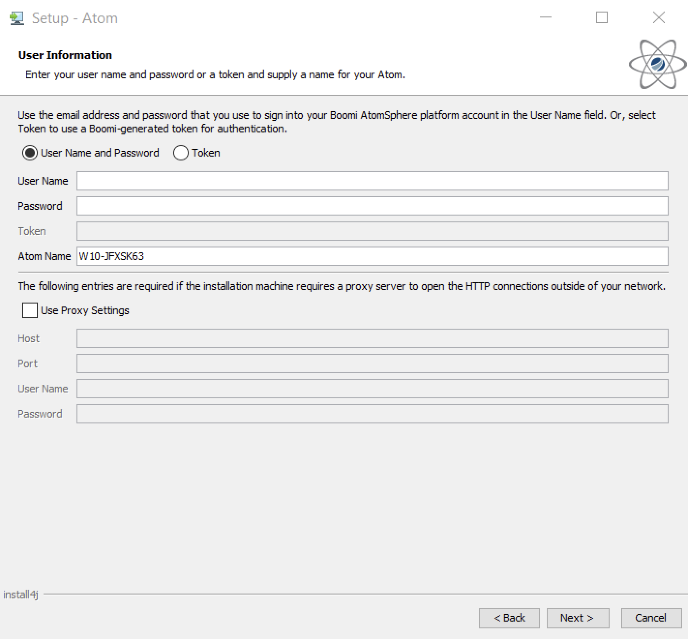

# Installing a local Atom on Windows 

<head>
  <meta name="guidename" content="Integration"/>
  <meta name="context" content="GUID-beec31b0-477d-430b-a744-cedb3a8d67eb"/>
</head>

Install the downloaded Windows version of the local Atom by running the installation file. See [Downloading the local Atom installer](./t-atm-Downloading_the_local_Atom_installer_401abba4-2ea0-43d7-9a15-4012f63467c1.md) and [Atom installation checklist (Windows)](./int-Atom_Cloud_installation_checklist_Windows_cad69a98-88cf-4bdb-9854-56acd2a34caf.md) for further details.

## Before you begin

Atoms require the Java 8 JRE or the Java 11 JDK. Boomi internally tested Amazon Corretto OpenJDK Java 1.8.0_382 and Amazon Corretto Open JDK 11.0.22.7.1.

The installer installs a private copy of Java 11 for the Atom to use. Alternatively, you can manage your own distribution of the Java 11 JDK by downloading the JDK from [Amazon](https://docs.aws.amazon.com/corretto/latest/corretto-11-ug/downloads-list.html) prior to installing the Atom.

Before completing these steps, download the local Atom installer.

Depending on the version of Windows you are running, you might require Administrator access to run the local Atom installer.

:::caution Warning

If there are Unicode characters in the directory path to where you intend to install the Atom, the installation will fail.

:::

## Procedure

1. After downloading the Atom installer, run the executable file.

2. If you see a security verification window, click **Yes**.

    The Atom Setup Wizard opens.

3. If the installer cannot find the JRE on the computer, you receive a prompt to download it.

4. On the **Welcome** page, click **Next**.

    The **User Information** page appears.

    

5. On the **User Information** page:

    1. Select **User Name and Password** or **Token**, depending on how you want Platform to authenticate the Atom.

    2. Enter one of the following, depending on the selected option:
       - Type your Platform **User Name** and **Password**.
       - Type a valid installer token

        When downloading the Atom installer from the Atom Setup dialog, you can generate installer tokens. A token is valid only for the account that creates it. Tokens expire after a set time ranging from 30 minutes to 24 hours.

    3.  Enter a name for the Atom.
    
        The Atom name that appears in **Manage** > **Atom Management**. The name defaults to the local host name, but you can change it to something more familiar.

        :::note

        The following characters are reserved and cannot be used in the name: asterisk (`*`), backslash (`\`), caret (`^`), colon (`:`), dollar sign (`$`), greater than (`>`), less than (`<`), percent (`%`), pipe (`|`), question mark (`?`), quotation mark (`"`), slash mark (`/`), Yen sign (`¥`).

        :::

    4. (Optional) If the local computer uses an HTTP proxy to connect to the internet, select **Use Proxy Settings** and enter the appropriate host, port, user name, and password for the proxy.

        If you do not fill out the proxy settings now, you can add them later.

    5. Click **Next**.

        You connect to Platform with your credentials authenticated.

        If you specified a user name and password, the **Accounts** page appears.

        If you specified an installer token, the **Select Destination Directory** page appears and you can skip to step 7.

6. (Optional) On the **Accounts** page:

7. If your user name has access to multiple accounts, you see a list of accounts. Select the account to which you associated the Atom. This step typically applies only to partners.

8. Click **Next**.

9.  (Optional) On the **Environment** page:

    1. If you created environments for your account, a list of them appears. Select the environment to which you attach the Atom. If you do not select an environment, your new Atom appears in the list of **Unattached Atoms** on the **Atom Management** page in the user interface.

    2. Click **Next**.

10. On the **Select Destination Directory** page, select the installation directory and click **Next**. By default the Atom installs to C:\Program Files\Boomi Enterprise Platform\Atom — `<Atom_name>`.

    :::note

    If you are using Windows Vista, Windows Server 2008 or Windows 7, anyone who needs to modify files in this directory must have Administrator access.

    :::

11. On the **Select Start Menu Folder** page, modify any Start menu settings and shortcuts and click **Next**.

12. On the **Information** page, review the installation settings and click **Next**.

    The installer installs all of the necessary files for the Atom.

13. When the installation is complete, click **Finish** to start the Atom.

## Results

The Atom runs as a Windows service. You can view the Atom online by going to **Manage** > **Atom Management**.

## Next steps

See the topics about maintaining Atoms, Molecules, and Atom Clouds. You might want to modify how the Atom runs, change default settings, or remove it.