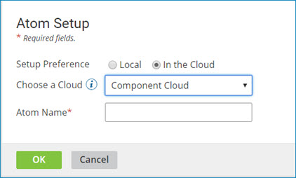

# Setting up an Atom in an Atom Cloud 

<head>
  <meta name="guidename" content="Integration"/>
  <meta name="context" content="GUID-45c1a7b6-8a1a-4ee4-8ba8-23d846625d6a"/>
</head>

On the **Atom Management** page, install and configure an Atom in a Atom Cloud or Test Atom Cloud, or in a private Atom Cloud.

## About this task

If your integration scenario requires only internet-accessible applications or data locations, you can set up your production processes to run virtually within a Boomi Atom Cloud. If you enable environments and test connections in your account and if you have test connection licenses, you can set up your test processes to run virtually within a Boomi Test Atom Cloud. If you have access to a private Atom Cloud, you can set up your processes to run virtually within it. To run your processes in one of these Atom Clouds, you must set up an Atom in the Cloud. You do not have to install any hardware or software.

:::note

If you have access to a private Atom Cloud, you can set up additional Atoms in this Cloud. To do so, simply repeat the setup process for each additional Atom.

:::

## Procedure

1. Download the Atom installer in one of the following ways:

    - Go to **Manage** > **Atom Management** and click **New** > **Atom**.

    - On the **Build** page, click the **Welcome** tab. Then, under **Create**, click **Atom**.

    The Atom Setup dialog opens.

2. Select **In the Cloud** and do one of the following:

    - If you want to use a Atom Cloud or Test Atom Cloud, choose one from the list.

        The list includes the Atom Clouds and Test Atom Clouds to which your account has access.

    - If you have access to a private Atom Cloud, choose one from the list.

        

        :::info Important

        If you cannot select the **In the Cloud** option, click **Cancel**.

        If this option is not available, it means one of two things:

        - Your account is attached to a Atom Cloud or Test Atom Cloud, and there are no other Atom Clouds available for you to use.

        - Your account has access to a private Atom Cloud, but you have already set up the maximum number of Atoms that you are allowed to have in that Cloud.

        :::

3. In the Atom Name field, type a name for the new Atom.

    There are no naming restrictions for the display name. You can use the same display name for multiple Atoms if needed.

4. Click **OK**.

    You receive a confirmation message indicating that the new Atom is set up in the Atom Cloud that you selected.

5. Click **OK**.

6. To confirm that you can access the new Atom, go to **Manage** > **Atom Management**.

    The Atom appears in the Atoms list on the left. Now, you can deploy processes to this Atom.

If you would like to install a local Atom instead, refer to [Downloading the local Atom installer](../Atom,%20Molecule,%20and%20Atom%20Cloud%20setup/t-atm-Downloading_the_local_Atom_installer_401abba4-2ea0-43d7-9a15-4012f63467c1.md)