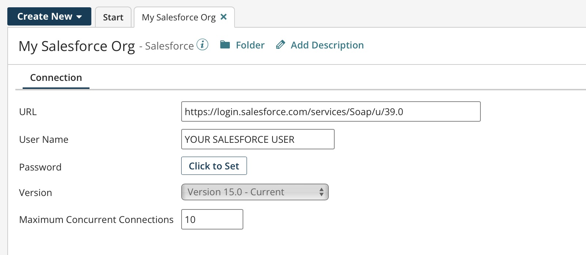
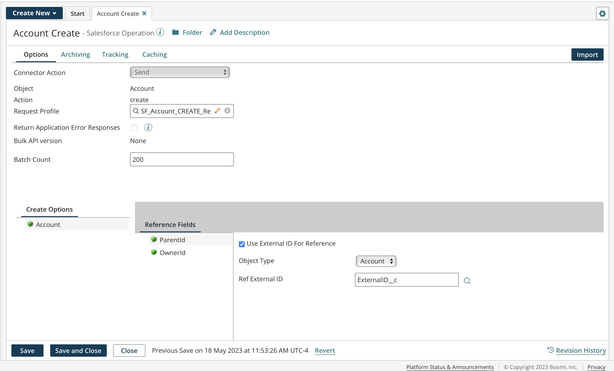

# Application connectors 

<head>
  <meta name="guidename" content="Integration"/>
  <meta name="context" content="GUID-f3571dff-ed8f-4528-9948-cde0ee139045"/>
</head>

Application connectors provide connectivity to specific software applications such as Netsuite, Salesforce, SAP, or Amazon.

Application connectors are tailored for particular software APIs so you can quickly connect and perform data operations. For example, some operations expect a specific format or profile in XML or JSON representing a request message to that application or a response message from it. Operations for application connectors are typically configured with filters to limit the results returned. When you build endpoints into an integration, make your first choice to use an application connector.

The following image is an example of a configured Salesforce connection.

The following image is an example of a configured Salesforce operation.

## Connector licenses and classes 

Connection licenses are categorized and provisioned by connector classes:

-   **Small Business** — For example, QuickBooks and Sage 50/Peachtree.
-   **Standard** — For example, NetSuite, Salesforce, SFTP, Disk, and so on. Most connectors are Standard class connectors.
-   **Enterprise** — For example, SAP and Oracle E-Business.
-   **Trading Partner** — For example, your trading partner profiles, such as X12, HL7, EDIFACT, and so on.

In general, provisioning of your account is with the number of connection licenses based on your subscription. Therefore, you can deploy up to that many connections across your various integration processes. Each one consumes the licenses as you deploy processes containing unique connections.

- [Agiloft CLM - Partner connector](./int-Agiloft_CLM_connector_b8ebad38-c52b-49b5-8bd4-16d06b72b6f0.md):
  The Agiloft CLM - Partner connector makes it easy to connect other applications with Agiloft on the Boomi Enterprise Platform and to automate a wide range of tasks from simple data export to complex inter-application workflows.

- [Aible AI – Partner connector](./int-Aible_connector_b2c80ebe-82f6-4130-b9ad-10b5183e0da3.md):
  Aible is the pioneer in ROI-optimized AI that systematically delivers business impact while respecting your business constraints.

- [Alleantia IoT - Partner connector](./int-Alleantia_partner_connector_a4844537-9d9e-4263-9bfb-976fd8786575.md):
  The Alleantia IoT - Partner Connector is a component that bridges the Alleantia ISC IoT Gateway and the Boomi Enterprise Platform, ensuring a fast and easy connection between machines and applications, to enable complete monitoring and control features for industrial devices, machines, plants and sensors.

- [Amazon Redshift connector](./int-Amazon_Redshift_connector_1ab9ffee-4dfe-4502-a268-68862a0444e0.md):
  Amazon Redshift Connector enables you to connect to an Amazon Redshift database cluster setup via Amazon Redshift JDBC driver.

- [Amazon S3 connector](./r-atm-Amazon_S3_connector_e69ef1f3-37dd-420c-9c7a-af470c969bc7.md):
  The Amazon S3 connector makes it easy to work with Amazon Simple Storage Service by simplifying the interaction and adding convenience.

- [Amazon S3 REST connector](./r-atm-Amazon_S3_REST_connector_bc37d2c7-9ea6-41b7-931b-9eb0c2a80640.md):
  Amazon Simple Storage Service (S3) allows you to simply and securely store and retrieve any amount of data from anywhere on the Web. Using the Amazon S3 REST connector, you can use a Integration process to upload, store, retrieve, filter, and delete object data from an Amazon S3 bucket.

- [Amazon SNS connector](./r-atm-Amazon_SNS_connector_f9dc71ca-95f6-4dc3-ac1f-8b78bc7ff8b0.md):
  The Amazon SNS connector makes it easy to work with the Amazon Simple Notification Service by simplifying the interaction and adding convenience.

- [Anaplan (legacy) connector](./int-Anaplan_legacy_connector_923cbe1f-4a2d-453f-b24b-d8ac421412d0.md):
  The Anaplan (legacy) connector enables you to import and export Anaplan’s business modeling and planning platform data to many On Demand or SaaS-based applications.

- [Anaplan connector](./r-atm-Anaplan_connector_308e18b1-32e0-4181-b1b1-61df77580b89.md):
  The Anaplan connector allows you to upload and insert new Anaplan business modeling and financial planning data, and import and export data to On Demand and SaaS-based applications. You can upload a file as a single chunk, or in several chunks.

- [Aprimo connector](./r-atm-Aprimo_connector_df5114eb-a887-4e55-b5a7-f56e25604607.md):
  The Aprimo connector enables you to move data into and out of Aprimo Marketing Studio On Demand.

- [Aria – Partner connector](./r-atm-Aria_connector_f1893b38-c5b3-4af9-a8ba-691a18648e1e.md):
  The Aria – Partner connector enables you to connect to the Aria Subscription Billing Platform to move data into and out of the Aria application.

- [Autotask connector](./r-atm-Autotask_connector_3829d2f2-346e-4525-9e67-6ae7143e10cd.md):
  The Autotask connector enables you to easily integrate your Autotask application data, such as customers, contracts, and projects, with other systems, including CRM applications, accounting packages, and more.

- [Boomi AtomSphere API connector](./r-atm-AtomSphere_API_connector_c575ca80-7ae4-4221-abe1-5dcdc0055f20.md):
  The Boomi AtomSphere API connector enables you to perform the object-based operations and actions exposed in the AtomSphere API.

- [Boomi AtomSphere Partner API connector](./r-atm-AtomSphere_Partner_API_connector_868916ed-6d6d-4854-88c2-ad51a03bc018.md):
  The Boomi AtomSphere Partner API connector enables you to perform object-based operations and actions exposed in the AtomSphere Partner API.

- [Boomi for SAP connector](./int-Boomi_SAP_connector.md):
  The Boomi for SAP connector allows you to connect to Boomi for SAP core functionality via OpenAPIs. This connector retrieves the OpenAPI definition and generates an easy to use interface for you to seamlessly configure the operations available as part of Boomi for SAP.

- [Boomi Flow Client connector](./r-atm-Flow_Client_connector_f5bb5da8-a28d-4587-bdb7-d2c21a7969e5.md):
  The Boomi Flow Client connector enables processes to request actions exposed in the Flow API.

- [Boomi Master Data Hub connector](./r-atm-MDM_connector_ff690a6f-288d-44b3-96fb-e81afb046703.md):
  The Boomi Master Data Hub connector connects seamlessly with Hub repositories.

- [Boomi Master Data Hub Listener connector](./r-atm-MDM_Listener_connector_3a30d199-8905-492a-9229-919352404655.md):
  The Boomi Master Data Hub Listener connector is a listen-only connector used only in Integration Hub listener processes.

- [Box connector](./r-atm-Box_connector_6b3e3d8e-f379-40fd-8644-1e8938cfa1f3.md):
  The Box connector enables government agencies and employees to safely and securely store, access, share, and collaborate on files, folders, and content across devices in a cloud-friendly and secure environment.

- [Ceres Technology - Partner connector](./r-atm-Ceres_Tech_connector_5a328f60-ba7e-4f63-8041-58527fb5212f.md):
  Ceres Technology offers an AI solution that enables clients to predict supply chain delays, often months in advance. We are able to provide you with the ability to know which products and suppliers are at risk of a delay before you place your purchase orders.

- [CloudBlue Connect - Partner connector](./int_CloudBlue_Connect_connector_df3922ce-7958-4d5c-9333-f2d86a039452.md):
  The CloudBlue Connect platform enables the users to work in real-time with the transactions generated between distributors, resellers, and customers.

- [Coupa connector](./r-atm-Coupa_connector_398e7796-e71d-407a-aea7-efab51ea4f92.md):
  The Coupa connector enables you to move data into and out of Coupa and integrate any on-premise applications and legacy systems with Coupa.

- [Fiix — Partner connector](./int-Fiix_Integration_connector_83569955-d262-4fc9-a596-61056dbbbde0.md):
  The Fiix — Partner connector allows you to work with various objects exposed through the Fiix API, meaning that you can access all Computerized Maintenance Management System (CMMS) related data and methods to work with assets, purchase orders, work orders, and more. The connector supports the Query, Create, Update, and Delete operations.

- [Files.com - Partner connector](./r-atm-Files_connector_233ee8d5-7738-4ed7-86a1-37c85563592c.md):
  Use the Files.com connector to use their cloud based Managed File Transfer (MFT) automation platform.

- [Google Ad Manager connector](./r-atm-Google_DFP_connector_fe51c7d3-a860-4de6-9aed-218ac04c2dfe.md):
  The Google Ad Manager connector enables Integration users to integrate their data with Google Ad Manager.

- [Google BigQuery connector](./r-atm-Google_BigQuery_connector_e68dae37-25d8-4653-8cf8-14406617cd01.md):
  Use the Google BigQuery connector to stream and insert incremental structured data into Google BigQuery.

- [Google G Suite connector](./r-atm-Google_Apps_connector_9b88d8a1-4ec8-4fc3-9437-8e5efbda8cff.md):
  The Google G Suite connector enables you to integrate with the Google G Suite platform’s Contacts, Calendar, and Spreadsheets services.

- [Google Sheets connector](./r-atm-Google_Sheets_connector_5e7fbf2e-fe00-4556-ae9c-894d3561066e.md):
  With the Google Sheets connector, you can create, delete, get, query, and update objects in Google Sheets.

- [Google Storage connector](./r-atm-Google_Cloud_Storage_connector_28f39f16-486a-4433-a2d1-719e721f22c8.md):
  The Google Storage connector enables you to leverage a powerful, simple, and cost effective object storage service. Using this connector, you can store and retrieve files and data from the Google Cloud Storage platform from a process.

- [Great Plains connector](./r-atm-Great_Plains_connector_8e05bdf1-b56e-4e9e-988c-1c8cc0eac857.md):
  The Great Plains connector enables you to move data into and out of the Microsoft Great Plains (now called Microsoft Dynamics GP) business management application.

- [Hadoop connector](./r-atm-Hadoop_connector_33d08b80-8f21-46e0-9440-6e87e47d8714.md):
  The Hadoop connector gets files from or sends files to data directories on the Hadoop Distributed File System (HDFS) server(s) to which the Atom has access.

- [Hypatos.ai - Partner connector](./r-atm-Hypatos_Studio_connector_c021a3f1-066a-493c-b0db-535a0c40ce56.md):
  Hypatos is a deep learning document automation hub for the enterprise. Unlike rule-based solutions that perform data capturing, it collects, understands, and enriches document data to automate higher value-added processes for enterprise operations. Its deep learning foundation is coupled with an intuitive, no-code interface (Hypatos Studio) to enable human-in-the-loop participation when desired.

- [IFS REST – Partner connector](./int-IFS_REST_Connector_e7e1c825-992f-42f8-a41d-f29f8b4992ea.md):
  The IFS REST – Partner connector simplifies communicating with IFS Application 10 (Apps 10) or IFS Cloud instances, on-premise or in the cloud, to create, read, update or delete data through IFS's REST APIs.

- [IFS FSM REST connector](./int-IFS_FSM_REST_connector_0aaa24a1-14bc-4ffe-8a70-2b022ec8b683.md):
  The IFS FSM REST connector simplifies communicating with an IFS Field Service Management (FSM) instance on-premise or in the cloud to create, read, update, or delete data through FSM's REST APIs. Using the connector, you can integrate FSM with other software applications and services wherever they reside. The connector allows you to browse the FSM schema, and guides you in setting up filters, sorts, and other common activities.

- [Innotas – Partner connector](./r-atm-Innotas_connector_9b387376-d96a-431a-b255-60ce39d4bee6.md):
  The Innotas – Partner connector enables you to easily integrate your Innotas On Demand Project Management application data (such as customers, resources and projects) with other systems, including CRM applications, accounting packages and more.

- [Intacct connector](./r-atm-Intacct_connector_2a89e2ac-147c-4407-95de-2be4f25bf5a6.md):
  The Intacct connector enables you to move data into and out of Intacct's On-Demand Financial Application Suite.

- [JIRA REST connector](./r-atm-JIRA_REST_connector_eef36c81-bc39-4286-b8da-24d432e79031.md):
  You can use the JIRA REST connector to move data into and out of the JIRA application and integrate any on-premise applications and legacy systems.

- [Kanverse IDP - Partner connector](./r-atm-Kanverse_IDP_connector_e031220e-a6f9-4dbd-8ecb-cb66748b8c0f.md):
  Built upon a SaaS-based Hyperautomation platform, Kanverse Intelligent Document Processing (IDP) brings together cognitive computing and automation in a standalone product to deliver unprecedented benefits to customers. Kanverse IDP - Partner connector for Boomi helps developers to connect Kanverse to the Boomi Enterprise Platform.

- [Laserfiche - Partner connector](./r-atm-Laserfiche_connector_64a79214-e9ce-4dcb-8234-ce6183d23776.md):
  Leverage the Laserfiche - Partner connector to build integrations with other enterprise platforms and implement custom end-to-end solutions. Currently, the Laserfiche - Partner connector supports operations that let you interact with your Laserfiche repository, which promotes easy access to information inside and outside your business, all while maintaining content compliance at all stages, from initial capture to final archival.

- [Live Optics connector](./int-Live_Optics_connector_e7e24c79-808d-44c5-a02b-adfc8a8bdb0f.md):
  The Live Optics connector enables you to connect to the Live Optics application and Get necessary data in JSON format using PAPIs and Project ID.

- [Lumesse TalentLink – Partner connector](./r-atm-Lumesse_TalentLink_connector_92da5dc0-28b3-4cfb-b4ca-14284a8aea16.md):
  The Lumesse TalentLink – Partner connector enables Integration users to integrate with Lumesse TalentLink.

- [Magento connector](./r-atm-Magento_connector_674f95f4-1b8b-4e36-9beb-02acd4691829.md):
  The Magento connector makes it easy to work with the Magento eCommerce website software by simplifying the interaction and adding convenience.

- [Marketo — Partner connector](./r-atm-Marketo_connector_-_Legacy_f9f9ba83-3c4d-42a2-99c9-eec3fe070d18.md):
  The Marketo — Partner connector enables you to move data into and out of the Marketo application.

- [Marketo REST connector](./r-atm-Marketo_REST_connector_caf966f4-5e90-4fc5-89d3-4e58ba1a2acd.md):
  The Marketo REST connector makes it easy to move data into and out of Marketo’s marketing automation platform using the REST protocol.

- [Microsoft Azure Blob Storage connector](./r-atm-Microsoft_Azure_Blob_Storage_connector_216ef744-e76e-4764-848c-a421af79d469.md):
  The Microsoft Azure Blob Storage connector makes it easy to build integrations by simplifying construction to your Azure Storage objects.

- [Microsoft Azure Data Lake Storage connector](./int-ADLS_Gen2_connector_a80bb83d-3f78-425a-a6b3-2a99ecca8686.mdx):
  Microsoft Azure Data Lake Storage (ADLS) Gen2 connector enables you to access and interact with your ADLS Gen2 storage account using the ADLS Gen2 REST APIs.

- [Microsoft Azure SQL Data Warehouse connector](./r-atm-Microsoft_Azure_SQL_Data_Warehouse_connector_a7821121-3aed-46ee-9d85-a8013a1ff2f7.md):
  The Microsoft Azure SQL Data Warehouse connector makes it easy to work with Microsoft Azure SQL Warehouse.

- [Microsoft Azure SQL Database connector](./r-atm-Microsoft_Azure_SQL_Database_connector_d52c83b3-1ca2-4db3-b48a-c60abb607bed.md):
  The Microsoft Azure SQL Database connector makes it easy to work with Microsoft Azure SQL Database.

- [Microsoft Dynamics 365 for Customer Engagement connector](./r-atm-Microsoft_Dynamics_365_for_Cus_Engage_connector_4a13d4aa-8c77-40fc-b84a-aab9f87f2a73.md):
  Use the Microsoft Dynamics 365 for Customer Engagement connector to connect the Boomi Enterprise Platform to any Dynamics 365 Customer Engagement service, including Dynamics 365 for CRM.

- [Microsoft Dynamics 365 for Finance and Operations connector](./r-atm-Microsoft_Dynamics_365_for_Fin_and_Op_connec_61b1fe0d-7c87-437c-90cb-ae24edd640ad.md):
  Use the Microsoft Dynamics 365 for Finance and Operations connector to connect the Boomi Enterprise Platform to any Dynamics 365 for Finance and Operations service.

- [Microsoft Dynamics AX connector](./r-atm-Microsoft_Dynamics_AX_connector_7ae295ae-bd78-4277-be9a-df08c93f5af6.md):
  The Microsoft Dynamics AX connector enables moving data into and out of the Microsoft Dynamics AX business management application.

- [Microsoft Dynamics CRM connector](./r-atm-Microsoft_Dynamics_CRM_connector_b43f7cb2-abf5-4e36-a4a4-a1606b7860c6.md):
  The Microsoft Dynamics CRM connector enables you to move data into and out of the Microsoft Dynamics CRM application.

- [Microsoft Dynamics GP connector](./r-atm-Microsoft_Dynamics_GP_connector_d3980054-06a1-42fb-adb7-03fc4d63de4b.md):
  Use the Microsoft Dynamics GP connector to move data into and out of the Microsoft Dynamics GP business accounting application.

- [Microsoft SQL Server BCP connector](./r-atm-Microsoft_SQL_Server_BCP_connector_71db5c3a-0725-45d4-8f2b-e0ac2f1ceef2.md):
  Use the Microsoft SQL Server Bulk Copy Process (BCP) connector to perform Bulk Copy operations on a SQL Server database.

- [Microsoft Teams connector](./int-Microsoft_Teams_V2_connector_976a9db8-a1a1-4983-a6e0-2e0706629507.md):
  Microsoft Teams connector allows you to connect to your Microsoft Teams server and perform required data transfer from/to, using Microsoft Graph REST APIs.

- [MongoDB connector](./int-MongoDB_connector_a6cce0aa-00a6-48d0-bfbe-feb2474b57e1.md):
  The MongoDB connector allows you to perform single/bulk transfer of data from/to a MongoDB server using MongoDB Java APIs.

- [NetSuite connector](./r-atm-NetSuite_connector_0e4b02c7-ef6b-4c1e-a273-2f5d443c7e7c.md):
  NetSuite is a financial management solution allowing you to manage IT costs, optimize accounting efficiency, streamline order management and procurement processes.

- [NetSuite OpenAir connector](./r-atm-NetSuite_OpenAir_connector_e32064fa-4e28-4bd1-b318-6c6ac09554da.md):
  The NetSuite OpenAir connector enables you to move data into and out of NetSuite OpenAir services resource planning (SRP) software.

- [OANDA –Partner connector](./r-atm-OANDA_connector_7ad488db-f0ff-4de7-8801-1c1dcf6f4a49.md):
  The OANDA –Partner connector allows you to query OANDA’s daily exchange rate data through the OANDA Exchange Rates API.

- [Okta connector](./int-Okta_connector_fa2e390a-de24-430f-979d-57b027c4bceb.md):
  The Okta connector allows you to interact with an Okta account, to leverage Okta's REST APIs to easily provision and manage users.

- [OpenLegacy Hub - Partner connector](./int-OpenLegacy_Hub_connector_53023a18-5d28-4186-88d6-e515e0ec7243.md):
  The OpenLegacy Hub - Partner connector integrates the Boomi Enterprise Platform to any legacy systems via the OpenLegacy Hub, an all-in-one platform for managing and integrating legacy assets into third-party technology platforms.

- [OpenManage Enterprise connector](./int-OME_connector_0f06cfa3-9362-44cc-825d-570c61a58897.md):
  The OpenManage Enterprise connector allows you to connect to DELL Open Manage Enterprise (OME) and use a process to query Alerts (based on ID, SeverityType and Timestamp filters) in DELL OME and receive output data in JSON format.

- [Oracle CRM On Demand connector](./r-atm-Oracle_CRM_On_Demand_connector_da69da7a-592a-405c-8d61-8cf0f09469fb.md):
  The Oracle CRM On Demand connector enables you to move data into and out of the Oracle CRM On Demand solutions, and the Oracle CRM On Demand Industry Editions solutions.

- [Oracle Database connector](./int-Oracle_database_connector_2e42bb82-873a-4ec8-8d2d-3db821c0d9ec.md):
  The Oracle Database connector allows you to select, insert, update, delete, upsert records and also allows you to call stored procedures in an Oracle database.

- [Oracle E-Business (EBS) connector](./r-atm-Oracle_E-Business_connector_983bcd7f-d885-47de-afed-7504c8961d9d.md):
  The Oracle E-Business (EBS) connector (classified as an Enterprise connector) enables you to connect to the Oracle E-Business Suite. This integration runs database stored procedure calls (Execute operation) and queries (Query operation) using Java (JDBC).

- [Oracle E-Business Suite V2 connector](./int-Oracle_EBS_V2_connector_5083af8a-8d20-4262-8020-aac9cf558d4e.md):
  The Oracle E-Business Suite (EBS) V2 connector (classified as an Enterprise connector) allows you to connect to an Oracle EBS instance. You can interact with Oracle EBS based on the applicable Interface types defined in the Oracle Integration Repository, or establish a direct connection to the Oracle Database via Oracle JDBC drivers.

- [Oracle Fusion connector](./int-Oracle_fusion_connector_c8a70026-8fda-4e9a-8ea3-af5ea88fc1c8.md):
  The Oracle Fusion connector supports connectivity to Oracle Fusion/Oracle ERP Cloud via Simple Object Access Protocol (SOAP) services and BASIC authentication protocol.

- [Oracle SQL*Loader connector](./r-atm-Oracle_SQL_Loader_Connector_0d741a67-f692-467b-9b05-a3c09d0bdd0a.md):
  The Oracle SQL*Loader connector enables you to perform bulk data uploads to an Oracle database.

- [PowerSteering – Partner connector](./r-atm-PowerSteering_connector_62499fbb-0d61-4365-a81c-22061bb6d9b9.md):
  The PowerSteering – Partner connector is built on top of the PowerSteering REST API interface to provide simplified access to its data for Integration users.

- [Pricefx - Partner connector](./int-Pricefx_connector_8cdda9d4-a5a0-45d4-8864-7af9f284b257.md):
  Together, the Integration and the Pricefx - Partner connector enable you to easily connect any customer data or application to Pricefx, which enables the creation of a full suite of pricing management solutions.

- [QuickBooks connector](./r-atm-QuickBooks_Connector_4d9b5e0a-0ebb-42c1-b5b1-23cd318b4201.md):
  The QuickBooks connector enables you to move data into and out of QuickBooks financial software.

- [QuickBooks Online connector](./r-atm-QuickBooks_Online_connector_3eba9366-ad15-4d92-b349-5912b9018c3d.md):
  The QuickBooks Online connector enables you to move data into and out of the QuickBooks Online financial software.

- [Radius by Campus Management connector](./r-atm-Hobsons_Radius_connector_3fd14d39-f133-4802-bab4-9f57933b314b.md):
  The Radius by Campus Management connector (formerly, Hobsons Radius) enables Integration users to integrate with Radius by Campus Management, a best-in-class admissions and enrollment management CRM.

- [RightNow – Partner connector](./r-atm-RightNow_Connector_d007ae7e-36aa-4193-9d47-b943b6d40620.md):
  The RightNow – Partner connector enables you to move data into and out of the Oracle RightNow CX CRM.

- [RutterKey Procore - Partner connector](./int-RutterKey_Procore_connector_81f12fcf-0d8a-4538-9af0-41bc61251d1a.md):
  The RutterKey Procore - Partner Connector simplifies communication with Procore to create, read, update or delete data through Procores REST APIs. Using this connector, you can integrate Procore with other software applications and services wherever they reside. Utilizing the connector you can browse Procore API operations, setup filters and perform other common activities.

- [Saba TalentSpace connector](./r-atm-Halogen_connector_87dfbff3-8b64-4343-b168-7a18428a4633.md):
  Use the Saba TalentSpace connector to move data into and out of Saba TalentSpace and to integrate any on-premise applications and legacy systems.

- [Sage 50/Peachtree connector](./r-atm-Sage_50_Peachtree_Connector_74bfdcc0-c2ca-4056-a95b-bd7e55c42de3.md):
  The Sage 50/Peachtree connector lets you move data into and out of the Sage 50 financial application (formerly, “Peachtree Accounting”).

- [Salesforce connector](./r-atm-Salesforce_Connector_6ff3c702-e986-41a1-be5b-a00e76ded0a5.md):
  The Salesforce connector connects seamlessly to any native Salesforce application, including Sales Cloud and Service Cloud as well any Custom Cloud or Force.com.

- [Salesforce Analytics connector](./r-atm-Salesforce_Analytics_Connector_d1fd5cb7-94d8-4569-b00d-a58587593dc5.md):
  The Salesforce Analytics connector simplifies uploading CSV (comma-separated value) files into an Analytics Cloud dataset. The connector automatically compresses data for faster uploads.

- [Salesforce Apex connector](./r-atm-Apex_connector_d261071d-faee-45fa-aae5-5f8915bc49d0.md):
  The Salesforce Apex connector enables you to integrate your Salesforce data by dynamically referencing compiled Salesforce Apex WSDL documents.

- [Salesforce Marketing Cloud connector](./int-Salesforce_Marketing_Cloud_connector_3a95b76b-ed2e-4fb6-9890-06ac49ba1eee.mdx):
  Salesforce Marketing Cloud (SFMC) connector enables you to interact with the Salesforce Marketing Cloud platform through the Marketing Cloud APIs.

- [SAP connector](./r-atm-SAP_Connector_1357073d-338b-4c1c-b475-01197756f04a.md):
  The SAP connector (classified as an Enterprise connector) enables you to connect to your SAP NetWeaver-based application and get or send data using BAPIs, Remote Function Modules (RFMs) and asynchronously using IDocs.

- [SAP Business ByDesign connector](./r-atm-SAP_Cloud_for_Customer_Connector_f8083b5a-a526-4782-beed-b708d9e4ab40.md):
  The SAP Business ByDesign connector enables Integration to connect to specific solutions of the SAP Cloud platform.

- [SAP HANA Database connector](./int-SAP_HANA_Database_connector_677cc0c5-2232-4dc2-bd8a-6f2e030f9898.mdx):
  SAP HANA Database connector allows you to interact with SAP HANA Database using Java Database Connectivity (JDBC) drivers. The connector uses the SAP HANA JDBC driver version `ngdbc-2.8.11.jar`.

- [SAP JCo V2 connector](./int-SAP_JCo_V2_connector_093cda95-a783-486b-b588-5a5a922c3ffc.md):
  The SAP JCo V2 connector (classified as an Enterprise connector) enables you to connect to your SAP systems via SAP’s RFC protocol. You can execute BAPIs, Remote Function Modules (RFMs) and send/receive IDocs asynchronously.

- [SAP S/4HANA OData connector](./int-SAP_S4HANA_OData_connector_195bca0c-0684-45f4-a262-ec0bb9732b33.mdx):
  SAP S/4HANA OData connector enables you to connect to SAP S/4HANA Cloud or SAP S/4HANA system via OData V2 (Open Data Protocol) services.

- [ServiceNow connector](./r-atm-ServiceNow_Connector_cc7806a6-3a88-474e-ab81-d1aa36331c36.md):
  The ServiceNow connector enables you to move data into and out of ServiceNow.

- [ServiceNow REST connector](./r-atm-ServiceNow_REST_connector_507b6914-9f6a-45ef-a832-880d7430881c.md):
  The ServiceNow REST connector enables you to directly connect to ServiceNow and use a process to insert, retrieve, update, delete, and query records (incidents, cases, accounts, customers, products, etc.) in ServiceNow.

- [Shopify connector](./r-atm-Shopify_connector_0ef10e52-18e4-483a-9b59-c0d957f06faa.md):
  The Shopify connector enables you to integrate with Shopify, the e-commerce site for setting up and running online storefronts.

- [Signifyd – Partner connector](./r-atm-Signifyd_connector_c42981f8-cf65-4eb4-8e02-f2cca2091106.md):
  The Signifyd – Partner connector allows you to access the Signifyd system through the Signifyd REST API and manage cases.

- [Slack connector](./r-atm-Slack_connector_2a8c29fd-7fb2-461e-9e66-41c92f49ff9c.md):
  The Slack connector simplified the integration with Slack, the cloud-based collaboration tool, to help improve collaboration in your organization.

- [Snowflake connector](./int-Snowflake_Connector_f551004c-1429-4fe1-85c1-b345d37ab73c.md):
  The Snowflake connector allows you to leverage the capabilities of a Snowflake data warehouse, i.e., speed, usability, and flexibility.

- [SuccessFactors – Partner connector](./r-atm-SuccessFactors_Connector_93ec6fae-8624-466e-b309-728de281d56a.md):
  The SuccessFactors – Partner connector extends the SuccessFactors BizX SFAPI to the Boomi Enterprise Platform and provides a user-friendly interface for creating and managing SFAPI connections and operations.

- [SugarCRM REST connector](./r-atm-SugarCRM_REST_connector_388b1a70-9ed6-44c8-b562-97c88a394250.md):
  The SugarCRM connector enables you to move data into and out of any edition of SugarCRM.

- [Taleo connector](./r-atm-Taleo_Connector_e753014a-f1eb-4c6b-b0a1-cd3ce6532336.md):
  The Taleo connector enables you to move data into and out of the Taleo Business Edition application.

- [Taleo REST connector](./r-atm-Taleo_REST_Connector_0debf238-20c3-4fd0-9a10-a834a18b8ad2.md):
  Use the Taleo REST connector to move data into and out of the Taleo Business Edition application by using its public REST API.

- [Teqtron Agile PLM — Partner connector](./int-Teqtron_Agile_PLM_connector_new_019b032f-46bf-4e07-a1bc-76499876f06e.md):
  The Teqtron Agile PLM connector enables users to access their Oracle Agile PLM system which accelerates innovation and new product introductions by efficiently managing items, parts, products, documents, requirements, engineering change orders, and quality workflows across supply chains while seamlessly integrating to computer-aided design (CAD) systems.

- [Thru MFT – Partner connector](./int-Thru_MFT_connector_050bf4b3-333e-401a-aa2a-e6e92e449623.md):
  The Thru MFT - Partner connector provides out-of-the-box file exchange for your Boomi processes using Thru’s MFT platform. By connecting a process to Thru’s unique cloud-native MFT Platform, you take your file transfer to a new level with unparalleled monitoring and control across all lines of business.

- [Toad Intelligence Central connector](./r-atm-Toad_Intelligence_Central_Connector_4e2492ce-7516-4f10-8f08-4bf85cfb1999.md):
  Use the Toad Intelligence Central connector to move data into the Toad Intelligence Central data repository from any on-premise application and legacy system, including other On Demand or SaaS-based applications.

- [Twilio connector](./r-atm-Twilio_Connector_56feaeb1-e6a0-46ee-9d96-53875e0a5589.md):
  Use the Twilio connector to query metadata about a Twilio account, phone numbers, calls, text messages, and recordings, initiate outbound calls, and send text (SMS) messages, in a Integration process.

- [UBIX Advanced Analytics - Partner connector](./int-Ubix_connector_ccb8007a-f4ab-44ea-985b-8d82bbc26c5a.mdx):
  Use the UBIX Advanced Analytics - Partner connector to serve as a gateway to send critical enterprise data from your Boomi-connected systems into a big data store called DataSpace. The UBIX platform allows you to quickly build Advanced Analytics workflows and cloud-based application leveraging a no-code ModelSpace and SolutionSpace App Builder capabilities to transform data into valuable assets by delivering real-time insights and data-driven decision making to your organization, thus transforming how you do business.

- [UKG Pro connector](../Connectors/r-atm-UKG_Pro_connector.mdx):
  Use the UKG Pro connector to easily browse, query, and get data out of UKG Pro and integrate that data with other back-office systems.

- [Workday connector](./r-atm-Workday_Connector_08c9018b-3103-419d-ac03-fc260503b78e.md):
  Use the Workday connector to connect to the Workday Financial Management and Human Capital Management applications.

- [Workday Prism Analytics (Tech Preview) connector](./r-atm-Workday_Prism_connector_d6a12964-d667-4d5f-9e92-8290b8171b74.md):
  Workday Prism Analytics allows you to bring together your data (Workday Prism Analytics and non-Workday Prism Analytics data) from any source so you can prepare, analyze, and securely share it with your organization. You gain the insights that you need to drive better business decisions and outcomes. You can bring external data sources into Workday Prism Analytics, govern them along with existing Workday Prism Analytics data sources, and generate financial and HR insights that can be shared across your organization.

- [Workday Prism Analytics V2 connector](./int-Workday_Prism_Analytics_V2_connector_ced6832f-3832-4325-926a-350bbdc2d64b.mdx):
  The Workday Prism Analytics V2 connector allows Workday customers to bring together data from any source, in order to prepare, analyze, and securely share it within your organization. By doing so, business insights are enabled to drive better business decisions and outcomes.

- [Zuora connector](./r-atm-Zuora_Connector_a39f0805-e30a-49a5-9f82-eb6ba5f969e2.md):
  Use the Zuora connector to connect to Zuora’s Z-Commerce Platform to access your Z-Billing and Z-Payments data.

- [Zuora REST connector](./r-atm-Zuora_REST_connector_3fe94b3d-1e1e-48d8-bc7b-f795e3ac8073.md):
  The Zuora REST connector enables you to connect to your Zuora’s automated operations like Z-Billing, Z-Payments, and Z-Tax.