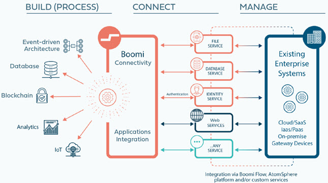
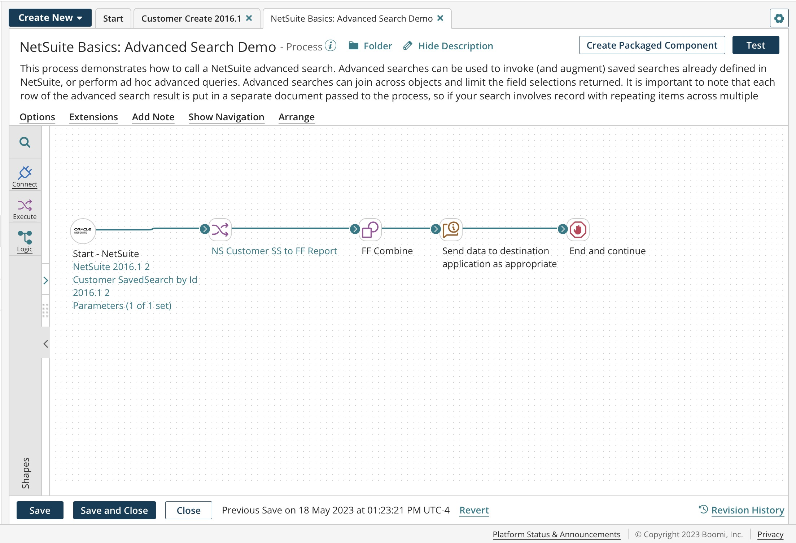
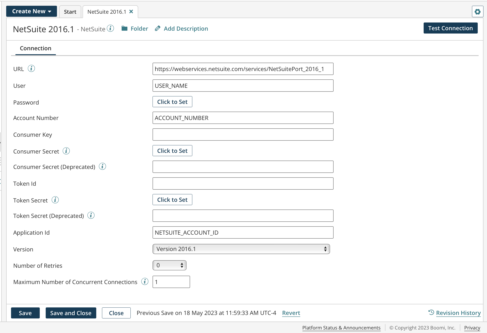
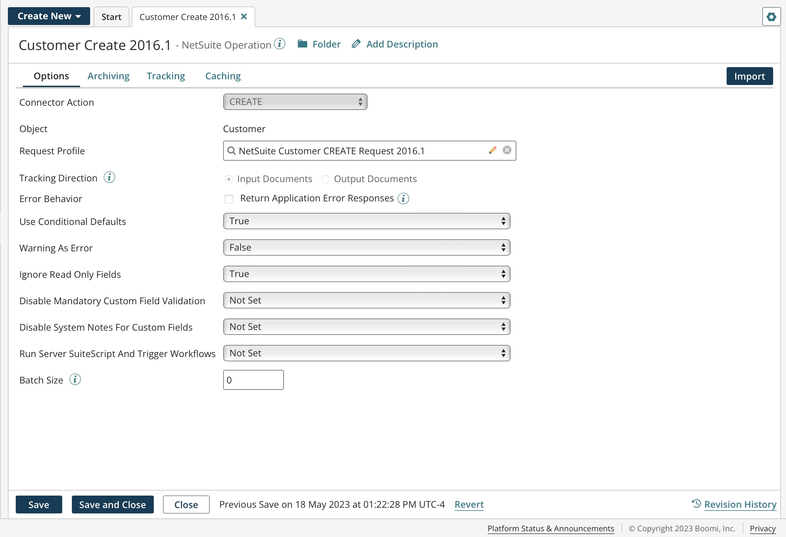

# Connectors

<head>
  <meta name="guidename" content="Integration"/>
  <meta name="context" content="GUID-bb305b35-0f13-4937-a918-f85dbbe1b27b"/>
</head>

<head>
  <meta name="guidename" content="Integration"/>
</head>

Integration connectors are the main component that facilitate integration and contain all the information needed to connect to a data source or application.

You can build your integrations with the catalog of connectors, or leverage the Connector SDK to build a custom connector to leverage the Boomi Enterprise Platform.

## Connector benefits 

Boomi connectors make it faster and easier for you to unify your data, systems, applications, processes, and people. Connectors let you easily connect and integrate third-party applications, such as Salesforce to NetSuite, to send and receive data between them. When you are assigned a Boomi account, you have access to all public application and technology connectors. You can also use the Connector SDK to build your own private, custom connectors.

Connectors provide the following benefits:

-   Simplifies application support
    -   Automatic updates and lower cost of ownership. When a new version of an API is available, the connector automatically updates to support that version.
    -   To protect access to your data, connectors support many authentication types including basic authentication, password digest, client certificate, OAuth, and so on.
    -   Connectors automatically discover the latest objects supported in an application API. For example, creating data, inserting data, deleting data, querying data, and so on.
-   Highly configurable
    -   Connectors are highly configurable and support advanced options to fine-tune their behavior. For example, the HTTP Client connector supports cookie scope to set the persistence of cookies. Many connectors support advanced options so you can more manipulate and fine-tune data.
-   Built-in data manipulation
    -   Increase your productivity while working with data by automatically paging through large data sets and retrieving the entire data set from the API.
    -   Optimize data transfer and efficiency by splitting large files into smaller chunks.
    -   Support batches to improve efficiency and performance, thereby reducing the processing time for an operation.
-   Real-time support
    -   For real-time data processing, integration, and process orchestration, some connectors provide listener support. For example, the Microsoft Azure Service Bus connector listens for messages from queues and topics. The JMS connector works with any JMS v1.1 messaging provider to send and receive messages from JMS queues or topics. The Atom Queue connector sends and receives messages to and from native Integration Atom message queues. This helps ensure you are working with the latest and most current data.
    -   Other listen-only connectors such as the Listener connector, the Flow Services Server connector, and the AS2 Shared Server connector, are available to provide real-time data validation and integration, including communication with trading partners.

## Connector components 

Connectors are a combination of two components that you can store separately in the Component Explorer:

-   Connection — The physical connection information; you define the URL of a data source or application, and provide credentials to access it.
-   Operation — The function to call or files to act upon; how to process the data.

Because both connections and operations are reusable components, you can, for example, create a single connection and pair it with different operations

The preconfigured NetSuite process in the image below is one of many examples available in the Boomi Enterprise Platform Process Library. You can find all of the examples on this page in the Process library by searching for **NetSuite Basics Examples**.

## Connector types 

Boomi supports the following types of connectors:

-   **Application connectors** — Provide connectivity to software applications such as Netsuite, Salesforce, SAP, Amazon, and many others. When you build endpoints into an integration, make your first choice to use an application connector. resolves many specific issues to get you connected faster. Application connectors can also support multiple versions of a specific API.
-   **Event-driven connectors** — Provide connectivity to event-based systems using application and technology connectors. Event-driven connectors respond to user actions, such as mouse clicks and messages from another application or program, and define the data, security model, integration path and control flow of such events. provides connectivity to multiple EDA technologies, such as Kafka, SQS, Solace and RabbitMQ.
-   **Technology connectors** — Provide connectivity to and from web applications, on-premise applications, and common data repositories using various protocols \(including HTTP, FTP, JMS, etc.\) using a standard data transport method or generic data driver. The data format or profile for technology connectors is independent from the connector’s operation. You can, for example, send any type of data to an FTP directory or HTTP URL. recommends using an application connector if possible.
-   **Custom connectors** — You can develop, deploy, and even publish custom connectors. Your build can leverage the Connector API using the Connector SDK and its companion . The Connector SDK supports REST web services, the SOAP Framework, a collection of third-party libraries, and custom code that enables easy integration. Another valuable resource for custom connector developers is the [Connector SDK Developers Community](https://community.boomi.com/s/topic/0TO1W000000cffDWAQ/connector-sdk) where you can collaborate with other SDK developers, view knowledge articles, ask questions, and learn how to extend the through custom connector development.

## Connector configuration 

All connectors have a connection and an operation. In the connection, you define the URL, provide the credentials needed to access an application’s API, and often specify the version. For technology connections, you can also optionally specify a connection pool or advanced options like time-outs.

The following image is an example of the NetSuite 2016.1 connection.

In the operation, you define a specific action or API call to the designated source in the connection. The options change from operation to operation depending on the API capabilities of each application or data source. Typically, you configure application connector query operations with filters or other selection criteria to limit the returned results.

The following image is an example of the NetSuite CREATE operation.

## Connector licenses and classes 

Connection licenses are categorized and provisioned by connector classes:

-   **Small Business** — For example, QuickBooks and Sage 50/Peachtree.
-   **Standard** — For example, NetSuite, Salesforce, SFTP, Disk, and so on. Most connectors are Standard class connectors.
-   **Enterprise** — For example, SAP and Oracle E-Business.
-   **Trading Partner** — For example, your trading partner profiles, such as X12, HL7, EDIFACT, and so on.

Provisioning your account with the number of connection licenses is based on your subscription. You can deploy connections up to the number of licenses across your various integration processes.

- [Application connectors](./c-atm-Application_connectors_f3571dff-ed8f-4528-9948-cde0ee139045.md):
   Application connectors provide connectivity to specific software applications such as Netsuite, Salesforce, SAP, or Amazon.
   
- [Event-driven connectors](./int-event_driven_connectors_1717cb17-4fc5-4a53-b096-e0ec81647915.md):
   Event-driven connectors allow organizations to seamlessly connect to event-based technologies and applications.

- [Technology connectors](./c-atm-Technology_connectors_2c48c3e3-1a3d-4f5b-ae06-00c35d0439fb.md):
   Technology connectors provide connectivity to and from web applications, on-premise applications, and common data repositories using various protocols (including HTTP, FTP, JMS, etc.) using a standard data transport method or generic data driver.

- [Building a connector](https://developer.boomi.com/docs/Connectors/GettingStartedWithConnectorDevelopment/Connectors_development_process):
   Developers can build a connector using the Boomi Connector Software Development Kit (SDK).

- [Connector Deployment API](https://developer.boomi.com/api/connectorgroup#section/Introduction-to-Boomi-integration-connectors):
   The Connector Deployment API provides programmatic access to deploy any connector that was created using the Boomi Software Development Kit (SDK).

- [Connector Management API](https://developer.boomi.com/api/connectorgroup):
   The Connector Management API provides programmatic access to connector administration functionality that is normally accessed through the Developer tab.

## Open source connectors

The following connectors are open source and their code is accessable to you:

- [Amazon EventBridge connector](./int-Amazon_EventBridge_connector_ea3d78b3-432b-42d8-ab7d-1083f4e29394.mdx)

- [Amazon Redshift Data connector](./int-Amazon_Redshift_connector_1ab9ffee-4dfe-4502-a268-68862a0444e0.mds)

- [Microsoft Azure Data Lake Storage connector](./int-ADLS_Gen2_connector_a80bb83d-3f78-425a-a6b3-2a99ecca8686.mdx)

- [Microsoft Azure Cosmos DB connector](./int-Microsoft_Azure_Cosmos_DB_connector_72f8782c-d4be-47ab-a56d-0c6e971b1f46.mdx)

- [Database V2 connector](./int-Database_V2_connector_7b04dbdd-ef36-4a2f-b6ff-b038b3f60ff2.mdx)

- [Google Sheets connector](r-atm-Google_Sheets_connector_5e7fbf2e-fe00-4556-ae9c-894d3561066e.md)

- [JMS v2 connector](./JMS_V2_connector_c8117b18-8913-4263-8ffa-c0ab9433c9da.md)

- [MongoDB connector](./int-MongoDB_connector_a6cce0aa-00a6-48d0-bfbe-feb2474b57e1.mdx)

- [Okta connector](./int-Okta_connector_fa2e390a-de24-430f-979d-57b027c4bceb.mdx)

- [Oracle Database connector](./int-Oracle_database_connector_2e42bb82-873a-4ec8-8d2d-3db821c0d9ec.mdx)

- [Salesforce REST connector](./int-Salesforce_REST_connector_9fe91520-cc0b-451e-93da-870ea9ce9d82.md)

- [SAP S4/HANA OData connector](./int-SAP_S4HANA_OData_connector_195bca0c-0684-45f4-a262-ec0bb9732b33.mdx)

- [SFTP V2 connector](./int-SFTP_connector_2b8933d7-e4f5-4458-9c4c-04655f18ecf8.md)

- [Snowflake connector](./int-Snowflake_Connector_f551004c-1429-4fe1-85c1-b345d37ab73c.md)

- [Veeva connector](./int-Veeva_connector_2a2709f7-b72a-4f5a-96cd-c4a1ba89b4ac.md)

- [Workday Prism connector](./r-atm-Workday_Prism_connector_d6a12964-d667-4d5f-9e92-8290b8171b74.md)

