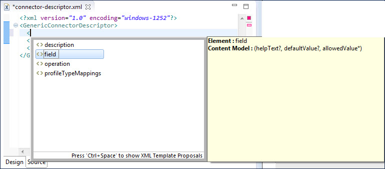

# Content assistance for editing XML connector files in Eclipse 

<head>
  <meta name="guidename" content="Integration"/>
  <meta name="context" content="GUID-ab568c4d-546d-42b1-b2b2-ec3e237efd3d"/>
</head>

The Boomi Connector SDK Tools plug-in for Eclipse includes a content assistant for XML editing.

As you edit XML connector configuration and descriptor files with an XML editor in Eclipse, the content assistant provides context-sensitive content completion. Popup windows provide possible elements and attribute values depending upon your position in the file or a delimiter character you inserted.

There are many XML editors available for Eclipse that support content assistance, including the open source Eclipse XML Editors and Tools. You can install an XML editor using the Install wizard \(**Help** \> **Install New Software**\). You set content assistance preferences for your installed XML editor in the Preferences dialog \(**Windows** \> **Preferences**\). If you are using Eclipse XML Editors and Tools, select the preference categories **XML**, **XML Files**, **Editor**.